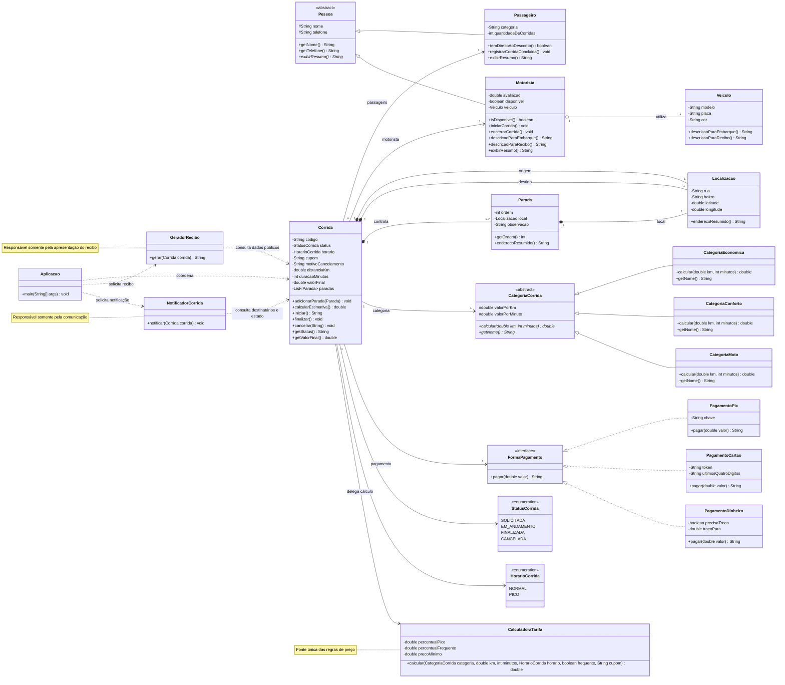

# Gabarito detalhado do professor — Laboratório de Refatoração

> **Material reservado ao professor. Não incluir no ZIP dos estudantes.**

## 1. Finalidade do laboratório

O projeto parte de uma aplicação de mobilidade urbana que funciona e usa corretamente vários mecanismos de POO. Entretanto, a aplicação possui problemas intencionais de Clean Code, DRY, KISS, Lei de Demeter e encapsulamento.

O aluno não deve reescrever o sistema de uma vez. A meta é realizar pequenas refatorações e executar os testes após cada mudança, preservando:

- os valores das tarifas;
- as mensagens observáveis;
- as transições de estado;
- o despacho polimórfico;
- as associações importantes do domínio;
- todos os comportamentos cobertos pela suíte de regressão.

A correção abrange **código e modelagem**. O código é alterado progressivamente durante as aulas; o arquivo `UML_INICIAL.md` é preservado como fotografia do problema original; e, ao término, o aluno produz um `UML_FINAL.md` coerente com a solução realmente implementada. O diagrama final não substitui os testes e não pode representar classes ou relações que não existam no código entregue.

Comando de verificação:

```powershell
javac -encoding UTF-8 -d out src\*.java testes\*.java
java -cp out TestesUnitarios
```

Resultado obrigatório:

```text
OK - 28 testes passaram.
```

### Estratégia da suíte de regressão

Os 28 testes protegem resultados observáveis: tarifas e sua ordem de aplicação, preço mínimo, equivalência entre estimativa e valor final, mensagens, pagamentos, transições de estado, cancelamentos, disponibilidade do motorista, histórico do passageiro, paradas, recibo e notificação.

Eles não verificam detalhes internos como a duplicação da fórmula, a presença da `CalculadoraUniversal` ou o uso de cadeias de getters. Assim, esses detalhes podem ser refatorados livremente. Se uma responsabilidade pública for movida para uma classe mais adequada, o teste correspondente pode ser adaptado para chamar a nova API, mas suas expectativas de comportamento não devem ser alteradas.

### Entregáveis esperados

| Entregável | Tratamento esperado |
|---|---|
| Código Java | Refatorado incrementalmente, compilando sem avisos e com todos os testes verdes |
| `TestesUnitarios.java` | Mantido como rede de segurança; expectativas só mudam quando a API muda, nunca para esconder regressões |
| `UML_INICIAL.md` | Não alterar; representa o estado anterior à refatoração |
| `UML_FINAL.md` | Criar ao final com classes, responsabilidades, relações e multiplicidades da implementação entregue |
| Justificativa técnica | Explicar cada decisão com Clean Code, DRY, KISS, Lei de Demeter ou encapsulamento |

### Como interpretar arquivos e linhas

Todas as referências no formato `arquivo:linha` apontam para a **versão inicial distribuída neste projeto**. Assim que o aluno inserir ou remover linhas, a numeração poderá mudar. Durante a correção, o nome da classe e do método deve ser considerado a referência permanente; o número serve para localizar rapidamente o problema antes da primeira refatoração.

### Catálogo rápido dos problemas iniciais

| ID | Problema | Princípio | Arquivo e linha inicial |
|---|---|---|---|
| E01 | nomes `x`, `v`, `s` e `r` não comunicam intenção | Clean Code | `src/Corrida.java:21`, `src/Corrida.java:54`, `src/Corrida.java:64`, `src/Corrida.java:100`, `src/CalculadoraUniversal.java:3` |
| E02 | várias instruções importantes aparecem na mesma linha | Clean Code | `src/Corrida.java:27-30`, `src/Corrida.java:80`, `src/Corrida.java:86`, `src/Corrida.java:92`; demais ocorrências detalhadas na Aula 1 |
| E03 | condição de fidelidade mistura consulta, limite e regra comercial | Clean Code | `src/Corrida.java:56`, `src/Corrida.java:66` |
| E04 | geração de recibo é longa e mistura responsabilidades | Clean Code / SRP | `src/Corrida.java:99-111` |
| E05 | fórmula de tarifa está duplicada | DRY | `src/Corrida.java:53-70` |
| E06 | calculadora recebe comandos por `String` e contém operações não utilizadas | KISS | `src/CalculadoraUniversal.java:1-14`; chamadas em `src/Corrida.java:55-57` e `src/Corrida.java:65-67` |
| E07 | estados, horário, categoria, cupom, percentuais e piso são valores mágicos | Clean Code / KISS | `src/Corrida.java:16`, `src/Corrida.java:55-58`, `src/Corrida.java:65-68`, `src/Corrida.java:78-92` |
| E08 | corrida atravessa motorista para acessar veículo | Lei de Demeter | `src/Corrida.java:81`, `src/Corrida.java:103` |
| E09 | corrida atravessa parada para acessar localização | Lei de Demeter | `src/Corrida.java:104-107` |
| E10 | aplicação navega pela estrutura interna da corrida | Lei de Demeter | `src/Aplicacao.java:205-211`, `src/Aplicacao.java:274-275` |
| E11 | lista interna de paradas é devolvida como coleção mutável | Encapsulamento / Demeter | `src/Corrida.java:44` |
| E12 | quantidade de corridas aceita atribuição arbitrária, inclusive negativa | Encapsulamento | `src/Passageiro.java:15`; chamada em `src/Corrida.java:86` |
| E13 | disponibilidade do motorista pode ser alterada por qualquer cliente | Encapsulamento | `src/Motorista.java:13`; chamadas em `src/Corrida.java:80`, `src/Corrida.java:86`, `src/Corrida.java:92` |
| E14 | status e valor final possuem setters que permitem estados impossíveis | Encapsulamento | `src/Corrida.java:46`, `src/Corrida.java:48` |
| E15 | `Corrida` concentra validação, cálculo, estado, pagamento, notificação e recibo | SRP / Classe Deus | `src/Corrida.java:53-111` |
| E16 | ordenação das paradas executa um `stream` sem usar o resultado | KISS / código morto | `src/Corrida.java:105` |
| E17 | cartão mantém número completo e CVV em memória | Clean Code / segurança | `src/PagamentoCartao.java:4-7` |
| E18 | nomes como `validarTudo` e `notificarTodoMundo` são vagos | Clean Code | `src/Corrida.java:72`, `src/Corrida.java:95` |

## 2. O que não deve ser tratado como erro

Antes de procurar defeitos, os alunos devem reconhecer os acertos de POO:

| Conceito | Evidência no projeto |
|---|---|
| Classe abstrata | `Pessoa` e `CategoriaCorrida` |
| Herança | `Passageiro` e `Motorista` estendem `Pessoa` |
| Sobrescrita | `exibirResumo()` e `calcular()` |
| Interface | `FormaPagamento` |
| Realização | Pix, cartão e dinheiro implementam o contrato |
| Polimorfismo | Referências `Pessoa`, `CategoriaCorrida` e `FormaPagamento` |
| Despacho dinâmico | A JVM escolhe qual `calcular()` e qual `pagar()` executar |
| Agregação | Motorista utiliza um veículo que pode existir independentemente |
| Composição/multiplicidade | A corrida controla zero ou muitas paradas |

O propósito não é remover herança, interfaces ou polimorfismo só porque existe código ruim ao redor deles.

---

# Aula 1 — Clean Code

## Objetivo para os alunos

Melhorar nomes, formatação, tamanho das funções, clareza das condições e comunicação do código sem alterar sua estrutura geral.

## Alteração 1 — nomes sem intenção

### Onde alterar

- `src/Corrida.java:21`, atributo `CalculadoraUniversal x`;
- `src/Corrida.java:54` e `src/Corrida.java:64`, variável local `v`;
- `src/Corrida.java:100`, variável local `s`;
- `src/CalculadoraUniversal.java:3`, variável local `r`;
- `src/Corrida.java:72` e `src/Corrida.java:95`, métodos vagos `validarTudo` e `notificarTodoMundo`.

### Problema esperado

Os nomes não explicam o papel das variáveis. O leitor precisa interpretar todas as operações para descobrir o significado.

### Gabarito possível

| Antes | Depois |
|---|---|
| `x` | `calculadora` |
| `v` | `valorCalculado` |
| `s` | `recibo` ou `conteudoRecibo` |
| `r` | `resultado` |

### Critério de correção

Aceitar nomes diferentes se forem específicos, consistentes e representarem a intenção.

## Alteração 2 — formatação compactada

### Onde alterar

- `src/Corrida.java:27-30`, construtor com várias atribuições por linha;
- `src/Corrida.java:32-49`, getters e setters compactados;
- `src/Corrida.java:80`, `src/Corrida.java:86` e `src/Corrida.java:92`, transições com várias ações na mesma linha;
- `src/CategoriaEconomica.java:2-4`, `src/CategoriaConforto.java:2-4` e `src/CategoriaMoto.java:2-4`;
- `src/PagamentoPix.java:5-6`, `src/PagamentoCartao.java:6-7` e `src/PagamentoDinheiro.java:6-7`;
- `src/Motorista.java:8-13`, `src/Localizacao.java:8-13`, `src/Parada.java:7-11` e `src/Veiculo.java:7-11`;
- `src/Pessoa.java:10-11` e `src/Passageiro.java:11-12`.

### Problema esperado

Há várias instruções na mesma linha, dificultando depuração, revisão e leitura de diffs.

### Gabarito possível

Antes:

```java
status = "FINALIZADA"; motorista.setDisponivel(true); passageiro.setQuantidadeDeCorridas(...);
```

Depois:

```java
status = "FINALIZADA";
motorista.setDisponivel(true);
passageiro.setQuantidadeDeCorridas(
        passageiro.getQuantidadeDeCorridas() + 1
);
```

## Alteração 3 — condição difícil de ler

### Onde alterar

- `src/Corrida.java:56`, dentro de `calcularEstimativa()`;
- `src/Corrida.java:66`, dentro de `calcularValorFinal()`.

### Problema esperado

A condição de passageiro frequente mistura categoria, quantidade mínima e efeito do desconto.

### Gabarito possível

Extrair inicialmente apenas a intenção:

```java
private boolean passageiroTemDireitoAoDesconto() {
    return passageiro.getCategoria().equals("FREQUENTE")
            && passageiro.getQuantidadeDeCorridas() >= 10;
}
```

Nesta aula, ainda é aceitável manter strings e números mágicos. Eles serão tratados posteriormente.

## Alteração 4 — método longo de recibo

### Onde alterar

- `src/Corrida.java:99-111`, método `gerarReciboCompleto()`.

### Problema esperado

O método mistura cabeçalho, pessoas, veículo, trajeto, pagamento e total.

### Gabarito intermediário

Extrair métodos privados dentro da própria classe:

```java
private String gerarCabecalhoRecibo() { ... }
private String descreverParticipantes() { ... }
private String descreverTrajeto() { ... }
private String descreverPagamento() { ... }
```

Não mover ainda para uma nova classe. Essa decisão será discutida na integração final.

## Checkpoint da Aula 1

- [ ] nomes comunicam intenção;
- [ ] uma instrução importante por linha;
- [ ] condições complexas possuem nome;
- [ ] funções extraídas têm uma responsabilidade reconhecível;
- [ ] todos os testes continuam passando.

---

# Aula 2 — DRY

## Objetivo para os alunos

Identificar conhecimento duplicado e criar uma única fonte para a regra de preço.

## Alteração principal — fórmula duplicada

### Onde alterar

- `src/Corrida.java:53-59`, método `calcularEstimativa()`;
- `src/Corrida.java:62-69`, método `calcularValorFinal()`.

### Duplicação que deve ser encontrada

Os dois métodos repetem:

1. cálculo da categoria;
2. acréscimo de 25% no pico;
3. desconto de 10% para passageiro frequente;
4. desconto de R$ 10 do cupom;
5. piso de R$ 8;
6. arredondamento.

### Gabarito mínimo aceitável

Criar apenas uma implementação da regra:

```java
public double calcularEstimativa() {
    return calcularPreco();
}

public double calcularValorFinal() {
    return calcularPreco();
}

private double calcularPreco() {
    double valor = categoria.calcular(distanciaKm, duracaoMinutos);
    valor = aplicarTarifaDePico(valor);
    valor = aplicarDescontoDeFidelidade(valor);
    valor = aplicarCupom(valor);
    valor = aplicarPrecoMinimo(valor);
    return arredondar(valor);
}
```

### Discussão importante

DRY não significa eliminar qualquer trecho visualmente parecido. A duplicação relevante é o conhecimento da ordem e dos valores das regras comerciais.

### Erro comum dos alunos

Criar um método chamado `calcular()` e copiar toda a fórmula novamente em outro local. Isso desloca o código, mas não centraliza o conhecimento.

## Checkpoint da Aula 2

- [ ] existe uma única sequência oficial de cálculo;
- [ ] estimativa e valor final delegam para a mesma regra;
- [ ] a ordem dos descontos não mudou;
- [ ] o cenário principal continua resultando em `54.33`;
- [ ] todos os testes continuam passando.

---

# Aula 3 — KISS

## Objetivo para os alunos

Remover complexidade especulativa e representar diretamente as operações exigidas pelo domínio atual.

## Alteração 1 — `CalculadoraUniversal`

### Onde alterar

- `src/CalculadoraUniversal.java:1-14`, especialmente o comando recebido em `src/CalculadoraUniversal.java:2` e as operações não utilizadas em `src/CalculadoraUniversal.java:8-10`;
- chamadas realizadas em `src/Corrida.java:55-57` e `src/Corrida.java:65-67`.

### Problema esperado

A classe recebe o nome da operação por `String`, um valor genérico e um `boolean` de arredondamento. Também oferece operações nunca usadas: `MULTIPLICAR`, `TETO` e `PISO`.

### Gabarito preferencial

Remover `CalculadoraUniversal` e escrever operações pequenas com nomes do domínio:

```java
private double acrescentarPercentual(double valor, double percentual) {
    return valor + valor * percentual / 100;
}

private double descontarPercentual(double valor, double percentual) {
    return valor - valor * percentual / 100;
}
```

O cupom fixo pode ser expresso diretamente no método responsável por cupom.

### Alternativa aceitável

Manter uma calculadora simples com métodos explícitos, desde que ela não receba comandos por strings e não carregue operações não utilizadas.

## Alteração 2 — abstrações úteis versus artificiais

### Onde analisar

- `src/CategoriaCorrida.java:1-11` e subclasses em `src/CategoriaEconomica.java:1-5`, `src/CategoriaConforto.java:1-5` e `src/CategoriaMoto.java:1-5`;
- `src/FormaPagamento.java:1-3` e implementações em `src/PagamentoPix.java:1-7`, `src/PagamentoCartao.java:1-8` e `src/PagamentoDinheiro.java:1-8`.

### Resposta esperada

Essas abstrações não devem ser removidas. Diferentemente da calculadora universal, elas representam variações reais, exercitam polimorfismo e possuem implementações concretas utilizadas.

## Alteração 3 — números e strings mágicos

### Onde alterar

- `PICO`, `FREQUENTE`, `PRIMEIRA10`, percentuais e piso em `src/Corrida.java:55-58` e `src/Corrida.java:65-68`;
- estado inicial `SOLICITADA` em `src/Corrida.java:16`;
- verificações e transições `SOLICITADA`, `EM_ANDAMENTO`, `FINALIZADA` e `CANCELADA` em `src/Corrida.java:78-92`.

### Gabarito gradual

Primeiro, constantes:

```java
private static final double PERCENTUAL_PICO = 25.0;
private static final double DESCONTO_FREQUENTE = 10.0;
private static final double PRECO_MINIMO = 8.0;
```

Depois, se a turma já estiver confortável, usar enums para estados e horário:

```java
public enum StatusCorrida {
    SOLICITADA, EM_ANDAMENTO, FINALIZADA, CANCELADA
}
```

Não é necessário criar um framework de regras ou uma fábrica genérica.

## Alteração 4 — ordenação sem efeito

### Onde alterar

- `src/Corrida.java:105`, chamada a `paradas.stream().sorted(...).forEach(...)` cujo resultado é descartado;
- `src/Corrida.java:106`, laço que continua usando a lista original.

### Problema esperado

O `stream` ordenado não produz coleção, texto nem efeito observável. Ele apenas percorre os elementos com um `forEach` vazio. Isso adiciona ruído e sugere uma garantia de ordenação que o método não cumpre.

### Gabarito possível

Se a ordem de inserção for o contrato escolhido, remover a linha morta. Se `Parada.ordem` deve controlar o trajeto, primeiro adicionar um teste que caracterize essa exigência e então consumir o fluxo ordenado ou ordenar uma cópia. A correção funcional e a refatoração estrutural devem ficar em passos separados.

## Checkpoint da Aula 3

- [ ] operações especulativas foram removidas;
- [ ] não existem comandos de cálculo representados por strings;
- [ ] abstrações polimórficas úteis foram preservadas;
- [ ] constantes ou enums substituem valores mágicos relevantes;
- [ ] todos os testes continuam passando.

---

# Aula 4 — Lei de Demeter

## Objetivo para os alunos

Reduzir o conhecimento que cada objeto possui sobre a estrutura interna de seus colaboradores.

## Alteração 1 — cadeia de veículo

### Onde alterar

- `src/Corrida.java:81`, mensagem de início;
- `src/Corrida.java:103`, descrição do veículo no recibo;
- `src/Motorista.java:11`, exposição direta do veículo;
- `src/Veiculo.java:9-11`, getters usados para montar descrições fora do objeto.

### Cadeias problemáticas

```java
motorista.getVeiculo().getModelo()
motorista.getVeiculo().getCor()
motorista.getVeiculo().getPlaca()
```

### Gabarito possível

Em `Veiculo`:

```java
public String descricaoParaEmbarque() {
    return modelo + " " + cor + ", placa " + placa;
}
```

Em `Motorista`:

```java
public String descricaoParaEmbarque() {
    return nome + " chegará em um " + veiculo.descricaoParaEmbarque();
}
```

Cliente:

```java
motorista.descricaoParaEmbarque()
```

## Alteração 2 — cadeia de localização

### Onde alterar

- `src/Corrida.java:104-107`, geração do trajeto dentro do recibo;
- `src/Localizacao.java:10-11`, getters de rua e bairro usados por clientes;
- `src/Parada.java:10`, getter que expõe a localização para navegação externa.

### Cadeias problemáticas

```java
origem.getRua() + " - " + origem.getBairro()
parada.getLocal().getRua()
parada.getLocal().getBairro()
```

### Gabarito possível

Em `Localizacao`:

```java
public String enderecoResumido() {
    return rua + " - " + bairro;
}
```

Em `Parada`:

```java
public String enderecoResumido() {
    return local.enderecoResumido();
}
```

## Alteração 3 — coleções expostas

### Onde alterar

- `src/Corrida.java:44`, método `getParadas()`.

### Problema esperado

O método devolve a lista mutável. Qualquer classe pode adicionar, remover ou reordenar paradas sem passar pelas regras da corrida.

### Gabarito possível

```java
public List<Parada> getParadas() {
    return List.copyOf(paradas);
}
```

Ou expor apenas operações úteis:

```java
public int quantidadeDeParadas() { ... }
public String descreverParadas() { ... }
```

## Alteração 4 — cadeias na aplicação de console

### Onde alterar

- `src/Aplicacao.java:205`, acesso ao passageiro;
- `src/Aplicacao.java:206`, acesso às localizações de origem e destino;
- `src/Aplicacao.java:209-210`, navegação por motorista e veículo;
- `src/Aplicacao.java:211`, consulta direta à coleção de paradas;
- `src/Aplicacao.java:274-275`, formatação externa de `Localizacao`.

### Problema esperado

A camada de aplicação conhece a topologia interna de `Corrida`. Mesmo depois de melhorar o domínio, essas cadeias manteriam clientes acoplados a getters antigos e dificultariam sua remoção.

### Gabarito possível

Fazer a aplicação solicitar descrições e consultas significativas, como `corrida.resumoDaSolicitacao()`, `corrida.quantidadeDeParadas()` ou colaboradores de apresentação. Para localização, preferir `localizacao.enderecoResumido()`. A solução deve evitar transformar `Corrida` em um conjunto de getters de conveniência.

### Erro comum dos alunos

Criar métodos como `getPlacaDoVeiculoDoMotorista()`. Isso apenas esconde a cadeia e transforma `Corrida` em intermediária de todos os dados. O comportamento deve ficar com o objeto que possui o conhecimento necessário.

## Checkpoint da Aula 4

- [ ] não há cadeias longas de getters nos clientes;
- [ ] `Localizacao`, `Veiculo`, `Motorista` e `Parada` oferecem comportamentos significativos;
- [ ] a coleção interna não pode ser alterada externamente;
- [ ] não foram criados getters de conveniência sem significado de domínio;
- [ ] todos os testes continuam passando.

---

# Aula 5 — Integração, encapsulamento e Classe Deus

## Objetivo para os alunos

Combinar as melhorias e redistribuir responsabilidades sem criar uma arquitetura excessiva.

## Alteração 1 — encapsulamento do passageiro

### Onde alterar

- `src/Passageiro.java:15`, método `setQuantidadeDeCorridas()`;
- `src/Corrida.java:86`, chamada durante `finalizar()`.

### Problema esperado

O setter permite valores negativos e permite que qualquer classe sobrescreva o histórico.

### Gabarito preferencial

```java
public void registrarCorridaConcluida() {
    quantidadeDeCorridas++;
}
```

Remover o setter público quando os testes e clientes forem adaptados.

## Alteração 2 — encapsulamento do motorista

### Onde alterar

- `src/Motorista.java:13`, método `setDisponivel()`;
- `src/Corrida.java:80`, ocupação durante `iniciar()`;
- `src/Corrida.java:86`, liberação durante `finalizar()`;
- `src/Corrida.java:92`, liberação durante `cancelar()`.

### Gabarito possível

```java
public void iniciarCorrida() {
    if (!disponivel) {
        throw new IllegalStateException("Motorista indisponível");
    }
    disponivel = false;
}

public void encerrarCorrida() {
    disponivel = true;
}
```

## Alteração 3 — estado da corrida

### Onde alterar

- `src/Corrida.java:46`, método `setStatus()`;
- `src/Corrida.java:48`, método `setValorFinal()`;
- `src/Corrida.java:76-93`, métodos de transição `iniciar()`, `finalizar()` e `cancelar()`.

### Problema esperado

Setters públicos permitem estados impossíveis e valores finais arbitrários.

### Gabarito esperado

Remover os setters públicos. O estado e o preço devem mudar apenas por operações como `iniciar()`, `finalizar()` e `cancelar()`.

## Alteração 4 — decompor a Classe Deus

### Responsabilidades atualmente em `Corrida`

1. armazenamento dos dados em `src/Corrida.java:6-22`;
2. validação em `src/Corrida.java:72-74`;
3. cálculo de preço em `src/Corrida.java:53-70`;
4. transição de estados em `src/Corrida.java:76-93`;
5. disponibilidade do motorista em `src/Corrida.java:79-92`;
6. processamento de pagamento em `src/Corrida.java:87`;
7. envio de notificação em `src/Corrida.java:95-97`;
8. geração do recibo em `src/Corrida.java:99-111`.

### Gabarito equilibrado

Manter em `Corrida`:

- dados e invariantes da corrida;
- `iniciar`, `finalizar` e `cancelar`;
- relação com paradas;
- preço final já calculado.

Extrair:

- `CalculadoraTarifa`: concentra as regras de preço;
- `GeradorRecibo`: apenas apresenta uma corrida;
- `NotificadorCorrida`: envia notificações.

O pagamento pode continuar como interface colaboradora da corrida ou ser coordenado por um serviço de aplicação. As duas soluções são aceitáveis se as responsabilidades forem justificadas.

### Estrutura final possível

```text
Corrida
 ├─ mantém estado e invariantes
 ├─ conhece Passageiro, Motorista, CategoriaCorrida e FormaPagamento
 └─ controla Paradas

CalculadoraTarifa
 └─ calcula preço sem alterar a corrida

GeradorRecibo
 └─ transforma dados públicos da corrida em texto

NotificadorCorrida
 └─ envia mensagens sem imprimir diretamente no domínio
```

## Alteração 5 — dados do cartão

### Onde alterar

- `src/PagamentoCartao.java:4-5`, armazenamento de número e CVV;
- `src/PagamentoCartao.java:6`, construtor que recebe dados sensíveis;
- `src/PagamentoCartao.java:7`, extração dos últimos dígitos a partir do número completo.

### Problema esperado

Número completo e CVV permanecem armazenados em memória como strings comuns. Em um sistema real, isso seria inadequado.

### Gabarito conceitual

Para o laboratório, substituir os dados por um token e os quatro últimos dígitos:

```java
private String token;
private String ultimosQuatroDigitos;
```

Não é necessário implementar integração real com adquirente.

## Checkpoint da Aula 5

- [ ] objetos protegem suas próprias transições;
- [ ] setters perigosos foram removidos;
- [ ] `Corrida` deixou de gerar recibos e enviar notificações diretamente;
- [ ] cálculo possui um responsável claro;
- [ ] o polimorfismo de categorias e pagamentos continua funcionando;
- [ ] todos os testes continuam passando ou foram adaptados sem mudar comportamento.

---

# 3. Distribuição sugerida entre grupos

Todos os grupos devem trabalhar sobre o mesmo projeto e avançar pelas cinco aulas. Para revisão cruzada, cada grupo pode assumir um foco adicional:

| Grupo | Foco de revisão | Arquivos principais |
|---|---|---|
| Grupo 1 | Nomes, funções e formatação | `Corrida`, `CalculadoraUniversal` |
| Grupo 2 | Duplicação e cálculo | `Corrida`, `CategoriaCorrida` e subclasses |
| Grupo 3 | Simplicidade e strings mágicas | `CalculadoraUniversal`, estados e constantes |
| Grupo 4 | Lei de Demeter | `Corrida`, `Motorista`, `Veiculo`, `Localizacao`, `Parada` |
| Grupo 5 | Encapsulamento e invariantes | `Passageiro`, `Motorista`, `Corrida` |
| Grupo 6 | Classe Deus e responsabilidades | `Corrida`, novo gerador e novo notificador |

Se houver menos grupos, unir os focos 1–2, 3–4 e 5–6.

# 4. Rubrica de avaliação

| Critério | Pontos |
|---|---:|
| Testes permanecem verdes | 2,0 |
| Clean Code aplicado com justificativas | 1,25 |
| Regra de preço sem duplicação | 1,25 |
| Simplificação sem perder polimorfismo útil | 1,25 |
| Lei de Demeter e responsabilidades coerentes | 1,25 |
| Encapsulamento e invariantes | 1,0 |
| UML final fiel ao código e comparável à UML inicial | 1,0 |
| Pequenos commits e explicação das decisões | 1,0 |

# 5. Perguntas para a apresentação final

1. Qual alteração melhorou mais a compreensão do código?
2. Qual duplicação representava conhecimento de negócio?
3. Qual abstração foi removida por violar KISS?
4. Quais abstrações foram mantidas e por quê?
5. Onde a Lei de Demeter alterou a distribuição de responsabilidades?
6. Qual setter foi substituído por uma operação de domínio?
7. Como os testes permitiram refatorar com segurança?
8. Houve alguma melhoria proposta que criaria complexidade desnecessária?
9. Quais relações mudaram entre a UML inicial e a UML final, e por quê?

# 6. Critérios para aceitar soluções diferentes

O gabarito não exige nomes ou classes idênticos. Uma solução alternativa deve ser aceita quando:

- preserva o comportamento protegido;
- deixa explícita a responsabilidade de cada classe;
- reduz conhecimento duplicado;
- não remove polimorfismo útil apenas para diminuir a quantidade de arquivos;
- não cria padrões ou camadas sem necessidade;
- protege invariantes do domínio;
- pode ser explicada pelos alunos com base nos quatro princípios estudados.

# 7. Protocolo detalhado de refatoração e correção

## 7.1. Regra central: preservar comportamento, não implementação

Refatoração altera a estrutura interna sem alterar o comportamento observável. Neste laboratório, comportamento observável inclui valores, mensagens, estados, disponibilidade, histórico, pagamento, recibo, notificação e exceções previstas pelos testes.

O professor deve distinguir três situações:

| Situação | Exemplo | Tratamento |
|---|---|---|
| Refatoração válida | Centralizar a fórmula duplicada sem mudar `54.33` | Aceitar |
| Evolução de API sem mudança funcional | Mover geração de recibo para `GeradorRecibo` e adaptar apenas a chamada do teste | Aceitar se a expectativa permanecer igual |
| Regressão disfarçada | Alterar o valor esperado do teste porque a nova fórmula produz outro total | Rejeitar |

Nunca se deve “consertar” um teste apenas para fazê-lo aceitar um resultado novo e incompatível. Quando uma API for movida, o corpo de preparação ou a chamada pode mudar, mas valores, textos e transições protegidos devem continuar equivalentes.

## 7.2. Ciclo recomendado: verde–refatora–verde

Como o projeto começa funcionando, o ciclo não começa com um teste vermelho. Para cada mudança:

1. compilar e executar os 28 testes;
2. escolher um único mau cheiro;
3. realizar uma alteração pequena e nomeável;
4. compilar novamente;
5. executar os 28 testes;
6. comparar mensagens e saídas quando houver alteração de apresentação;
7. registrar a justificativa da mudança;
8. somente então iniciar a próxima refatoração.

Comandos de referência usando o JDK fornecido:

```powershell
New-Item -ItemType Directory -Force out
.\java\bin\javac.exe -encoding UTF-8 -Xlint:all -d out src\*.java testes\*.java
.\java\bin\java.exe -cp out TestesUnitarios
```

O uso de `-Xlint:all` permite que o professor trate avisos relevantes, e não apenas erros, durante a revisão.

## 7.3. Técnicas esperadas por princípio

| Princípio | Mau cheiro observado | Técnica apropriada | Evidência esperada | Evitar |
|---|---|---|---|---|
| Clean Code | nomes curtos, métodos longos e linhas compactadas | renomear símbolo, extrair método, separar etapas e explicitar intenção | leitura sequencial e nomes de domínio | comentários usados para justificar código confuso |
| DRY | regra completa repetida em estimativa e valor final | extrair fonte única da regra e delegar | uma única ordem oficial de cálculo | apenas mover as duas cópias para outra classe |
| KISS | calculadora genérica baseada em comandos `String` | remover generalização especulativa e usar operações explícitas | menos estados e operações não utilizadas | criar framework, fábrica ou motor de regras sem necessidade |
| Lei de Demeter | cadeias de getters e conhecimento da estrutura interna | mover comportamento para o objeto que possui os dados | mensagens como `descricaoParaEmbarque()` e `enderecoResumido()` | getters de conveniência como `getPlacaDoVeiculoDoMotorista()` |
| Encapsulamento | setters permitem estados impossíveis | substituir setter por operação de domínio | `registrarCorridaConcluida()`, `iniciarCorrida()` e `encerrarCorrida()` | setter público renomeado sem proteção de invariantes |
| Responsabilidade única | `Corrida` calcula, apresenta e notifica | extrair colaboradores pequenos e coesos | cálculo, recibo e notificação com responsáveis claros | criar muitas interfaces sem variação real |

## 7.4. Técnicas de refatoração que podem ser cobradas

### Renomear símbolo

O novo nome deve explicar intenção e unidade. Exemplos: `v` para `valorCalculado`, `x` para `calculadoraTarifa`, `min` para `duracaoMinutos`. A correção deve observar consistência em atributos, parâmetros e testes.

### Extrair método

Aplicar quando um trecho representa uma etapa nomeável, como `aplicarTarifaDePico`, `aplicarDescontoDeFidelidade`, `aplicarCupom` ou `formatarTrajeto`. Métodos extraídos não devem depender de efeitos colaterais ocultos.

### Extrair classe

Aplicar quando um grupo de operações possui uma responsabilidade própria. Candidatos naturais são `CalculadoraTarifa`, `GeradorRecibo` e `NotificadorCorrida`. A classe extraída deve reduzir a responsabilidade de `Corrida`; apenas copiar métodos sem mudar a colaboração não é suficiente.

### Substituir valor mágico por constante ou enum

Percentuais e preço mínimo podem ser constantes. Estados e horário possuem conjunto fechado e são bons candidatos a enum. O aluno deve preservar o texto público esperado, mesmo que internamente use `StatusCorrida.FINALIZADA` ou `HorarioCorrida.PICO`.

### Encapsular coleção

`getParadas()` não deve expor a lista interna mutável. São soluções aceitáveis retornar `List.copyOf(paradas)` ou oferecer consultas como `quantidadeDeParadas()` e `descreverTrajeto()`. A inclusão continua passando por `adicionarParada`.

### Substituir setter por operação de domínio

Em vez de permitir qualquer valor, o objeto deve oferecer uma ação válida. `Passageiro.registrarCorridaConcluida()` incrementa exatamente uma corrida; `Motorista.iniciarCorrida()` verifica disponibilidade; `Motorista.encerrarCorrida()` restabelece disponibilidade.

### Preservar fachada durante uma extração

Se a turma ainda não estiver trabalhando com migração de API, métodos públicos antigos podem permanecer como fachadas delegadoras. Por exemplo, `Corrida.gerarReciboCompleto()` pode delegar a `GeradorRecibo` durante a transição. Isso mantém clientes e testes funcionando enquanto a responsabilidade interna muda.

## 7.5. Ordem segura para as mudanças

1. melhorar nomes e formatação sem mover responsabilidades;
2. extrair condições e etapas da regra de preço;
3. eliminar a duplicação entre estimativa e valor final;
4. remover a `CalculadoraUniversal` e operações especulativas;
5. introduzir constantes ou enums para conceitos fechados;
6. mover descrições para `Veiculo`, `Motorista`, `Localizacao` e `Parada`;
7. encapsular a lista de paradas;
8. substituir setters perigosos por operações de domínio;
9. extrair cálculo, recibo e notificação quando a turma dominar as etapas anteriores;
10. atualizar a UML final somente depois de estabilizar o código.

Essa ordem reduz o número de mudanças simultâneas e facilita localizar a causa quando um teste falha.

# 8. Correção da UML

## 8.1. Política dos dois diagramas

O projeto deve possuir duas visões complementares:

- `UML_INICIAL.md`: não é corrigido nem sobrescrito; documenta os maus cheiros recebidos pelos alunos;
- `UML_FINAL.md`: é produzido pelos alunos e documenta exatamente a solução entregue.

O diagrama final deve ser criado depois do código, e não usado para fingir uma arquitetura que não foi implementada. Se o aluno escolher uma solução alternativa aceita pelo guia, sua UML deve mostrar essa solução alternativa.

## 8.2. Elementos obrigatórios na UML final

- classes e enums que realmente existem;
- principais atributos de estado, omitindo detalhes irrelevantes;
- operações públicas que expressam comportamento de domínio;
- herança de `Pessoa` e `CategoriaCorrida`;
- realização de `FormaPagamento`;
- associação entre corrida, passageiro, motorista, categoria e pagamento;
- agregação entre motorista e veículo;
- composição de origem, destino e paradas na corrida;
- multiplicidades, especialmente uma corrida para zero ou muitas paradas;
- dependências para classes extraídas, como calculadora, gerador de recibo e notificador;
- remoção visual de elementos eliminados do código, como `CalculadoraUniversal` e setters perigosos.

## 8.3. Comparação mínima entre antes e depois

| Tema | UML inicial | UML final esperada |
|---|---|---|
| Cálculo | `Corrida` depende de `CalculadoraUniversal` | fonte única em `CalculadoraTarifa` ou solução igualmente simples |
| Estados | representados por `String` e setters públicos | enum ou constantes protegidas por operações de transição |
| Passageiro | quantidade alterada por setter genérico | operação `registrarCorridaConcluida()` |
| Motorista | disponibilidade alterada externamente | operações `iniciarCorrida()` e `encerrarCorrida()` |
| Veículo e localização | objetos expõem apenas dados por getters | objetos oferecem descrições significativas |
| Paradas | coleção interna exposta | coleção encapsulada e inclusão controlada |
| Recibo e notificação | responsabilidades concentradas em `Corrida` | colaboradores próprios ou fachada com delegação explícita |
| Cartão | número completo e CVV armazenados | token e últimos quatro dígitos, em uma solução conceitualmente mais segura |

## 8.4. Erros de modelagem que devem descontar nota

- UML final idêntica à inicial apesar de mudanças estruturais no código;
- classe presente no diagrama, mas ausente no projeto;
- relação desenhada como composição sem controle de ciclo de vida;
- omissão das multiplicidades;
- interface desenhada como herança de classe concreta;
- `CalculadoraUniversal` mantida no diagrama depois de removida do código;
- novos serviços implementados, mas não relacionados aos seus clientes;
- métodos privados de pouca relevância ocupando espaço enquanto operações públicas importantes são omitidas.

# 9. Roteiro de correção do professor

## 9.1. Antes de avaliar a qualidade

1. compilar todos os arquivos com o JDK fornecido;
2. confirmar `OK - 28 testes passaram.`;
3. executar `Aplicacao` e concluir pelo menos uma corrida;
4. verificar se a saída mantém acentos, valores e estados;
5. comparar `UML_INICIAL.md`, `UML_FINAL.md` e código.

Se os testes falharem, a primeira análise deve separar falha de compilação, mudança legítima de API e regressão funcional.

## 9.2. Perguntas para revisar cada princípio

### Clean Code

- Os nomes permitem compreender a regra sem interpretar variáveis genéricas?
- Métodos possuem uma intenção principal?
- Condições complexas receberam nomes significativos?
- Formatação e mensagens permanecem consistentes?

### DRY

- Existe exatamente uma sequência oficial para pico, fidelidade, cupom, piso e arredondamento?
- Estimativa e valor final delegam para essa sequência?
- Alterar um percentual exigiria modificar apenas um lugar?

### KISS

- Operações nunca usadas foram removidas?
- A solução possui apenas abstrações justificadas pelo domínio?
- O aluno evitou reflexão, mapas de comandos, fábricas genéricas e padrões sem necessidade?

### Lei de Demeter

- Clientes pedem comportamentos em vez de navegar pela estrutura interna?
- `Motorista`, `Veiculo`, `Localizacao` e `Parada` concentram o conhecimento que possuem?
- A lista de paradas deixou de ser modificável externamente?

### Encapsulamento e responsabilidade

- Estados impossíveis são impedidos pelos próprios objetos?
- Finalização é o único caminho que incrementa histórico e processa pagamento?
- Cancelamento libera o motorista sem cobrar?
- Cálculo, recibo e notificação possuem responsáveis identificáveis?

## 9.3. Diagnóstico de uma falha de teste

| Falha | Causa provável | Pontos da versão inicial para comparar |
|---|---|---|
| total diferente de `54.33` | ordem das regras, percentual, cupom ou arredondamento alterado | `src/Corrida.java:53-70` e cálculos em `src/CategoriaEconomica.java:2-3`, `src/CategoriaConforto.java:2-3`, `src/CategoriaMoto.java:2-3` |
| estimativa diferente do valor final | duplicação não eliminada ou caminhos divergentes | `src/Corrida.java:53-70` |
| pagamento chamado ao iniciar | efeito colateral movido para a transição errada | início em `src/Corrida.java:76-82`; pagamento original em `src/Corrida.java:87` |
| motorista continua ocupado após finalizar ou cancelar | encapsulamento da disponibilidade incompleto | `src/Motorista.java:13`, `src/Corrida.java:80`, `src/Corrida.java:86`, `src/Corrida.java:92` |
| histórico incrementa ao cancelar | operação de conclusão usada na transição errada | incremento original somente em `src/Corrida.java:86`; cancelamento em `src/Corrida.java:90-93` |
| recibo perde endereço ou veículo | extração de apresentação descartou dados públicos | `src/Corrida.java:99-111` |
| teste não compila após remoção de getter | API removida sem fachada ou teste ainda não adaptado à nova operação | getters originais em `src/Corrida.java:32-49`, `src/Motorista.java:10-12`, `src/Localizacao.java:10-13` |

# 10. Checklist de aceite final

## Comportamento

- [ ] compilação concluída sem erros e sem avisos relevantes;
- [ ] 28 testes aprovados;
- [ ] aplicação interativa executa solicitação, início, finalização e cancelamento;
- [ ] cenário principal continua totalizando `54.33`;
- [ ] mensagens públicas, recibo e notificação preservados.

## Estrutura do código

- [ ] fórmula de tarifa possui uma única fonte;
- [ ] `CalculadoraUniversal` foi removida ou justificada sem operações especulativas;
- [ ] strings e números mágicos relevantes foram tratados;
- [ ] cadeias profundas de getters foram reduzidas;
- [ ] coleção de paradas está encapsulada;
- [ ] setters perigosos foram substituídos por operações de domínio;
- [ ] abstrações polimórficas úteis foram mantidas;
- [ ] extrações não criaram complexidade desnecessária.

## Modelagem e documentação

- [ ] `UML_INICIAL.md` foi preservado;
- [ ] `UML_FINAL.md` corresponde ao código entregue;
- [ ] relações e multiplicidades estão corretas;
- [ ] classes removidas não aparecem na UML final;
- [ ] classes adicionadas aparecem com suas dependências;
- [ ] diferenças entre os diagramas conseguem ser explicadas pelo aluno.

# 11. UML final de referência

O diagrama abaixo representa uma solução final possível e equilibrada. Ele não é um molde obrigatório: nomes ou distribuições diferentes são aceitáveis quando preservam comportamento, reduzem os maus cheiros e correspondem ao código entregue. Nesta referência, cálculo, recibo e notificação possuem responsáveis próprios; estados e horário são enums; e os objetos de domínio oferecem operações significativas em vez de setters genéricos.


