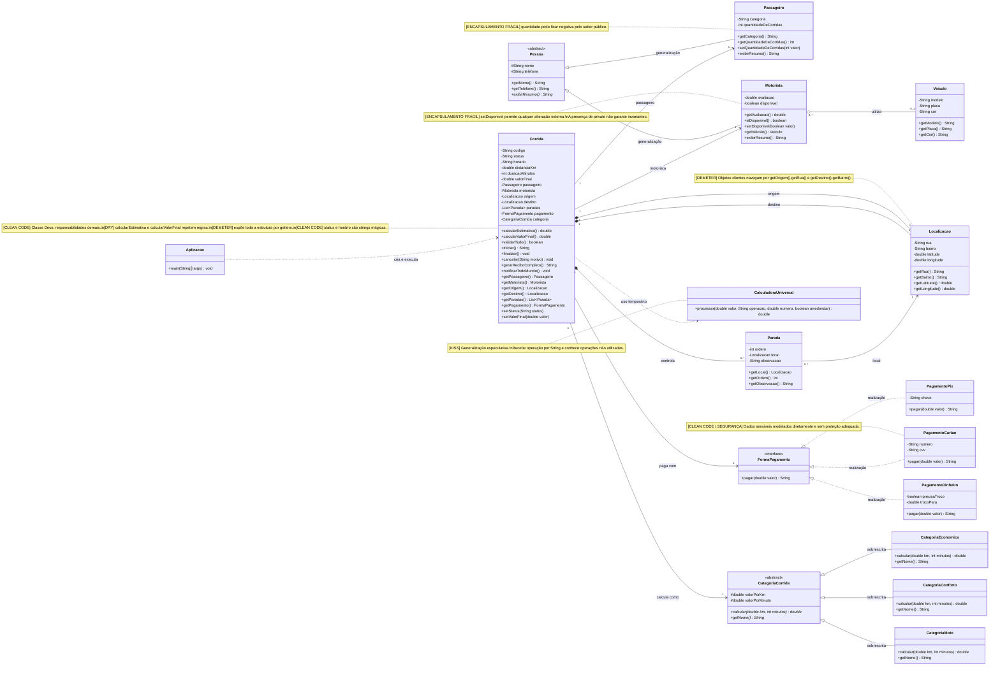

# UML inicial — aplicativo de mobilidade urbana

Esta é a versão **antes da refatoração**. Ela utiliza os conceitos de POO estudados, mas contém deliberadamente problemas de Clean Code, DRY, KISS e Lei de Demeter.

## Diagrama de classes

## Conceitos de POO presentes

| Conceito | Onde aparece |
|---|---|
| Classe e objeto | Todas as classes; instanciação realizada por `Aplicacao` |
| Abstração | `Pessoa` e `CategoriaCorrida` representam conceitos essenciais do domínio |
| Encapsulamento | Atributos privados/protegidos com operações públicas — propositalmente incompleto em alguns pontos |
| Associação | `Corrida` conhece passageiro, motorista, pagamento e categoria |
| Agregação | `Motorista` utiliza um `Veiculo`, que pode existir e ser compartilhado independentemente |
| Composição | A corrida controla suas localizações e suas paradas |
| Herança | `Passageiro` e `Motorista` especializam `Pessoa` |
| Classe abstrata | `Pessoa` e `CategoriaCorrida` compartilham estado e comportamento-base |
| Interface | `FormaPagamento` define o contrato de pagamento |
| Realização | Pix, cartão e dinheiro implementam `FormaPagamento` |
| Sobrescrita | Cada categoria calcula a tarifa de modo diferente |
| Polimorfismo | `Corrida` usa os tipos comuns `FormaPagamento` e `CategoriaCorrida` |
| Multiplicidade | Uma corrida possui um passageiro, um motorista e zero ou muitas paradas |
| Dependência | `Aplicacao` cria corridas; `Corrida` usa temporariamente `CalculadoraUniversal` |

## Legenda dos problemas propositais

- **[CLEAN CODE]**: nomes, tamanho, responsabilidades, strings mágicas ou exposição desnecessária.
- **[DRY]**: uma mesma regra de negócio aparece em mais de um método.
- **[KISS]**: solução mais genérica e complexa do que a necessidade atual.
- **[DEMETER]**: uma classe precisa atravessar vários objetos para obter dados.
- **[ENCAPSULAMENTO FRÁGIL]**: o atributo é privado, mas o objeto não protege suas regras e invariantes.

## Perguntas para apresentar antes do código

1. Quais relações representam “é um”, “tem um” e “usa temporariamente”?
2. Onde ocorre polimorfismo por tipo comum e despacho dinâmico?
3. Por que apenas declarar atributos `private` não garante bom encapsulamento?
4. Quais responsabilidades não deveriam estar concentradas em `Corrida`?
5. Quais problemas são de modelagem POO e quais são de qualidade do código?

> O objetivo inicial não é corrigir o diagrama. Primeiro, os estudantes devem reconhecer os conceitos de POO e identificar os problemas intencionais. A implementação Java deve reproduzir esta versão problemática; as melhorias virão progressivamente nas aulas seguintes.
