# GRASP aplicado ao backend de um jogo RTS

## Estudo de caso para uma turma de graduação

> Material dedicado exclusivamente aos padrões GRASP. A aula utiliza apenas UML, perguntas de análise e decisões de atribuição de responsabilidades.

---

## 1. Objetivo da aula

Esta aula apresenta GRASP por meio da análise de um backend simplificado de um jogo de estratégia em tempo real.

O ponto de partida será um único diagrama de classes propositalmente inadequado. A turma deverá identificar os problemas e melhorar o modelo gradualmente.

Ao final, o aluno deverá ser capaz de:

- identificar responsabilidades em um sistema orientado a objetos;
- escolher classes adequadas para executar essas responsabilidades;
- reconhecer problemas de coesão e acoplamento;
- representar variações de comportamento por polimorfismo;
- justificar decisões de projeto usando os nove padrões GRASP.

### Limite didático

O material não utiliza:

- código Java;
- `Map`, `List` ou tipos genéricos;
- banco de dados específico;
- comunicação em tempo real;
- algoritmos de caminho específicos;
- frameworks ou tecnologias externas.

Os diagramas utilizam apenas:

- classes;
- atributos simples;
- métodos simples;
- associações;
- composição;
- interfaces;
- herança e realização.

---

## 2. Contexto do jogo

Durante uma partida:

1. O jogador possui madeira, alimento, ouro e pedra.
2. O jogador pode coletar novos recursos.
3. Um quartel pode iniciar a produção de um soldado.
4. Produzir uma unidade consome recursos do jogador.
5. Unidades podem atacar outras unidades.
6. A partida precisa ser salva.
7. Os jogadores precisam ser avisados quando algo importante acontece.
8. Algumas unidades podem utilizar formas diferentes de calcular um caminho.

### Conceitos principais

| Conceito | Significado no jogo |
|---|---|
| `Partida` | Representa uma partida em andamento |
| `Jogador` | Representa um participante |
| `Unidade` | Representa uma unidade do exército |
| `Edificio` | Representa uma construção do jogador |
| `OrdemProducao` | Representa uma unidade aguardando produção |
| `ControladorJogo` | Recebe as solicitações externas no modelo inicial |

---

## 3. UML inicial propositalmente errado

O modelo abaixo consegue representar os dados principais, mas distribui mal as responsabilidades.

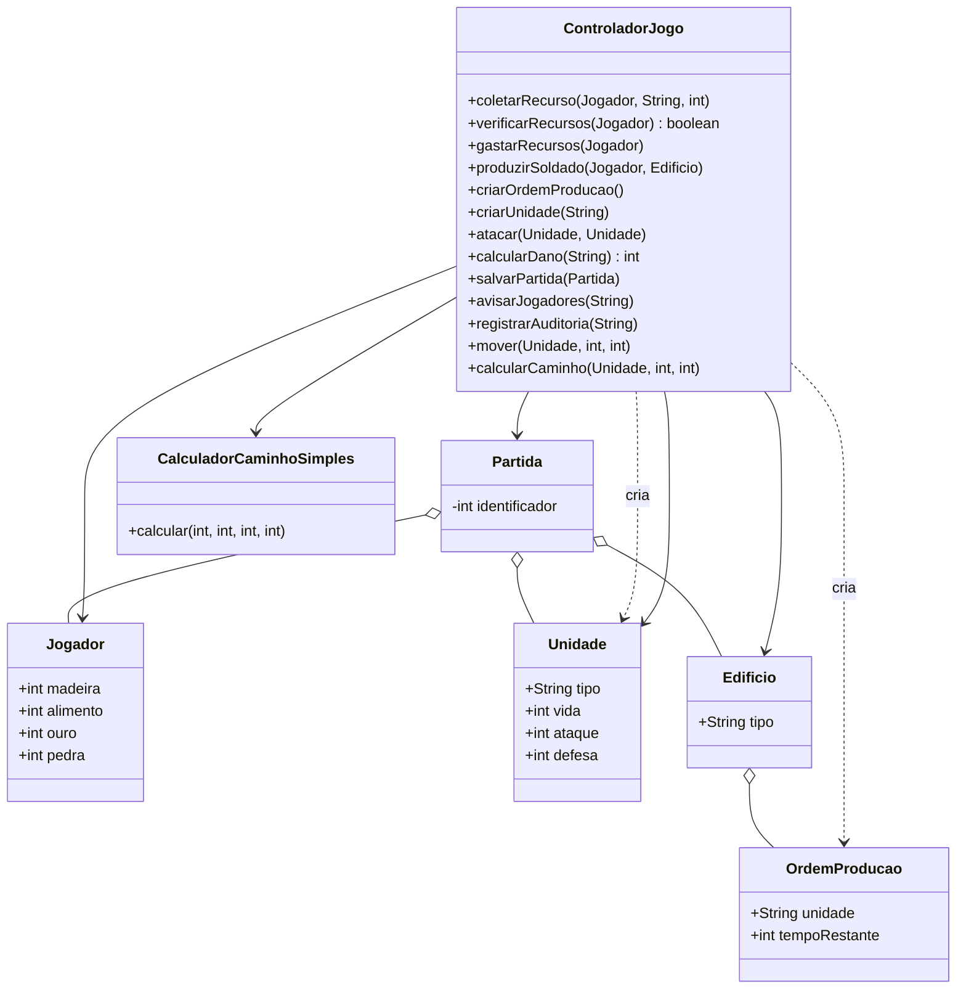
```mermaid
classDiagram
    direction TB

    class ControladorJogo {
        +coletarRecurso(Jogador, String, int)
        +verificarRecursos(Jogador) boolean
        +gastarRecursos(Jogador)
        +produzirSoldado(Jogador, Edificio)
        +criarOrdemProducao()
        +criarUnidade(String)
        +atacar(Unidade, Unidade)
        +calcularDano(String) int
        +salvarPartida(Partida)
        +avisarJogadores(String)
        +registrarAuditoria(String)
        +mover(Unidade, int, int)
        +calcularCaminho(Unidade, int, int)
    }

    class Partida {
        -int identificador
    }

    class Jogador {
        +int madeira
        +int alimento
        +int ouro
        +int pedra
    }

    class Unidade {
        +String tipo
        +int vida
        +int ataque
        +int defesa
    }

    class Edificio {
        +String tipo
    }

    class OrdemProducao {
        +String unidade
        +int tempoRestante
    }

    class CalculadorCaminhoSimples {
        +calcular(int, int, int, int)
    }

    ControladorJogo --> Partida
    ControladorJogo --> Jogador
    ControladorJogo --> Unidade
    ControladorJogo --> Edificio
    ControladorJogo ..> OrdemProducao : cria
    ControladorJogo ..> Unidade : cria
    ControladorJogo --> CalculadorCaminhoSimples
    Partida o-- Jogador
    Partida o-- Unidade
    Partida o-- Edificio
    Edificio o-- OrdemProducao
```

### Pergunta de abertura

> O `ControladorJogo` deveria conhecer e executar todas essas operações?

### Problemas existentes no modelo

- `ControladorJogo` concentra praticamente todas as decisões.
- `Jogador`, `Unidade` e `Edificio` apenas armazenam dados.
- Os atributos do domínio estão públicos.
- O controlador altera diretamente os recursos do jogador.
- O controlador cria objetos que serão mantidos por outras classes.
- O cálculo de dano depende de uma `String` que representa o tipo.
- Armazenamento, notificação e auditoria são executados pelo próprio controlador.
- Existe apenas uma forma concreta de calcular caminhos.
- A classe central possui muitas responsabilidades e dependências.

### Mapa reservado ao professor

| Evidência no UML errado | GRASP relacionado |
|---|---|
| Controlador verifica e gasta recursos | Information Expert |
| Controlador cria ordens e unidades | Creator |
| Um controlador recebe todos os tipos de solicitação | Controller |
| Produção, combate, armazenamento e aviso na mesma classe | High Cohesion |
| Controlador depende de muitas classes | Low Coupling |
| Dano calculado por uma `String` de tipo | Polymorphism |
| Armazenamento, aviso e auditoria dentro do controlador | Pure Fabrication |
| Controlador conhece todos os interessados em um evento | Indirection |
| Forma de calcular caminho fixada no controlador | Protected Variations |

---

## 4. Como conduzir a atividade

Mantenha o UML inicial visível. Para cada padrão GRASP:

1. apresente a definição;
2. localize o problema no UML errado;
3. pergunte quem deveria receber a responsabilidade;
4. compare as propostas dos alunos;
5. apresente o modelo completo corrigido;
6. incorpore a alteração ao modelo da turma;
7. discuta o benefício e o possível custo da mudança.

Cada padrão utiliza três diagramas completos:

1. **Antes:** apresenta o estado atual do modelo, incluindo as correções anteriores.
2. **Erro em vermelho:** repete o modelo e destaca as classes envolvidas no problema.
3. **Correção em azul:** apresenta o novo estado completo e destaca os elementos alterados.

O terceiro diagrama de um padrão torna-se o ponto de partida do padrão seguinte. O modelo consolidado será apresentado ao final.

> **Regra de continuidade:** o UML azul do tópico atual, após a retirada exclusiva das linhas `style`, deve ser idêntico ao primeiro UML do tópico seguinte. Nenhuma classe, atributo, método ou relação pode surgir ou desaparecer entre esses dois diagramas.

> **Importante:** o diagrama azul corrige o problema focal do tópico, mas pode conservar outros problemas do modelo. Esses problemas remanescentes tornam-se o objeto de análise das etapas seguintes.

---

## 5. GRASP 1 — Information Expert

> **Definição:** atribuir uma responsabilidade à classe que possui as informações necessárias para executá-la corretamente.

### Problema no UML inicial

`ControladorJogo` verifica e altera madeira, alimento, ouro e pedra. Entretanto, essas informações pertencem ao `Jogador`.

### Pergunta para a turma

> Quem possui as informações necessárias para verificar e gastar os recursos?

### Decisão

`Jogador` deve proteger seus recursos e executar as operações que dependem dessas informações.

### 1. UML completo antes da análise

```mermaid
classDiagram
    direction TB

    class ControladorJogo {
        +coletarRecurso(Jogador, String, int)
        +verificarRecursos(Jogador) boolean
        +gastarRecursos(Jogador)
        +produzirSoldado(Jogador, Edificio)
        +criarOrdemProducao()
        +criarUnidade(String)
        +atacar(Unidade, Unidade)
        +calcularDano(String) int
        +salvarPartida(Partida)
        +avisarJogadores(String)
        +registrarAuditoria(String)
        +mover(Unidade, int, int)
        +calcularCaminho(Unidade, int, int)
    }

    class Partida {
        -int identificador
    }

    class Jogador {
        +int madeira
        +int alimento
        +int ouro
        +int pedra
    }

    class Unidade {
        +String tipo
        +int vida
        +int ataque
        +int defesa
    }

    class Edificio {
        +String tipo
    }

    class OrdemProducao {
        +String unidade
        +int tempoRestante
    }

    class CalculadorCaminhoSimples {
        +calcular(int, int, int, int)
    }

    ControladorJogo --> Partida
    ControladorJogo --> Jogador
    ControladorJogo --> Unidade
    ControladorJogo --> Edificio
    ControladorJogo ..> OrdemProducao : cria
    ControladorJogo ..> Unidade : cria
    ControladorJogo --> CalculadorCaminhoSimples
    Partida o-- Jogador
    Partida o-- Unidade
    Partida o-- Edificio
    Edificio o-- OrdemProducao
```

### 2. Erro identificado em vermelho

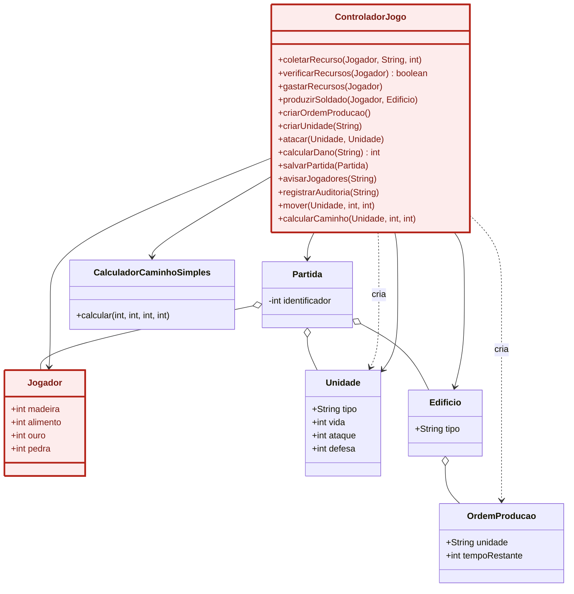
```mermaid
classDiagram
    direction TB

    class ControladorJogo {
        +coletarRecurso(Jogador, String, int)
        +verificarRecursos(Jogador) boolean
        +gastarRecursos(Jogador)
        +produzirSoldado(Jogador, Edificio)
        +criarOrdemProducao()
        +criarUnidade(String)
        +atacar(Unidade, Unidade)
        +calcularDano(String) int
        +salvarPartida(Partida)
        +avisarJogadores(String)
        +registrarAuditoria(String)
        +mover(Unidade, int, int)
        +calcularCaminho(Unidade, int, int)
    }

    class Partida {
        -int identificador
    }

    class Jogador {
        +int madeira
        +int alimento
        +int ouro
        +int pedra
    }

    class Unidade {
        +String tipo
        +int vida
        +int ataque
        +int defesa
    }

    class Edificio {
        +String tipo
    }

    class OrdemProducao {
        +String unidade
        +int tempoRestante
    }

    class CalculadorCaminhoSimples {
        +calcular(int, int, int, int)
    }

    ControladorJogo --> Partida
    ControladorJogo --> Jogador
    ControladorJogo --> Unidade
    ControladorJogo --> Edificio
    ControladorJogo ..> OrdemProducao : cria
    ControladorJogo ..> Unidade : cria
    ControladorJogo --> CalculadorCaminhoSimples
    Partida o-- Jogador
    Partida o-- Unidade
    Partida o-- Edificio
    Edificio o-- OrdemProducao

    style ControladorJogo fill:#FDECEC,stroke:#B42318,color:#7A1A12,stroke-width:3px
    style Jogador fill:#FDECEC,stroke:#B42318,color:#7A1A12,stroke-width:3px
```

Em vermelho: o controlador manipula informações que pertencem ao jogador, e os recursos estão expostos publicamente.

### 3. UML completo após a correção

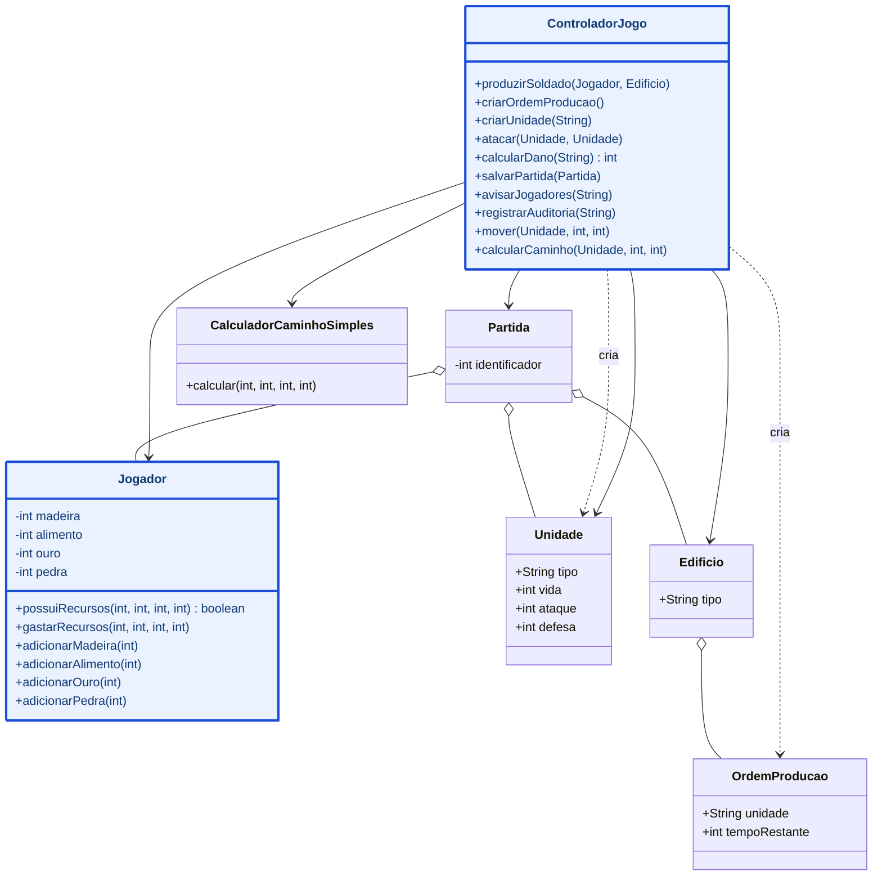
```mermaid
classDiagram
    direction TB

    class ControladorJogo {
        +produzirSoldado(Jogador, Edificio)
        +criarOrdemProducao()
        +criarUnidade(String)
        +atacar(Unidade, Unidade)
        +calcularDano(String) int
        +salvarPartida(Partida)
        +avisarJogadores(String)
        +registrarAuditoria(String)
        +mover(Unidade, int, int)
        +calcularCaminho(Unidade, int, int)
    }

    class Partida {
        -int identificador
    }

    class Jogador {
        -int madeira
        -int alimento
        -int ouro
        -int pedra
        +possuiRecursos(int, int, int, int) boolean
        +gastarRecursos(int, int, int, int)
        +adicionarMadeira(int)
        +adicionarAlimento(int)
        +adicionarOuro(int)
        +adicionarPedra(int)
    }

    class Unidade {
        +String tipo
        +int vida
        +int ataque
        +int defesa
    }

    class Edificio {
        +String tipo
    }

    class OrdemProducao {
        +String unidade
        +int tempoRestante
    }

    class CalculadorCaminhoSimples {
        +calcular(int, int, int, int)
    }

    ControladorJogo --> Partida
    ControladorJogo --> Jogador
    ControladorJogo --> Unidade
    ControladorJogo --> Edificio
    ControladorJogo ..> OrdemProducao : cria
    ControladorJogo ..> Unidade : cria
    ControladorJogo --> CalculadorCaminhoSimples
    Partida o-- Jogador
    Partida o-- Unidade
    Partida o-- Edificio
    Edificio o-- OrdemProducao

    style ControladorJogo fill:#EAF2FF,stroke:#1D4ED8,color:#123A73,stroke-width:3px
    style Jogador fill:#EAF2FF,stroke:#1D4ED8,color:#123A73,stroke-width:3px
```

### O que foi alterado

- Os atributos passaram de públicos para privados.
- `verificarRecursos()` saiu do controlador.
- `gastarRecursos()` saiu do controlador.
- `Jogador` tornou-se responsável por proteger seus próprios dados.

### Ponderação

Information Expert não significa colocar qualquer operação na classe que possui um dado. A responsabilidade deve realmente depender das informações mantidas pela classe.

### Pergunta de verificação

> Calcular o dano de uma espada deveria ficar em `Jogador` apenas porque ele controla a unidade?

**Resposta correta:** não. O jogador não possui as informações específicas necessárias para calcular o ataque da unidade.

---

## 6. GRASP 2 — Creator

> **Definição:** atribuir a uma classe `B` a criação de objetos da classe `A` quando `B` contém, registra, utiliza intensamente ou possui os dados necessários para iniciar `A`.

### Problema no UML inicial

`ControladorJogo` cria `OrdemProducao`, mas a ordem será mantida pelo `Edificio`.

### Pergunta para a turma

> Quem deveria criar uma ordem que ficará dentro de um edifício?

### Decisão

`Edificio` deve criar e manter suas ordens de produção. Ao concluir uma ordem, ele também cria a unidade produzida.

### 1. UML completo antes da análise

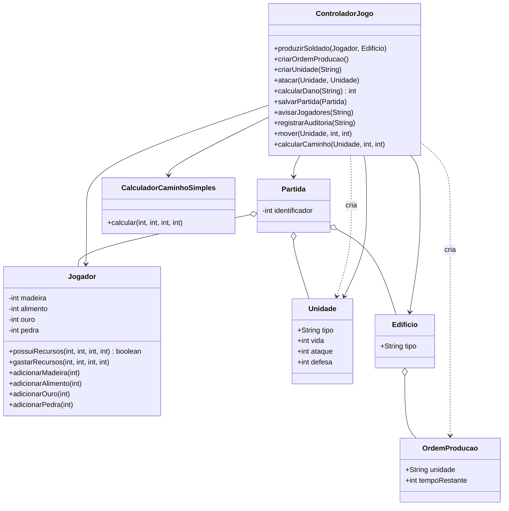
```mermaid
classDiagram
    direction TB

    class ControladorJogo {
        +produzirSoldado(Jogador, Edificio)
        +criarOrdemProducao()
        +criarUnidade(String)
        +atacar(Unidade, Unidade)
        +calcularDano(String) int
        +salvarPartida(Partida)
        +avisarJogadores(String)
        +registrarAuditoria(String)
        +mover(Unidade, int, int)
        +calcularCaminho(Unidade, int, int)
    }

    class Partida {
        -int identificador
    }

    class Jogador {
        -int madeira
        -int alimento
        -int ouro
        -int pedra
        +possuiRecursos(int, int, int, int) boolean
        +gastarRecursos(int, int, int, int)
        +adicionarMadeira(int)
        +adicionarAlimento(int)
        +adicionarOuro(int)
        +adicionarPedra(int)
    }

    class Unidade {
        +String tipo
        +int vida
        +int ataque
        +int defesa
    }

    class Edificio {
        +String tipo
    }

    class OrdemProducao {
        +String unidade
        +int tempoRestante
    }

    class CalculadorCaminhoSimples {
        +calcular(int, int, int, int)
    }

    ControladorJogo --> Partida
    ControladorJogo --> Jogador
    ControladorJogo --> Unidade
    ControladorJogo --> Edificio
    ControladorJogo ..> OrdemProducao : cria
    ControladorJogo ..> Unidade : cria
    ControladorJogo --> CalculadorCaminhoSimples
    Partida o-- Jogador
    Partida o-- Unidade
    Partida o-- Edificio
    Edificio o-- OrdemProducao
```

### 2. Erro identificado em vermelho

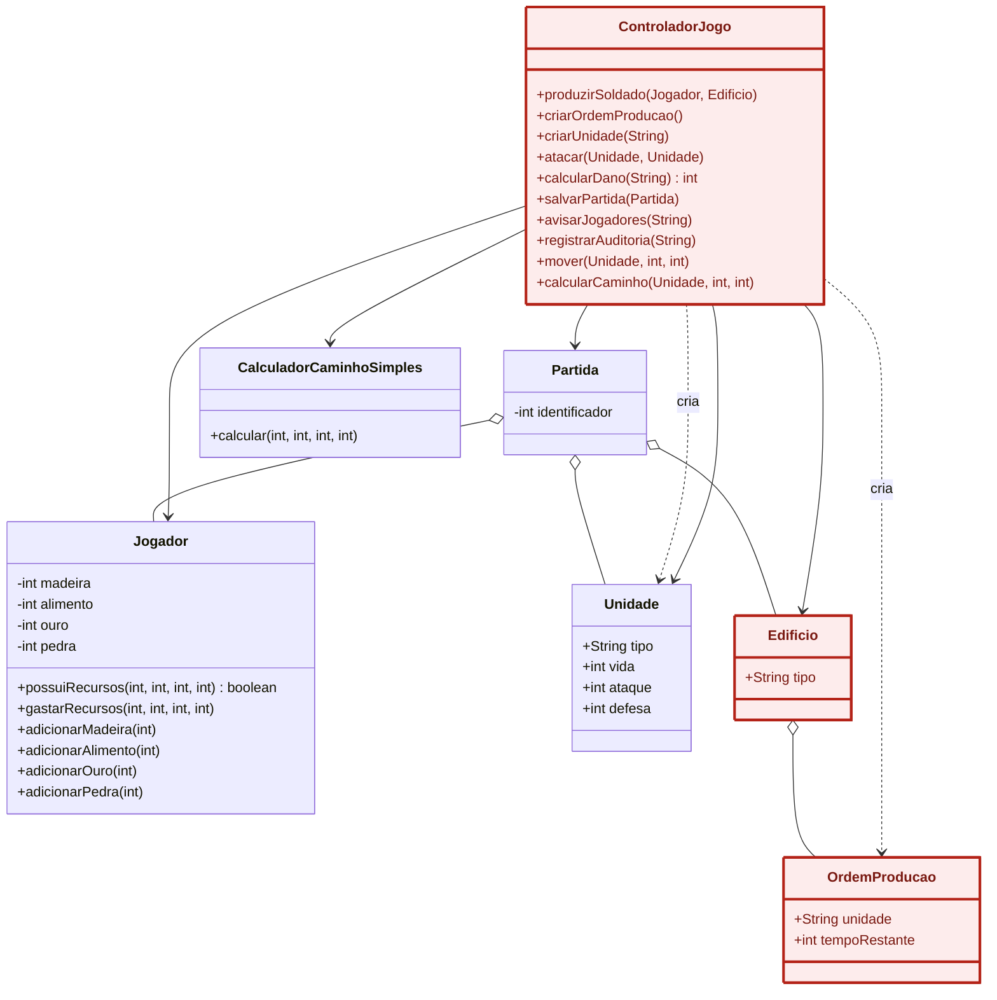
```mermaid
classDiagram
    direction TB

    class ControladorJogo {
        +produzirSoldado(Jogador, Edificio)
        +criarOrdemProducao()
        +criarUnidade(String)
        +atacar(Unidade, Unidade)
        +calcularDano(String) int
        +salvarPartida(Partida)
        +avisarJogadores(String)
        +registrarAuditoria(String)
        +mover(Unidade, int, int)
        +calcularCaminho(Unidade, int, int)
    }

    class Partida {
        -int identificador
    }

    class Jogador {
        -int madeira
        -int alimento
        -int ouro
        -int pedra
        +possuiRecursos(int, int, int, int) boolean
        +gastarRecursos(int, int, int, int)
        +adicionarMadeira(int)
        +adicionarAlimento(int)
        +adicionarOuro(int)
        +adicionarPedra(int)
    }

    class Unidade {
        +String tipo
        +int vida
        +int ataque
        +int defesa
    }

    class Edificio {
        +String tipo
    }

    class OrdemProducao {
        +String unidade
        +int tempoRestante
    }

    class CalculadorCaminhoSimples {
        +calcular(int, int, int, int)
    }

    ControladorJogo --> Partida
    ControladorJogo --> Jogador
    ControladorJogo --> Unidade
    ControladorJogo --> Edificio
    ControladorJogo ..> OrdemProducao : cria
    ControladorJogo ..> Unidade : cria
    ControladorJogo --> CalculadorCaminhoSimples
    Partida o-- Jogador
    Partida o-- Unidade
    Partida o-- Edificio
    Edificio o-- OrdemProducao

    style ControladorJogo fill:#FDECEC,stroke:#B42318,color:#7A1A12,stroke-width:3px
    style Edificio fill:#FDECEC,stroke:#B42318,color:#7A1A12,stroke-width:3px
    style OrdemProducao fill:#FDECEC,stroke:#B42318,color:#7A1A12,stroke-width:3px
```

Em vermelho: o controlador cria objetos que serão mantidos pelo edifício.

### 3. UML completo após a correção

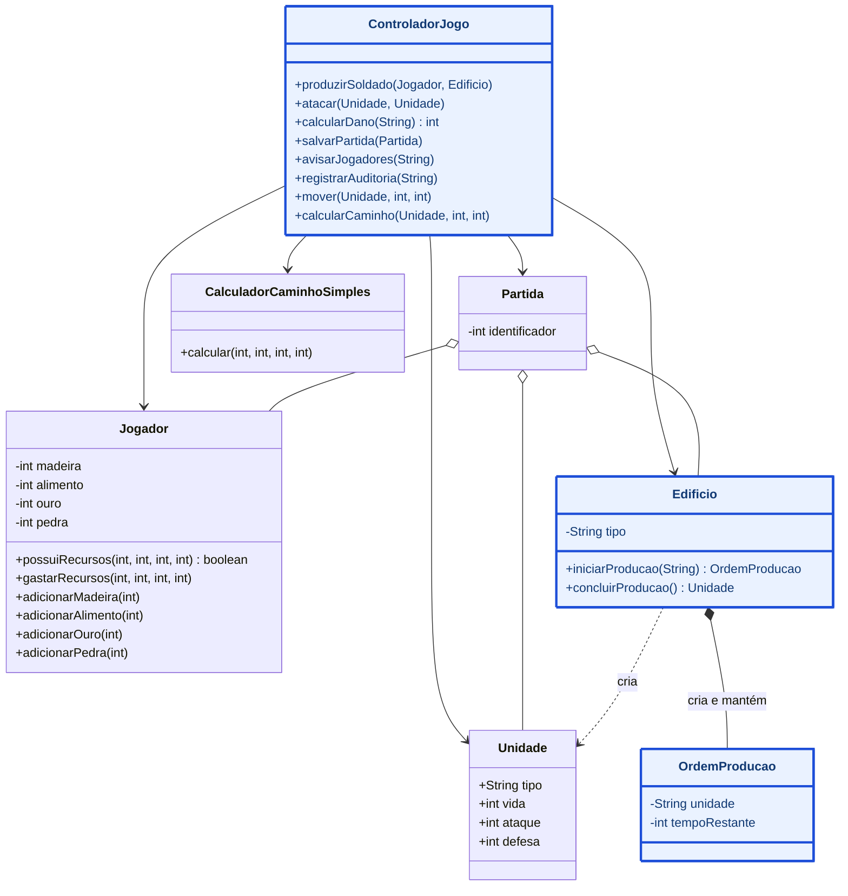
```mermaid
classDiagram
    direction TB

    class ControladorJogo {
        +produzirSoldado(Jogador, Edificio)
        +atacar(Unidade, Unidade)
        +calcularDano(String) int
        +salvarPartida(Partida)
        +avisarJogadores(String)
        +registrarAuditoria(String)
        +mover(Unidade, int, int)
        +calcularCaminho(Unidade, int, int)
    }

    class Partida {
        -int identificador
    }

    class Jogador {
        -int madeira
        -int alimento
        -int ouro
        -int pedra
        +possuiRecursos(int, int, int, int) boolean
        +gastarRecursos(int, int, int, int)
        +adicionarMadeira(int)
        +adicionarAlimento(int)
        +adicionarOuro(int)
        +adicionarPedra(int)
    }

    class Unidade {
        +String tipo
        +int vida
        +int ataque
        +int defesa
    }

    class Edificio {
        -String tipo
        +iniciarProducao(String) OrdemProducao
        +concluirProducao() Unidade
    }

    class OrdemProducao {
        -String unidade
        -int tempoRestante
    }

    class CalculadorCaminhoSimples {
        +calcular(int, int, int, int)
    }

    ControladorJogo --> Partida
    ControladorJogo --> Jogador
    ControladorJogo --> Unidade
    ControladorJogo --> Edificio
    ControladorJogo --> CalculadorCaminhoSimples
    Partida o-- Jogador
    Partida o-- Unidade
    Partida o-- Edificio
    Edificio *-- OrdemProducao : cria e mantém
    Edificio ..> Unidade : cria

    style ControladorJogo fill:#EAF2FF,stroke:#1D4ED8,color:#123A73,stroke-width:3px
    style Edificio fill:#EAF2FF,stroke:#1D4ED8,color:#123A73,stroke-width:3px
    style OrdemProducao fill:#EAF2FF,stroke:#1D4ED8,color:#123A73,stroke-width:3px
```

### O que foi alterado

- `criarOrdemProducao()` saiu do controlador.
- `Edificio` recebeu `iniciarProducao()`.
- A composição indica que a ordem pertence ao edifício.

### Ponderação

Creator não significa que qualquer classe possa criar qualquer objeto. A escolha considera a relação existente entre o criador e o objeto criado.

### Pergunta de verificação

> `Jogador` também poderia criar a ordem? Qual opção exige menos conhecimento sobre a estrutura interna do edifício?

**Resposta correta:** embora o jogador solicite a produção, `Edificio` é o criador mais adequado porque mantém a ordem e conhece sua própria produção. Essa escolha exige menos conhecimento externo sobre a estrutura do edifício.

---

## 7. GRASP 3 — Controller

> **Definição:** atribuir o tratamento de uma solicitação do sistema a um objeto que represente o sistema, uma sessão ou um caso de uso.

Controller, neste padrão, é o objeto que coordena uma solicitação. Ele não deve executar todas as regras do jogo.

### Problema no UML inicial

`ControladorJogo` recebe coleta, produção, ataque, armazenamento, aviso e auditoria.

### Pergunta para a turma

> Um único controlador deveria coordenar todos os casos de uso do jogo?

### Decisão

Criar controladores mais específicos para os principais casos de uso.

### 1. UML completo antes da análise

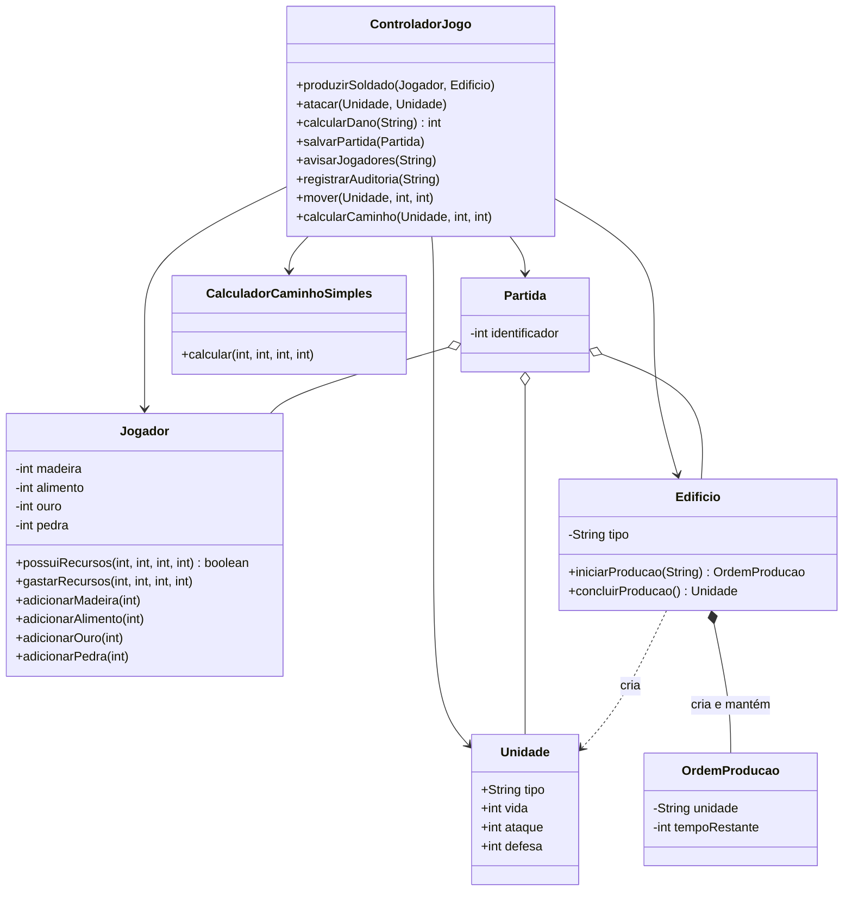
```mermaid
classDiagram
    direction TB

    class ControladorJogo {
        +produzirSoldado(Jogador, Edificio)
        +atacar(Unidade, Unidade)
        +calcularDano(String) int
        +salvarPartida(Partida)
        +avisarJogadores(String)
        +registrarAuditoria(String)
        +mover(Unidade, int, int)
        +calcularCaminho(Unidade, int, int)
    }

    class Partida {
        -int identificador
    }

    class Jogador {
        -int madeira
        -int alimento
        -int ouro
        -int pedra
        +possuiRecursos(int, int, int, int) boolean
        +gastarRecursos(int, int, int, int)
        +adicionarMadeira(int)
        +adicionarAlimento(int)
        +adicionarOuro(int)
        +adicionarPedra(int)
    }

    class Unidade {
        +String tipo
        +int vida
        +int ataque
        +int defesa
    }

    class Edificio {
        -String tipo
        +iniciarProducao(String) OrdemProducao
        +concluirProducao() Unidade
    }

    class OrdemProducao {
        -String unidade
        -int tempoRestante
    }

    class CalculadorCaminhoSimples {
        +calcular(int, int, int, int)
    }

    ControladorJogo --> Partida
    ControladorJogo --> Jogador
    ControladorJogo --> Unidade
    ControladorJogo --> Edificio
    ControladorJogo --> CalculadorCaminhoSimples
    Partida o-- Jogador
    Partida o-- Unidade
    Partida o-- Edificio
    Edificio *-- OrdemProducao : cria e mantém
    Edificio ..> Unidade : cria
```

### 2. Erro identificado em vermelho

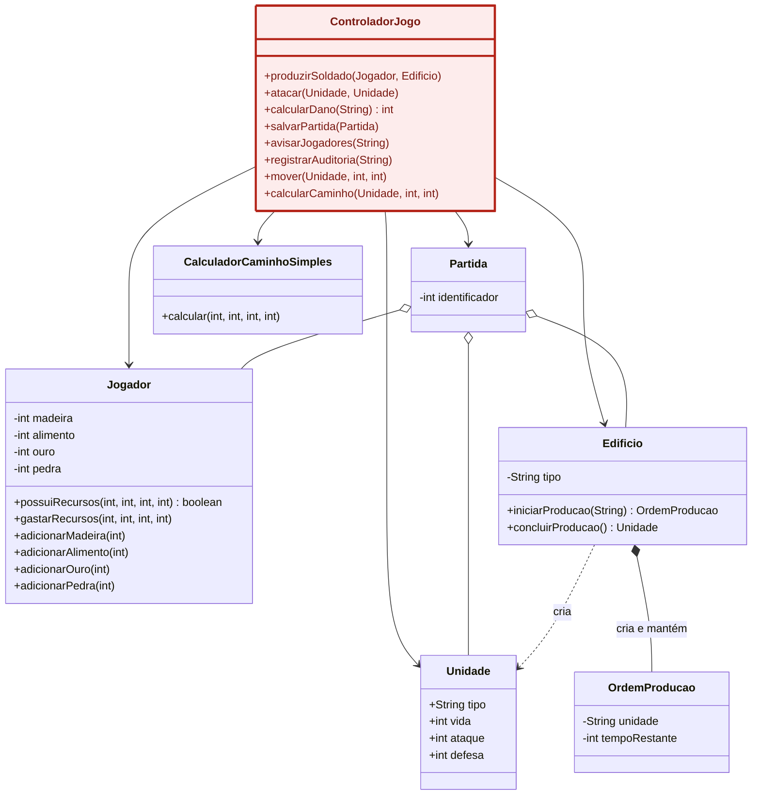
```mermaid
classDiagram
    direction TB

    class ControladorJogo {
        +produzirSoldado(Jogador, Edificio)
        +atacar(Unidade, Unidade)
        +calcularDano(String) int
        +salvarPartida(Partida)
        +avisarJogadores(String)
        +registrarAuditoria(String)
        +mover(Unidade, int, int)
        +calcularCaminho(Unidade, int, int)
    }

    class Partida {
        -int identificador
    }

    class Jogador {
        -int madeira
        -int alimento
        -int ouro
        -int pedra
        +possuiRecursos(int, int, int, int) boolean
        +gastarRecursos(int, int, int, int)
        +adicionarMadeira(int)
        +adicionarAlimento(int)
        +adicionarOuro(int)
        +adicionarPedra(int)
    }

    class Unidade {
        +String tipo
        +int vida
        +int ataque
        +int defesa
    }

    class Edificio {
        -String tipo
        +iniciarProducao(String) OrdemProducao
        +concluirProducao() Unidade
    }

    class OrdemProducao {
        -String unidade
        -int tempoRestante
    }

    class CalculadorCaminhoSimples {
        +calcular(int, int, int, int)
    }

    ControladorJogo --> Partida
    ControladorJogo --> Jogador
    ControladorJogo --> Unidade
    ControladorJogo --> Edificio
    ControladorJogo --> CalculadorCaminhoSimples
    Partida o-- Jogador
    Partida o-- Unidade
    Partida o-- Edificio
    Edificio *-- OrdemProducao : cria e mantém
    Edificio ..> Unidade : cria

    style ControladorJogo fill:#FDECEC,stroke:#B42318,color:#7A1A12,stroke-width:3px
```

Em vermelho: um único controlador coordena coleta, produção, ataque, movimento e ações de apoio.

### 3. UML completo após a correção

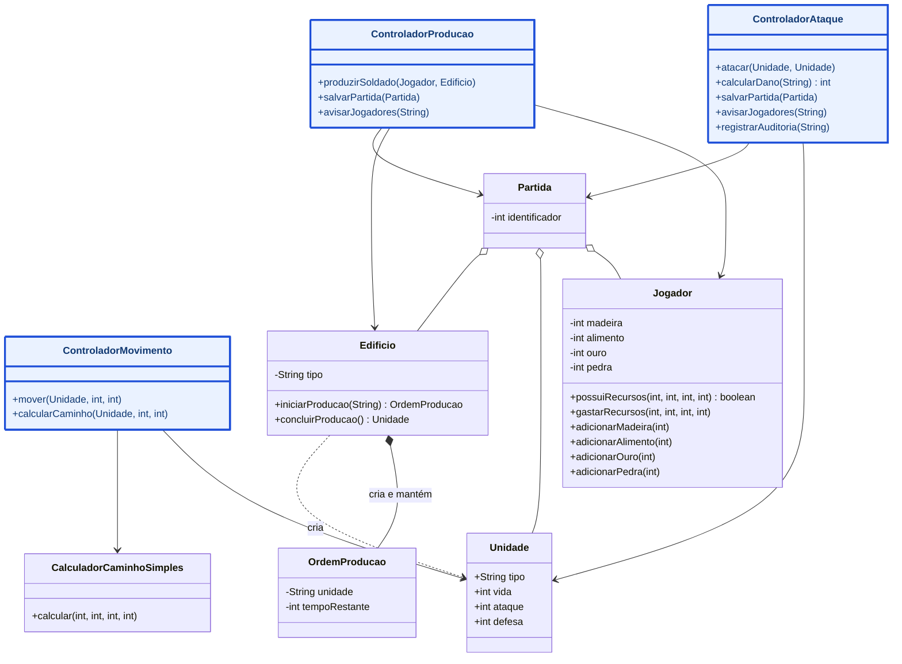
```mermaid
classDiagram
    direction TB

    class ControladorProducao {
        +produzirSoldado(Jogador, Edificio)
        +salvarPartida(Partida)
        +avisarJogadores(String)
    }

    class ControladorAtaque {
        +atacar(Unidade, Unidade)
        +calcularDano(String) int
        +salvarPartida(Partida)
        +avisarJogadores(String)
        +registrarAuditoria(String)
    }

    class ControladorMovimento {
        +mover(Unidade, int, int)
        +calcularCaminho(Unidade, int, int)
    }

    class Partida {
        -int identificador
    }

    class Jogador {
        -int madeira
        -int alimento
        -int ouro
        -int pedra
        +possuiRecursos(int, int, int, int) boolean
        +gastarRecursos(int, int, int, int)
        +adicionarMadeira(int)
        +adicionarAlimento(int)
        +adicionarOuro(int)
        +adicionarPedra(int)
    }

    class Unidade {
        +String tipo
        +int vida
        +int ataque
        +int defesa
    }

    class Edificio {
        -String tipo
        +iniciarProducao(String) OrdemProducao
        +concluirProducao() Unidade
    }

    class OrdemProducao {
        -String unidade
        -int tempoRestante
    }

    class CalculadorCaminhoSimples {
        +calcular(int, int, int, int)
    }

    ControladorProducao --> Jogador
    ControladorProducao --> Edificio
    ControladorProducao --> Partida
    ControladorAtaque --> Unidade
    ControladorAtaque --> Partida
    ControladorMovimento --> Unidade
    ControladorMovimento --> CalculadorCaminhoSimples
    Partida o-- Jogador
    Partida o-- Unidade
    Partida o-- Edificio
    Edificio *-- OrdemProducao : cria e mantém
    Edificio ..> Unidade : cria

    style ControladorProducao fill:#EAF2FF,stroke:#1D4ED8,color:#123A73,stroke-width:3px
    style ControladorAtaque fill:#EAF2FF,stroke:#1D4ED8,color:#123A73,stroke-width:3px
    style ControladorMovimento fill:#EAF2FF,stroke:#1D4ED8,color:#123A73,stroke-width:3px
```

### O que foi alterado

- `ControladorJogo` foi dividido por caso de uso.
- O controlador coordena a operação.
- As regras continuam nos objetos que possuem as informações.

### Ponderação

Dividir um controlador não significa criar uma classe para cada pequeno método. A divisão deve acompanhar casos de uso compreensíveis.

### Pergunta de verificação

> `ControladorProducao` deve diminuir diretamente a madeira do jogador ou solicitar que o próprio jogador gaste os recursos?

**Resposta correta:** deve solicitar que o próprio `Jogador` gaste os recursos, pois ele possui as informações e protege essa regra.

---

## 8. GRASP 4 — High Cohesion

> **Definição:** distribuir responsabilidades de modo que cada classe permaneça concentrada em tarefas relacionadas e voltadas a um propósito claro.

### Problema no UML inicial

`ControladorAtaque` ainda mistura coordenação do ataque, cálculo do dano, armazenamento, notificação e auditoria.

### Pergunta para a turma

> Todas essas operações pertencem ao mesmo propósito?

### Decisão

Manter cada classe concentrada em uma finalidade.

### 1. UML completo antes da análise

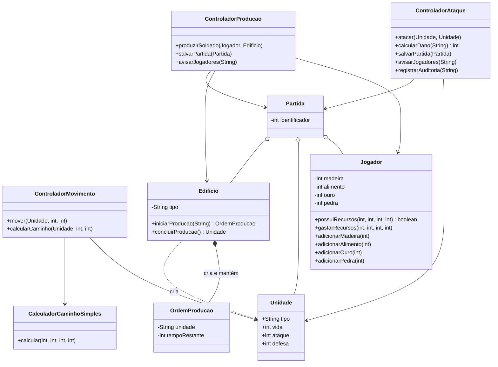
```mermaid
classDiagram
    direction TB

    class ControladorProducao {
        +produzirSoldado(Jogador, Edificio)
        +salvarPartida(Partida)
        +avisarJogadores(String)
    }

    class ControladorAtaque {
        +atacar(Unidade, Unidade)
        +calcularDano(String) int
        +salvarPartida(Partida)
        +avisarJogadores(String)
        +registrarAuditoria(String)
    }

    class ControladorMovimento {
        +mover(Unidade, int, int)
        +calcularCaminho(Unidade, int, int)
    }

    class Partida {
        -int identificador
    }

    class Jogador {
        -int madeira
        -int alimento
        -int ouro
        -int pedra
        +possuiRecursos(int, int, int, int) boolean
        +gastarRecursos(int, int, int, int)
        +adicionarMadeira(int)
        +adicionarAlimento(int)
        +adicionarOuro(int)
        +adicionarPedra(int)
    }

    class Unidade {
        +String tipo
        +int vida
        +int ataque
        +int defesa
    }

    class Edificio {
        -String tipo
        +iniciarProducao(String) OrdemProducao
        +concluirProducao() Unidade
    }

    class OrdemProducao {
        -String unidade
        -int tempoRestante
    }

    class CalculadorCaminhoSimples {
        +calcular(int, int, int, int)
    }

    ControladorProducao --> Jogador
    ControladorProducao --> Edificio
    ControladorProducao --> Partida
    ControladorAtaque --> Unidade
    ControladorAtaque --> Partida
    ControladorMovimento --> Unidade
    ControladorMovimento --> CalculadorCaminhoSimples
    Partida o-- Jogador
    Partida o-- Unidade
    Partida o-- Edificio
    Edificio *-- OrdemProducao : cria e mantém
    Edificio ..> Unidade : cria
```

### 2. Erro identificado em vermelho

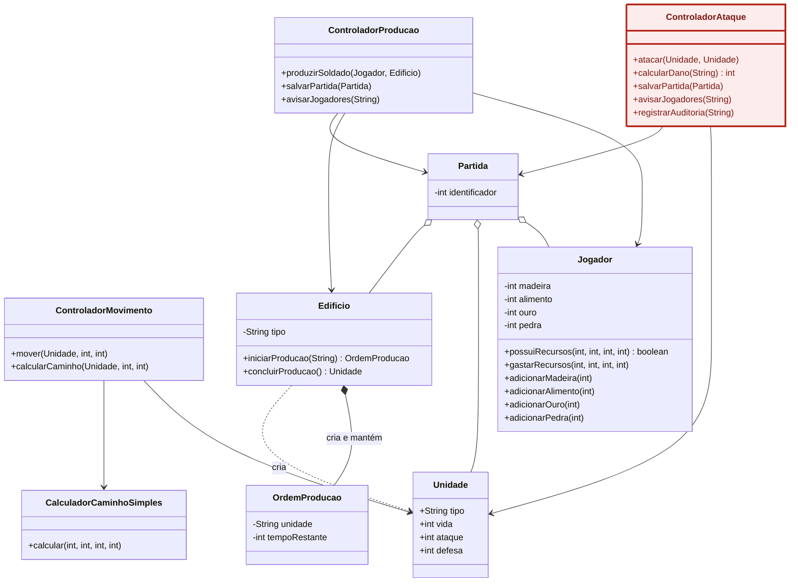
```mermaid
classDiagram
    direction TB

    class ControladorProducao {
        +produzirSoldado(Jogador, Edificio)
        +salvarPartida(Partida)
        +avisarJogadores(String)
    }

    class ControladorAtaque {
        +atacar(Unidade, Unidade)
        +calcularDano(String) int
        +salvarPartida(Partida)
        +avisarJogadores(String)
        +registrarAuditoria(String)
    }

    class ControladorMovimento {
        +mover(Unidade, int, int)
        +calcularCaminho(Unidade, int, int)
    }

    class Partida {
        -int identificador
    }

    class Jogador {
        -int madeira
        -int alimento
        -int ouro
        -int pedra
        +possuiRecursos(int, int, int, int) boolean
        +gastarRecursos(int, int, int, int)
        +adicionarMadeira(int)
        +adicionarAlimento(int)
        +adicionarOuro(int)
        +adicionarPedra(int)
    }

    class Unidade {
        +String tipo
        +int vida
        +int ataque
        +int defesa
    }

    class Edificio {
        -String tipo
        +iniciarProducao(String) OrdemProducao
        +concluirProducao() Unidade
    }

    class OrdemProducao {
        -String unidade
        -int tempoRestante
    }

    class CalculadorCaminhoSimples {
        +calcular(int, int, int, int)
    }

    ControladorProducao --> Jogador
    ControladorProducao --> Edificio
    ControladorProducao --> Partida
    ControladorAtaque --> Unidade
    ControladorAtaque --> Partida
    ControladorMovimento --> Unidade
    ControladorMovimento --> CalculadorCaminhoSimples
    Partida o-- Jogador
    Partida o-- Unidade
    Partida o-- Edificio
    Edificio *-- OrdemProducao : cria e mantém
    Edificio ..> Unidade : cria

    style ControladorAtaque fill:#FDECEC,stroke:#B42318,color:#7A1A12,stroke-width:3px
```

Em vermelho: `ControladorAtaque` mistura coordenação, cálculo de dano, armazenamento, aviso e auditoria.

### 3. UML completo após a correção

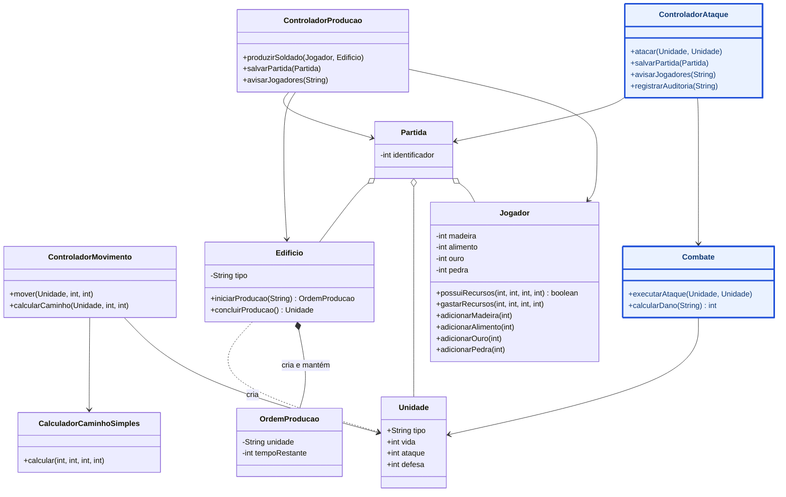
```mermaid
classDiagram
    direction TB

    class ControladorProducao {
        +produzirSoldado(Jogador, Edificio)
        +salvarPartida(Partida)
        +avisarJogadores(String)
    }

    class ControladorAtaque {
        +atacar(Unidade, Unidade)
        +salvarPartida(Partida)
        +avisarJogadores(String)
        +registrarAuditoria(String)
    }

    class ControladorMovimento {
        +mover(Unidade, int, int)
        +calcularCaminho(Unidade, int, int)
    }

    class Combate {
        +executarAtaque(Unidade, Unidade)
        +calcularDano(String) int
    }

    class Partida {
        -int identificador
    }

    class Jogador {
        -int madeira
        -int alimento
        -int ouro
        -int pedra
        +possuiRecursos(int, int, int, int) boolean
        +gastarRecursos(int, int, int, int)
        +adicionarMadeira(int)
        +adicionarAlimento(int)
        +adicionarOuro(int)
        +adicionarPedra(int)
    }

    class Unidade {
        +String tipo
        +int vida
        +int ataque
        +int defesa
    }

    class Edificio {
        -String tipo
        +iniciarProducao(String) OrdemProducao
        +concluirProducao() Unidade
    }

    class OrdemProducao {
        -String unidade
        -int tempoRestante
    }

    class CalculadorCaminhoSimples {
        +calcular(int, int, int, int)
    }

    ControladorProducao --> Jogador
    ControladorProducao --> Edificio
    ControladorProducao --> Partida
    ControladorAtaque --> Combate
    ControladorAtaque --> Partida
    ControladorMovimento --> Unidade
    ControladorMovimento --> CalculadorCaminhoSimples
    Combate --> Unidade
    Partida o-- Jogador
    Partida o-- Unidade
    Partida o-- Edificio
    Edificio *-- OrdemProducao : cria e mantém
    Edificio ..> Unidade : cria

    style ControladorAtaque fill:#EAF2FF,stroke:#1D4ED8,color:#123A73,stroke-width:3px
    style Combate fill:#EAF2FF,stroke:#1D4ED8,color:#123A73,stroke-width:3px
```

### O que foi alterado

- Produção e ataque possuem controladores próprios.
- A regra de combate ficou concentrada em `Combate`.
- A regra de combate passou para uma classe com finalidade específica.

### Ponderação

Alta coesão não significa criar uma classe para cada linha ou método. Classes excessivamente fragmentadas também dificultam a compreensão.

### Pergunta de verificação

> Os métodos `executarAtaque()` e `calcularDano()` possuem uma finalidade relacionada?

**Resposta correta:** sim. Ambos pertencem à resolução de um combate e podem permanecer em `Combate` sem reduzir sua coesão.

---

## 9. GRASP 5 — Low Coupling

> **Definição:** distribuir responsabilidades de modo a reduzir dependências desnecessárias entre as classes e limitar o impacto das mudanças.

### Problema no UML inicial

Mesmo após a divisão por casos de uso, os controladores ainda acumulam operações de apoio e dependem de `Partida` para atividades que não fazem parte de sua finalidade principal.

### Pergunta para a turma

> De quantos objetos um controlador realmente precisa para coordenar a produção de uma unidade?

### Decisão

Cada controlador deve manter somente as operações e os colaboradores necessários ao seu caso de uso. Nesta etapa intermediária, as operações de apoio serão concentradas em `Partida` e reavaliadas posteriormente.

### 1. UML completo antes da análise

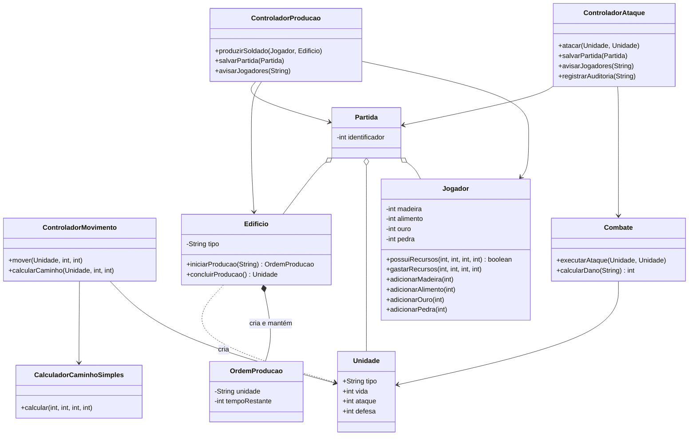
```mermaid
classDiagram
    direction TB

    class ControladorProducao {
        +produzirSoldado(Jogador, Edificio)
        +salvarPartida(Partida)
        +avisarJogadores(String)
    }

    class ControladorAtaque {
        +atacar(Unidade, Unidade)
        +salvarPartida(Partida)
        +avisarJogadores(String)
        +registrarAuditoria(String)
    }

    class ControladorMovimento {
        +mover(Unidade, int, int)
        +calcularCaminho(Unidade, int, int)
    }

    class Combate {
        +executarAtaque(Unidade, Unidade)
        +calcularDano(String) int
    }

    class Partida {
        -int identificador
    }

    class Jogador {
        -int madeira
        -int alimento
        -int ouro
        -int pedra
        +possuiRecursos(int, int, int, int) boolean
        +gastarRecursos(int, int, int, int)
        +adicionarMadeira(int)
        +adicionarAlimento(int)
        +adicionarOuro(int)
        +adicionarPedra(int)
    }

    class Unidade {
        +String tipo
        +int vida
        +int ataque
        +int defesa
    }

    class Edificio {
        -String tipo
        +iniciarProducao(String) OrdemProducao
        +concluirProducao() Unidade
    }

    class OrdemProducao {
        -String unidade
        -int tempoRestante
    }

    class CalculadorCaminhoSimples {
        +calcular(int, int, int, int)
    }

    ControladorProducao --> Jogador
    ControladorProducao --> Edificio
    ControladorProducao --> Partida
    ControladorAtaque --> Combate
    ControladorAtaque --> Partida
    ControladorMovimento --> Unidade
    ControladorMovimento --> CalculadorCaminhoSimples
    Combate --> Unidade
    Partida o-- Jogador
    Partida o-- Unidade
    Partida o-- Edificio
    Edificio *-- OrdemProducao : cria e mantém
    Edificio ..> Unidade : cria
```

### 2. Erro identificado em vermelho

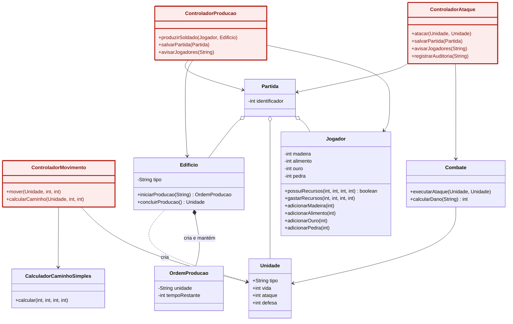
```mermaid
classDiagram
    direction TB

    class ControladorProducao {
        +produzirSoldado(Jogador, Edificio)
        +salvarPartida(Partida)
        +avisarJogadores(String)
    }

    class ControladorAtaque {
        +atacar(Unidade, Unidade)
        +salvarPartida(Partida)
        +avisarJogadores(String)
        +registrarAuditoria(String)
    }

    class ControladorMovimento {
        +mover(Unidade, int, int)
        +calcularCaminho(Unidade, int, int)
    }

    class Combate {
        +executarAtaque(Unidade, Unidade)
        +calcularDano(String) int
    }

    class Partida {
        -int identificador
    }

    class Jogador {
        -int madeira
        -int alimento
        -int ouro
        -int pedra
        +possuiRecursos(int, int, int, int) boolean
        +gastarRecursos(int, int, int, int)
        +adicionarMadeira(int)
        +adicionarAlimento(int)
        +adicionarOuro(int)
        +adicionarPedra(int)
    }

    class Unidade {
        +String tipo
        +int vida
        +int ataque
        +int defesa
    }

    class Edificio {
        -String tipo
        +iniciarProducao(String) OrdemProducao
        +concluirProducao() Unidade
    }

    class OrdemProducao {
        -String unidade
        -int tempoRestante
    }

    class CalculadorCaminhoSimples {
        +calcular(int, int, int, int)
    }

    ControladorProducao --> Jogador
    ControladorProducao --> Edificio
    ControladorProducao --> Partida
    ControladorAtaque --> Combate
    ControladorAtaque --> Partida
    ControladorMovimento --> Unidade
    ControladorMovimento --> CalculadorCaminhoSimples
    Combate --> Unidade
    Partida o-- Jogador
    Partida o-- Unidade
    Partida o-- Edificio
    Edificio *-- OrdemProducao : cria e mantém
    Edificio ..> Unidade : cria

    style ControladorProducao fill:#FDECEC,stroke:#B42318,color:#7A1A12,stroke-width:3px
    style ControladorAtaque fill:#FDECEC,stroke:#B42318,color:#7A1A12,stroke-width:3px
    style ControladorMovimento fill:#FDECEC,stroke:#B42318,color:#7A1A12,stroke-width:3px
```

Em vermelho: os controladores ainda conhecem objetos que não são necessários para sua finalidade principal.

### 3. UML completo após a correção

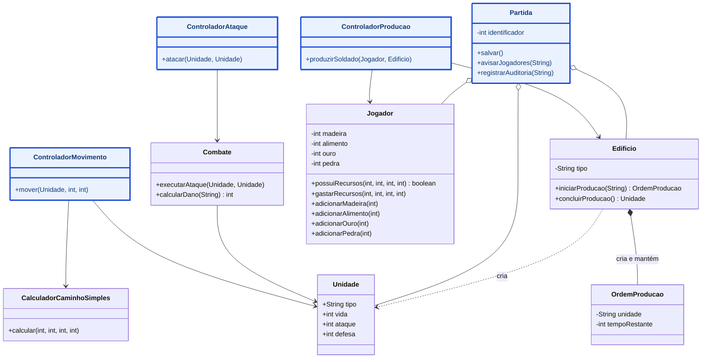
```mermaid
classDiagram
    direction TB

    class ControladorProducao {
        +produzirSoldado(Jogador, Edificio)
    }

    class ControladorAtaque {
        +atacar(Unidade, Unidade)
    }

    class ControladorMovimento {
        +mover(Unidade, int, int)
    }

    class Combate {
        +executarAtaque(Unidade, Unidade)
        +calcularDano(String) int
    }

    class Partida {
        -int identificador
        +salvar()
        +avisarJogadores(String)
        +registrarAuditoria(String)
    }

    class Jogador {
        -int madeira
        -int alimento
        -int ouro
        -int pedra
        +possuiRecursos(int, int, int, int) boolean
        +gastarRecursos(int, int, int, int)
        +adicionarMadeira(int)
        +adicionarAlimento(int)
        +adicionarOuro(int)
        +adicionarPedra(int)
    }

    class Unidade {
        +String tipo
        +int vida
        +int ataque
        +int defesa
    }

    class Edificio {
        -String tipo
        +iniciarProducao(String) OrdemProducao
        +concluirProducao() Unidade
    }

    class OrdemProducao {
        -String unidade
        -int tempoRestante
    }

    class CalculadorCaminhoSimples {
        +calcular(int, int, int, int)
    }

    ControladorProducao --> Jogador
    ControladorProducao --> Edificio
    ControladorAtaque --> Combate
    ControladorMovimento --> Unidade
    ControladorMovimento --> CalculadorCaminhoSimples
    Combate --> Unidade
    Partida o-- Jogador
    Partida o-- Unidade
    Partida o-- Edificio
    Edificio *-- OrdemProducao : cria e mantém
    Edificio ..> Unidade : cria

    style ControladorProducao fill:#EAF2FF,stroke:#1D4ED8,color:#123A73,stroke-width:3px
    style ControladorAtaque fill:#EAF2FF,stroke:#1D4ED8,color:#123A73,stroke-width:3px
    style ControladorMovimento fill:#EAF2FF,stroke:#1D4ED8,color:#123A73,stroke-width:3px
    style Partida fill:#EAF2FF,stroke:#1D4ED8,color:#123A73,stroke-width:3px
```

### O que foi alterado

- As operações de armazenamento, aviso e auditoria saíram dos controladores.
- Cada controlador permaneceu ligado apenas aos colaboradores do seu caso de uso.
- Como decisão intermediária, as operações de apoio foram colocadas em `Partida`.
- Essa concentração reduz dependências nos controladores, mas cria uma nova questão de coesão que será analisada em Pure Fabrication.

### Ponderação

Baixo acoplamento não significa eliminar toda colaboração. Objetos precisam colaborar; o objetivo é evitar conhecimento desnecessário.

### Pergunta de verificação

> Se a regra de combate mudar, `ControladorProducao` deverá ser alterado?

**Resposta correta:** não. `ControladorProducao` não depende de `Combate` nem conhece regras de ataque.

---

## 10. GRASP 6 — Polymorphism

> **Definição:** quando um comportamento varia conforme o tipo, atribuir essa variação a operações polimórficas dos próprios tipos, evitando decisões condicionais centralizadas.

### Problema no UML inicial

`Combate.calcularDano(String)` recebe o nome do tipo da unidade. Isso sugere comparações como “se for espadachim”, “se for arqueiro” e “se for catapulta”.

### Pergunta para a turma

> Cada unidade poderia conhecer seu próprio dano?

### Decisão

Criar uma operação comum em `Unidade` e permitir que cada subtipo forneça seu comportamento.

### 1. UML completo antes da análise

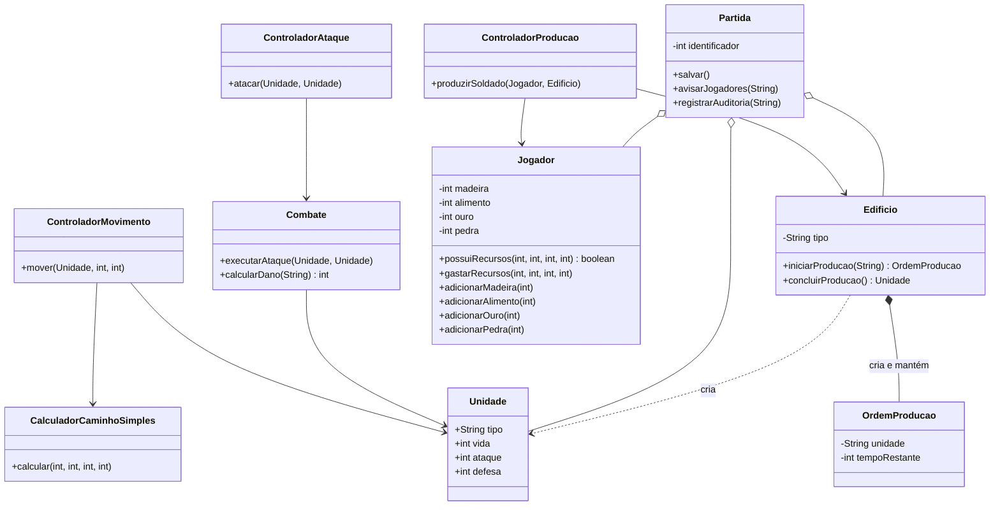
```mermaid
classDiagram
    direction TB

    class ControladorProducao {
        +produzirSoldado(Jogador, Edificio)
    }

    class ControladorAtaque {
        +atacar(Unidade, Unidade)
    }

    class ControladorMovimento {
        +mover(Unidade, int, int)
    }

    class Combate {
        +executarAtaque(Unidade, Unidade)
        +calcularDano(String) int
    }

    class Partida {
        -int identificador
        +salvar()
        +avisarJogadores(String)
        +registrarAuditoria(String)
    }

    class Jogador {
        -int madeira
        -int alimento
        -int ouro
        -int pedra
        +possuiRecursos(int, int, int, int) boolean
        +gastarRecursos(int, int, int, int)
        +adicionarMadeira(int)
        +adicionarAlimento(int)
        +adicionarOuro(int)
        +adicionarPedra(int)
    }

    class Unidade {
        +String tipo
        +int vida
        +int ataque
        +int defesa
    }

    class Edificio {
        -String tipo
        +iniciarProducao(String) OrdemProducao
        +concluirProducao() Unidade
    }

    class OrdemProducao {
        -String unidade
        -int tempoRestante
    }

    class CalculadorCaminhoSimples {
        +calcular(int, int, int, int)
    }

    ControladorProducao --> Jogador
    ControladorProducao --> Edificio
    ControladorAtaque --> Combate
    ControladorMovimento --> Unidade
    ControladorMovimento --> CalculadorCaminhoSimples
    Combate --> Unidade
    Partida o-- Jogador
    Partida o-- Unidade
    Partida o-- Edificio
    Edificio *-- OrdemProducao : cria e mantém
    Edificio ..> Unidade : cria
```

### 2. Erro identificado em vermelho

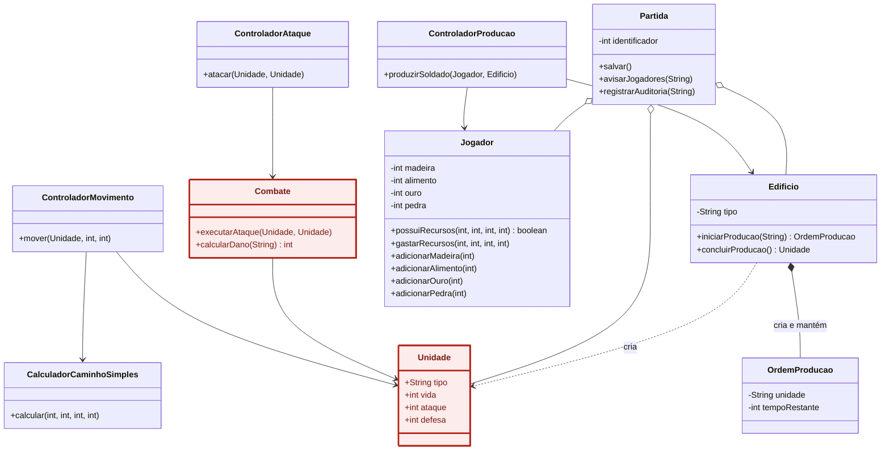
```mermaid
classDiagram
    direction TB

    class ControladorProducao {
        +produzirSoldado(Jogador, Edificio)
    }

    class ControladorAtaque {
        +atacar(Unidade, Unidade)
    }

    class ControladorMovimento {
        +mover(Unidade, int, int)
    }

    class Combate {
        +executarAtaque(Unidade, Unidade)
        +calcularDano(String) int
    }

    class Partida {
        -int identificador
        +salvar()
        +avisarJogadores(String)
        +registrarAuditoria(String)
    }

    class Jogador {
        -int madeira
        -int alimento
        -int ouro
        -int pedra
        +possuiRecursos(int, int, int, int) boolean
        +gastarRecursos(int, int, int, int)
        +adicionarMadeira(int)
        +adicionarAlimento(int)
        +adicionarOuro(int)
        +adicionarPedra(int)
    }

    class Unidade {
        +String tipo
        +int vida
        +int ataque
        +int defesa
    }

    class Edificio {
        -String tipo
        +iniciarProducao(String) OrdemProducao
        +concluirProducao() Unidade
    }

    class OrdemProducao {
        -String unidade
        -int tempoRestante
    }

    class CalculadorCaminhoSimples {
        +calcular(int, int, int, int)
    }

    ControladorProducao --> Jogador
    ControladorProducao --> Edificio
    ControladorAtaque --> Combate
    ControladorMovimento --> Unidade
    ControladorMovimento --> CalculadorCaminhoSimples
    Combate --> Unidade
    Partida o-- Jogador
    Partida o-- Unidade
    Partida o-- Edificio
    Edificio *-- OrdemProducao : cria e mantém
    Edificio ..> Unidade : cria

    style Combate fill:#FDECEC,stroke:#B42318,color:#7A1A12,stroke-width:3px
    style Unidade fill:#FDECEC,stroke:#B42318,color:#7A1A12,stroke-width:3px
```

Em vermelho: o dano varia por tipo, mas a decisão continua centralizada em `Combate` por meio de uma `String`.

### 3. UML completo após a correção

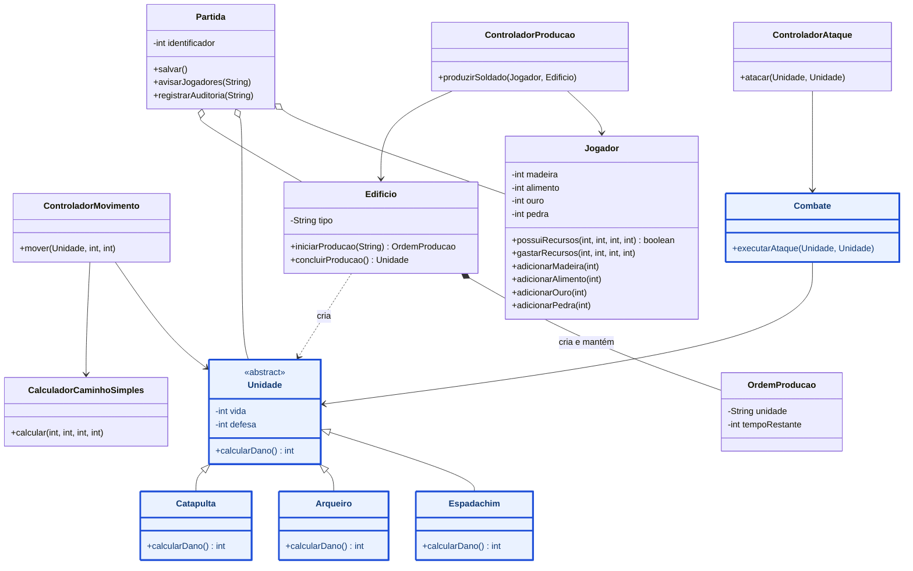
```mermaid
classDiagram
    direction TB

    class ControladorProducao {
        +produzirSoldado(Jogador, Edificio)
    }

    class ControladorAtaque {
        +atacar(Unidade, Unidade)
    }

    class ControladorMovimento {
        +mover(Unidade, int, int)
    }

    class Combate {
        +executarAtaque(Unidade, Unidade)
    }

    class Partida {
        -int identificador
        +salvar()
        +avisarJogadores(String)
        +registrarAuditoria(String)
    }

    class Jogador {
        -int madeira
        -int alimento
        -int ouro
        -int pedra
        +possuiRecursos(int, int, int, int) boolean
        +gastarRecursos(int, int, int, int)
        +adicionarMadeira(int)
        +adicionarAlimento(int)
        +adicionarOuro(int)
        +adicionarPedra(int)
    }

    class Unidade {
        <<abstract>>
        -int vida
        -int defesa
        +calcularDano() int
    }

    class Espadachim {
        +calcularDano() int
    }

    class Arqueiro {
        +calcularDano() int
    }

    class Catapulta {
        +calcularDano() int
    }

    class Edificio {
        -String tipo
        +iniciarProducao(String) OrdemProducao
        +concluirProducao() Unidade
    }

    class OrdemProducao {
        -String unidade
        -int tempoRestante
    }

    class CalculadorCaminhoSimples {
        +calcular(int, int, int, int)
    }

    ControladorProducao --> Jogador
    ControladorProducao --> Edificio
    ControladorAtaque --> Combate
    ControladorMovimento --> Unidade
    ControladorMovimento --> CalculadorCaminhoSimples
    Combate --> Unidade
    Partida o-- Jogador
    Partida o-- Unidade
    Partida o-- Edificio
    Edificio *-- OrdemProducao : cria e mantém
    Edificio ..> Unidade : cria
    Unidade <|-- Espadachim
    Unidade <|-- Arqueiro
    Unidade <|-- Catapulta

    style Combate fill:#EAF2FF,stroke:#1D4ED8,color:#123A73,stroke-width:3px
    style Unidade fill:#EAF2FF,stroke:#1D4ED8,color:#123A73,stroke-width:3px
    style Espadachim fill:#EAF2FF,stroke:#1D4ED8,color:#123A73,stroke-width:3px
    style Arqueiro fill:#EAF2FF,stroke:#1D4ED8,color:#123A73,stroke-width:3px
    style Catapulta fill:#EAF2FF,stroke:#1D4ED8,color:#123A73,stroke-width:3px
```

### O que foi alterado

- `calcularDano(String)` saiu de `Combate`.
- A classe abstrata define uma operação comum.
- Cada unidade fornece sua própria forma de calcular o dano.
- Um novo tipo pode ser incluído sem acrescentar outra comparação no controlador.

### Ponderação

Polimorfismo não significa que toda diferença deva produzir uma nova classe. Ele é útil quando existe uma variação comportamental relevante.

### Pergunta de verificação

> Para adicionar uma nova unidade, qual parte do controlador precisaria ser modificada nesse novo modelo?

**Resposta correta:** nenhuma. Basta adicionar um novo subtipo de `Unidade` que implemente `calcularDano()`.

---

## 11. GRASP 7 — Pure Fabrication

> **Definição:** criar uma classe que não representa diretamente um elemento do domínio para receber responsabilidades que aumentem a coesão ou reduzam o acoplamento.

### Problema no UML inicial

Salvar uma partida, avisar jogadores e registrar auditoria são responsabilidades necessárias, mas não representam unidades, jogadores ou edifícios.

Na etapa anterior, essas operações foram colocadas provisoriamente em `Partida`. A mudança está visível no UML azul de Low Coupling e agora será reavaliada.

### Pergunta para a turma

> `Partida` deveria saber como salvar a si mesma e como enviar avisos?

### Decisão

Criar classes de apoio com responsabilidades técnicas simples e bem definidas.

### 1. UML completo antes da análise

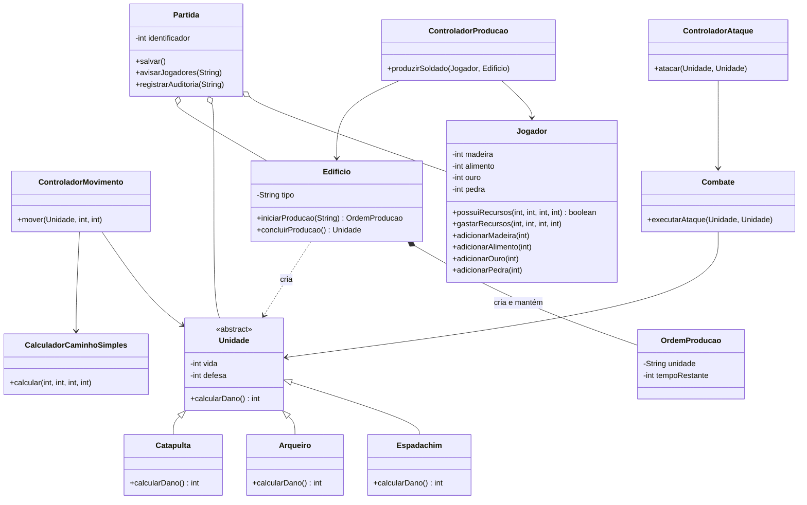
```mermaid
classDiagram
    direction TB

    class ControladorProducao {
        +produzirSoldado(Jogador, Edificio)
    }

    class ControladorAtaque {
        +atacar(Unidade, Unidade)
    }

    class ControladorMovimento {
        +mover(Unidade, int, int)
    }

    class Combate {
        +executarAtaque(Unidade, Unidade)
    }

    class Partida {
        -int identificador
        +salvar()
        +avisarJogadores(String)
        +registrarAuditoria(String)
    }

    class Jogador {
        -int madeira
        -int alimento
        -int ouro
        -int pedra
        +possuiRecursos(int, int, int, int) boolean
        +gastarRecursos(int, int, int, int)
        +adicionarMadeira(int)
        +adicionarAlimento(int)
        +adicionarOuro(int)
        +adicionarPedra(int)
    }

    class Unidade {
        <<abstract>>
        -int vida
        -int defesa
        +calcularDano() int
    }

    class Espadachim {
        +calcularDano() int
    }

    class Arqueiro {
        +calcularDano() int
    }

    class Catapulta {
        +calcularDano() int
    }

    class Edificio {
        -String tipo
        +iniciarProducao(String) OrdemProducao
        +concluirProducao() Unidade
    }

    class OrdemProducao {
        -String unidade
        -int tempoRestante
    }

    class CalculadorCaminhoSimples {
        +calcular(int, int, int, int)
    }

    ControladorProducao --> Jogador
    ControladorProducao --> Edificio
    ControladorAtaque --> Combate
    ControladorMovimento --> Unidade
    ControladorMovimento --> CalculadorCaminhoSimples
    Combate --> Unidade
    Partida o-- Jogador
    Partida o-- Unidade
    Partida o-- Edificio
    Edificio *-- OrdemProducao : cria e mantém
    Edificio ..> Unidade : cria
    Unidade <|-- Espadachim
    Unidade <|-- Arqueiro
    Unidade <|-- Catapulta
```

### 2. Erro identificado em vermelho

```mermaid
classDiagram
    direction TB

    class ControladorProducao {
        +produzirSoldado(Jogador, Edificio)
    }

    class ControladorAtaque {
        +atacar(Unidade, Unidade)
    }

    class ControladorMovimento {
        +mover(Unidade, int, int)
    }

    class Combate {
        +executarAtaque(Unidade, Unidade)
    }

    class Partida {
        -int identificador
        +salvar()
        +avisarJogadores(String)
        +registrarAuditoria(String)
    }

    class Jogador {
        -int madeira
        -int alimento
        -int ouro
        -int pedra
        +possuiRecursos(int, int, int, int) boolean
        +gastarRecursos(int, int, int, int)
        +adicionarMadeira(int)
        +adicionarAlimento(int)
        +adicionarOuro(int)
        +adicionarPedra(int)
    }

    class Unidade {
        <<abstract>>
        -int vida
        -int defesa
        +calcularDano() int
    }

    class Espadachim {
        +calcularDano() int
    }

    class Arqueiro {
        +calcularDano() int
    }

    class Catapulta {
        +calcularDano() int
    }

    class Edificio {
        -String tipo
        +iniciarProducao(String) OrdemProducao
        +concluirProducao() Unidade
    }

    class OrdemProducao {
        -String unidade
        -int tempoRestante
    }

    class CalculadorCaminhoSimples {
        +calcular(int, int, int, int)
    }

    ControladorProducao --> Jogador
    ControladorProducao --> Edificio
    ControladorAtaque --> Combate
    ControladorMovimento --> Unidade
    ControladorMovimento --> CalculadorCaminhoSimples
    Combate --> Unidade
    Partida o-- Jogador
    Partida o-- Unidade
    Partida o-- Edificio
    Edificio *-- OrdemProducao : cria e mantém
    Edificio ..> Unidade : cria
    Unidade <|-- Espadachim
    Unidade <|-- Arqueiro
    Unidade <|-- Catapulta

    style Partida fill:#FDECEC,stroke:#B42318,color:#7A1A12,stroke-width:3px
```

Em vermelho: `Partida` recebeu responsabilidades de armazenamento, aviso e auditoria que não representam regras da partida.

### 3. UML completo após a correção

```mermaid
classDiagram
    direction TB

    class ControladorProducao {
        +produzirSoldado(Jogador, Edificio)
    }

    class ControladorAtaque {
        +atacar(Unidade, Unidade)
    }

    class ControladorMovimento {
        +mover(Unidade, int, int)
    }

    class Combate {
        +executarAtaque(Unidade, Unidade)
    }

    class Partida {
        -int identificador
    }

    class Jogador {
        -int madeira
        -int alimento
        -int ouro
        -int pedra
        +possuiRecursos(int, int, int, int) boolean
        +gastarRecursos(int, int, int, int)
        +adicionarMadeira(int)
        +adicionarAlimento(int)
        +adicionarOuro(int)
        +adicionarPedra(int)
    }

    class Unidade {
        <<abstract>>
        -int vida
        -int defesa
        +calcularDano() int
    }

    class Espadachim {
        +calcularDano() int
    }

    class Arqueiro {
        +calcularDano() int
    }

    class Catapulta {
        +calcularDano() int
    }

    class Edificio {
        -String tipo
        +iniciarProducao(String) OrdemProducao
        +concluirProducao() Unidade
    }

    class OrdemProducao {
        -String unidade
        -int tempoRestante
    }

    class CalculadorCaminhoSimples {
        +calcular(int, int, int, int)
    }

    class ArmazenamentoPartida {
        +salvar(Partida)
        +buscar(int) Partida
    }

    class NotificadorJogadores {
        +avisar(String)
    }

    class RegistroAuditoria {
        +registrar(String)
    }

    ControladorProducao --> Jogador
    ControladorProducao --> Edificio
    ControladorProducao --> ArmazenamentoPartida
    ControladorProducao --> NotificadorJogadores
    ControladorAtaque --> Combate
    ControladorAtaque --> ArmazenamentoPartida
    ControladorAtaque --> NotificadorJogadores
    ControladorAtaque --> RegistroAuditoria
    ControladorMovimento --> Unidade
    ControladorMovimento --> CalculadorCaminhoSimples
    Combate --> Unidade
    ArmazenamentoPartida ..> Partida
    Partida o-- Jogador
    Partida o-- Unidade
    Partida o-- Edificio
    Edificio *-- OrdemProducao : cria e mantém
    Edificio ..> Unidade : cria
    Unidade <|-- Espadachim
    Unidade <|-- Arqueiro
    Unidade <|-- Catapulta

    style Partida fill:#EAF2FF,stroke:#1D4ED8,color:#123A73,stroke-width:3px
    style ArmazenamentoPartida fill:#EAF2FF,stroke:#1D4ED8,color:#123A73,stroke-width:3px
    style NotificadorJogadores fill:#EAF2FF,stroke:#1D4ED8,color:#123A73,stroke-width:3px
    style RegistroAuditoria fill:#EAF2FF,stroke:#1D4ED8,color:#123A73,stroke-width:3px
```

### O que foi alterado

- `Partida` permanece concentrada nas regras da partida.
- `ArmazenamentoPartida` cuida de salvar e buscar.
- `NotificadorJogadores` cuida dos avisos.
- `RegistroAuditoria` cuida do histórico de ações.

### Ponderação

Pure Fabrication não justifica classes genéricas chamadas apenas de `Util`, `Helper` ou `Manager`. A nova classe precisa possuir uma responsabilidade compreensível.

### Pergunta de verificação

> `NotificadorJogadores` representa um elemento do mundo do jogo ou uma necessidade do sistema?

**Resposta correta:** representa uma necessidade do sistema. Por isso é uma fabricação pura, e não uma entidade do domínio do jogo.

---

## 12. GRASP 8 — Indirection

> **Definição:** atribuir a um objeto intermediário a responsabilidade de mediar a colaboração entre outros objetos, evitando dependências diretas.

### Problema no UML inicial

Após um ataque, o controlador precisa avisar jogadores e registrar auditoria. Se surgir outro interessado, o controlador também precisará conhecê-lo.

### Pergunta para a turma

> Como o controlador pode informar que algo aconteceu sem conhecer todos os interessados?

### Decisão

Criar `DistribuidorEventos` como intermediário.

### 1. UML completo antes da análise

```mermaid
classDiagram
    direction TB

    class ControladorProducao {
        +produzirSoldado(Jogador, Edificio)
    }

    class ControladorAtaque {
        +atacar(Unidade, Unidade)
    }

    class ControladorMovimento {
        +mover(Unidade, int, int)
    }

    class Combate {
        +executarAtaque(Unidade, Unidade)
    }

    class Partida {
        -int identificador
    }

    class Jogador {
        -int madeira
        -int alimento
        -int ouro
        -int pedra
        +possuiRecursos(int, int, int, int) boolean
        +gastarRecursos(int, int, int, int)
        +adicionarMadeira(int)
        +adicionarAlimento(int)
        +adicionarOuro(int)
        +adicionarPedra(int)
    }

    class Unidade {
        <<abstract>>
        -int vida
        -int defesa
        +calcularDano() int
    }

    class Espadachim {
        +calcularDano() int
    }

    class Arqueiro {
        +calcularDano() int
    }

    class Catapulta {
        +calcularDano() int
    }

    class Edificio {
        -String tipo
        +iniciarProducao(String) OrdemProducao
        +concluirProducao() Unidade
    }

    class OrdemProducao {
        -String unidade
        -int tempoRestante
    }

    class CalculadorCaminhoSimples {
        +calcular(int, int, int, int)
    }

    class ArmazenamentoPartida {
        +salvar(Partida)
        +buscar(int) Partida
    }

    class NotificadorJogadores {
        +avisar(String)
    }

    class RegistroAuditoria {
        +registrar(String)
    }

    ControladorProducao --> Jogador
    ControladorProducao --> Edificio
    ControladorProducao --> ArmazenamentoPartida
    ControladorProducao --> NotificadorJogadores
    ControladorAtaque --> Combate
    ControladorAtaque --> ArmazenamentoPartida
    ControladorAtaque --> NotificadorJogadores
    ControladorAtaque --> RegistroAuditoria
    ControladorMovimento --> Unidade
    ControladorMovimento --> CalculadorCaminhoSimples
    Combate --> Unidade
    ArmazenamentoPartida ..> Partida
    Partida o-- Jogador
    Partida o-- Unidade
    Partida o-- Edificio
    Edificio *-- OrdemProducao : cria e mantém
    Edificio ..> Unidade : cria
    Unidade <|-- Espadachim
    Unidade <|-- Arqueiro
    Unidade <|-- Catapulta
```

### 2. Erro identificado em vermelho

```mermaid
classDiagram
    direction TB

    class ControladorProducao {
        +produzirSoldado(Jogador, Edificio)
    }

    class ControladorAtaque {
        +atacar(Unidade, Unidade)
    }

    class ControladorMovimento {
        +mover(Unidade, int, int)
    }

    class Combate {
        +executarAtaque(Unidade, Unidade)
    }

    class Partida {
        -int identificador
    }

    class Jogador {
        -int madeira
        -int alimento
        -int ouro
        -int pedra
        +possuiRecursos(int, int, int, int) boolean
        +gastarRecursos(int, int, int, int)
        +adicionarMadeira(int)
        +adicionarAlimento(int)
        +adicionarOuro(int)
        +adicionarPedra(int)
    }

    class Unidade {
        <<abstract>>
        -int vida
        -int defesa
        +calcularDano() int
    }

    class Espadachim {
        +calcularDano() int
    }

    class Arqueiro {
        +calcularDano() int
    }

    class Catapulta {
        +calcularDano() int
    }

    class Edificio {
        -String tipo
        +iniciarProducao(String) OrdemProducao
        +concluirProducao() Unidade
    }

    class OrdemProducao {
        -String unidade
        -int tempoRestante
    }

    class CalculadorCaminhoSimples {
        +calcular(int, int, int, int)
    }

    class ArmazenamentoPartida {
        +salvar(Partida)
        +buscar(int) Partida
    }

    class NotificadorJogadores {
        +avisar(String)
    }

    class RegistroAuditoria {
        +registrar(String)
    }

    ControladorProducao --> Jogador
    ControladorProducao --> Edificio
    ControladorProducao --> ArmazenamentoPartida
    ControladorProducao --> NotificadorJogadores
    ControladorAtaque --> Combate
    ControladorAtaque --> ArmazenamentoPartida
    ControladorAtaque --> NotificadorJogadores
    ControladorAtaque --> RegistroAuditoria
    ControladorMovimento --> Unidade
    ControladorMovimento --> CalculadorCaminhoSimples
    Combate --> Unidade
    ArmazenamentoPartida ..> Partida
    Partida o-- Jogador
    Partida o-- Unidade
    Partida o-- Edificio
    Edificio *-- OrdemProducao : cria e mantém
    Edificio ..> Unidade : cria
    Unidade <|-- Espadachim
    Unidade <|-- Arqueiro
    Unidade <|-- Catapulta

    style ControladorProducao fill:#FDECEC,stroke:#B42318,color:#7A1A12,stroke-width:3px
    style ControladorAtaque fill:#FDECEC,stroke:#B42318,color:#7A1A12,stroke-width:3px
    style NotificadorJogadores fill:#FDECEC,stroke:#B42318,color:#7A1A12,stroke-width:3px
    style RegistroAuditoria fill:#FDECEC,stroke:#B42318,color:#7A1A12,stroke-width:3px
```

Em vermelho: os controladores conhecem diretamente cada interessado nos eventos.

### 3. UML completo após a correção

```mermaid
classDiagram
    direction TB

    class ControladorProducao {
        +produzirSoldado(Jogador, Edificio)
    }

    class ControladorAtaque {
        +atacar(Unidade, Unidade)
    }

    class ControladorMovimento {
        +mover(Unidade, int, int)
    }

    class Combate {
        +executarAtaque(Unidade, Unidade)
    }

    class Partida {
        -int identificador
    }

    class Jogador {
        -int madeira
        -int alimento
        -int ouro
        -int pedra
        +possuiRecursos(int, int, int, int) boolean
        +gastarRecursos(int, int, int, int)
        +adicionarMadeira(int)
        +adicionarAlimento(int)
        +adicionarOuro(int)
        +adicionarPedra(int)
    }

    class Unidade {
        <<abstract>>
        -int vida
        -int defesa
        +calcularDano() int
    }

    class Espadachim {
        +calcularDano() int
    }

    class Arqueiro {
        +calcularDano() int
    }

    class Catapulta {
        +calcularDano() int
    }

    class Edificio {
        -String tipo
        +iniciarProducao(String) OrdemProducao
        +concluirProducao() Unidade
    }

    class OrdemProducao {
        -String unidade
        -int tempoRestante
    }

    class CalculadorCaminhoSimples {
        +calcular(int, int, int, int)
    }

    class ArmazenamentoPartida {
        +salvar(Partida)
        +buscar(int) Partida
    }

    class EventoJogo {
        -String descricao
    }

    class DistribuidorEventos {
        +distribuir(EventoJogo)
    }

    class NotificadorJogadores {
        +receber(EventoJogo)
    }

    class RegistroAuditoria {
        +receber(EventoJogo)
    }

    ControladorProducao --> Jogador
    ControladorProducao --> Edificio
    ControladorProducao --> ArmazenamentoPartida
    ControladorProducao --> DistribuidorEventos
    ControladorAtaque --> Combate
    ControladorAtaque --> ArmazenamentoPartida
    ControladorAtaque --> DistribuidorEventos
    ControladorMovimento --> Unidade
    ControladorMovimento --> CalculadorCaminhoSimples
    Combate --> Unidade
    ArmazenamentoPartida ..> Partida
    DistribuidorEventos --> NotificadorJogadores
    DistribuidorEventos --> RegistroAuditoria
    DistribuidorEventos ..> EventoJogo
    Partida o-- Jogador
    Partida o-- Unidade
    Partida o-- Edificio
    Edificio *-- OrdemProducao : cria e mantém
    Edificio ..> Unidade : cria
    Unidade <|-- Espadachim
    Unidade <|-- Arqueiro
    Unidade <|-- Catapulta

    style ControladorProducao fill:#EAF2FF,stroke:#1D4ED8,color:#123A73,stroke-width:3px
    style ControladorAtaque fill:#EAF2FF,stroke:#1D4ED8,color:#123A73,stroke-width:3px
    style DistribuidorEventos fill:#EAF2FF,stroke:#1D4ED8,color:#123A73,stroke-width:3px
    style EventoJogo fill:#EAF2FF,stroke:#1D4ED8,color:#123A73,stroke-width:3px
```

### O que foi alterado

- `ControladorAtaque` conhece apenas o distribuidor.
- O distribuidor encaminha o evento.
- Novos interessados podem ser adicionados sem aumentar as dependências do controlador.

### Ponderação

Indirection adiciona outra classe ao sistema. Se existir apenas um destino simples, essa indireção pode não ser necessária.

### Pergunta de verificação

> Se uma nova classe `PlacarPartida` precisar receber eventos, qual classe deverá passar a conhecê-la?

**Resposta correta:** somente `DistribuidorEventos` deverá conhecer `PlacarPartida`. Os controladores permanecem inalterados.

---

## 13. GRASP 9 — Protected Variations

> **Definição:** identificar pontos sujeitos a mudança e protegê-los por meio de um contrato estável, reduzindo o impacto da variação no restante do sistema.

### Problema no UML inicial

`ControladorMovimento` depende diretamente de `CalculadorCaminhoSimples`. Se a forma de calcular o caminho mudar, o controlador também precisará mudar.

### Pergunta para a turma

> O controlador precisa saber qual forma de cálculo está sendo utilizada?

### Decisão

Criar um contrato comum chamado `CalculadorCaminho`.

### 1. UML completo antes da análise

```mermaid
classDiagram
    direction TB

    class ControladorProducao {
        +produzirSoldado(Jogador, Edificio)
    }

    class ControladorAtaque {
        +atacar(Unidade, Unidade)
    }

    class ControladorMovimento {
        +mover(Unidade, int, int)
    }

    class Combate {
        +executarAtaque(Unidade, Unidade)
    }

    class Partida {
        -int identificador
    }

    class Jogador {
        -int madeira
        -int alimento
        -int ouro
        -int pedra
        +possuiRecursos(int, int, int, int) boolean
        +gastarRecursos(int, int, int, int)
        +adicionarMadeira(int)
        +adicionarAlimento(int)
        +adicionarOuro(int)
        +adicionarPedra(int)
    }

    class Unidade {
        <<abstract>>
        -int vida
        -int defesa
        +calcularDano() int
    }

    class Espadachim {
        +calcularDano() int
    }

    class Arqueiro {
        +calcularDano() int
    }

    class Catapulta {
        +calcularDano() int
    }

    class Edificio {
        -String tipo
        +iniciarProducao(String) OrdemProducao
        +concluirProducao() Unidade
    }

    class OrdemProducao {
        -String unidade
        -int tempoRestante
    }

    class CalculadorCaminhoSimples {
        +calcular(int, int, int, int)
    }

    class ArmazenamentoPartida {
        +salvar(Partida)
        +buscar(int) Partida
    }

    class EventoJogo {
        -String descricao
    }

    class DistribuidorEventos {
        +distribuir(EventoJogo)
    }

    class NotificadorJogadores {
        +receber(EventoJogo)
    }

    class RegistroAuditoria {
        +receber(EventoJogo)
    }

    ControladorProducao --> Jogador
    ControladorProducao --> Edificio
    ControladorProducao --> ArmazenamentoPartida
    ControladorProducao --> DistribuidorEventos
    ControladorAtaque --> Combate
    ControladorAtaque --> ArmazenamentoPartida
    ControladorAtaque --> DistribuidorEventos
    ControladorMovimento --> Unidade
    ControladorMovimento --> CalculadorCaminhoSimples
    Combate --> Unidade
    ArmazenamentoPartida ..> Partida
    DistribuidorEventos --> NotificadorJogadores
    DistribuidorEventos --> RegistroAuditoria
    DistribuidorEventos ..> EventoJogo
    Partida o-- Jogador
    Partida o-- Unidade
    Partida o-- Edificio
    Edificio *-- OrdemProducao : cria e mantém
    Edificio ..> Unidade : cria
    Unidade <|-- Espadachim
    Unidade <|-- Arqueiro
    Unidade <|-- Catapulta
```

### 2. Erro identificado em vermelho

```mermaid
classDiagram
    direction TB

    class ControladorProducao {
        +produzirSoldado(Jogador, Edificio)
    }

    class ControladorAtaque {
        +atacar(Unidade, Unidade)
    }

    class ControladorMovimento {
        +mover(Unidade, int, int)
    }

    class Combate {
        +executarAtaque(Unidade, Unidade)
    }

    class Partida {
        -int identificador
    }

    class Jogador {
        -int madeira
        -int alimento
        -int ouro
        -int pedra
        +possuiRecursos(int, int, int, int) boolean
        +gastarRecursos(int, int, int, int)
        +adicionarMadeira(int)
        +adicionarAlimento(int)
        +adicionarOuro(int)
        +adicionarPedra(int)
    }

    class Unidade {
        <<abstract>>
        -int vida
        -int defesa
        +calcularDano() int
    }

    class Espadachim {
        +calcularDano() int
    }

    class Arqueiro {
        +calcularDano() int
    }

    class Catapulta {
        +calcularDano() int
    }

    class Edificio {
        -String tipo
        +iniciarProducao(String) OrdemProducao
        +concluirProducao() Unidade
    }

    class OrdemProducao {
        -String unidade
        -int tempoRestante
    }

    class CalculadorCaminhoSimples {
        +calcular(int, int, int, int)
    }

    class ArmazenamentoPartida {
        +salvar(Partida)
        +buscar(int) Partida
    }

    class EventoJogo {
        -String descricao
    }

    class DistribuidorEventos {
        +distribuir(EventoJogo)
    }

    class NotificadorJogadores {
        +receber(EventoJogo)
    }

    class RegistroAuditoria {
        +receber(EventoJogo)
    }

    ControladorProducao --> Jogador
    ControladorProducao --> Edificio
    ControladorProducao --> ArmazenamentoPartida
    ControladorProducao --> DistribuidorEventos
    ControladorAtaque --> Combate
    ControladorAtaque --> ArmazenamentoPartida
    ControladorAtaque --> DistribuidorEventos
    ControladorMovimento --> Unidade
    ControladorMovimento --> CalculadorCaminhoSimples
    Combate --> Unidade
    ArmazenamentoPartida ..> Partida
    DistribuidorEventos --> NotificadorJogadores
    DistribuidorEventos --> RegistroAuditoria
    DistribuidorEventos ..> EventoJogo
    Partida o-- Jogador
    Partida o-- Unidade
    Partida o-- Edificio
    Edificio *-- OrdemProducao : cria e mantém
    Edificio ..> Unidade : cria
    Unidade <|-- Espadachim
    Unidade <|-- Arqueiro
    Unidade <|-- Catapulta

    style ControladorMovimento fill:#FDECEC,stroke:#B42318,color:#7A1A12,stroke-width:3px
    style CalculadorCaminhoSimples fill:#FDECEC,stroke:#B42318,color:#7A1A12,stroke-width:3px
```

Em vermelho: o controlador depende de uma única forma concreta de calcular o caminho.

### 3. UML completo após a correção

```mermaid
classDiagram
    direction TB

    class ControladorProducao {
        +produzirSoldado(Jogador, Edificio)
    }

    class ControladorAtaque {
        +atacar(Unidade, Unidade)
    }

    class ControladorMovimento {
        +mover(Unidade, int, int)
    }

    class Combate {
        +executarAtaque(Unidade, Unidade)
    }

    class Partida {
        -int identificador
    }

    class Jogador {
        -int madeira
        -int alimento
        -int ouro
        -int pedra
        +possuiRecursos(int, int, int, int) boolean
        +gastarRecursos(int, int, int, int)
        +adicionarMadeira(int)
        +adicionarAlimento(int)
        +adicionarOuro(int)
        +adicionarPedra(int)
    }

    class Unidade {
        <<abstract>>
        -int vida
        -int defesa
        +calcularDano() int
    }

    class Espadachim {
        +calcularDano() int
    }

    class Arqueiro {
        +calcularDano() int
    }

    class Catapulta {
        +calcularDano() int
    }

    class Edificio {
        -String tipo
        +iniciarProducao(String) OrdemProducao
        +concluirProducao() Unidade
    }

    class OrdemProducao {
        -String unidade
        -int tempoRestante
    }

    class ArmazenamentoPartida {
        +salvar(Partida)
        +buscar(int) Partida
    }

    class EventoJogo {
        -String descricao
    }

    class DistribuidorEventos {
        +distribuir(EventoJogo)
    }

    class NotificadorJogadores {
        +receber(EventoJogo)
    }

    class RegistroAuditoria {
        +receber(EventoJogo)
    }

    class CalculadorCaminho {
        <<interface>>
        +calcular(int, int, int, int)
    }

    class CaminhoSimples {
        +calcular(int, int, int, int)
    }

    class CaminhoComObstaculos {
        +calcular(int, int, int, int)
    }

    ControladorProducao --> Jogador
    ControladorProducao --> Edificio
    ControladorProducao --> ArmazenamentoPartida
    ControladorProducao --> DistribuidorEventos
    ControladorAtaque --> Combate
    ControladorAtaque --> ArmazenamentoPartida
    ControladorAtaque --> DistribuidorEventos
    ControladorMovimento --> Unidade
    ControladorMovimento --> CalculadorCaminho
    Combate --> Unidade
    ArmazenamentoPartida ..> Partida
    DistribuidorEventos --> NotificadorJogadores
    DistribuidorEventos --> RegistroAuditoria
    DistribuidorEventos ..> EventoJogo
    Partida o-- Jogador
    Partida o-- Unidade
    Partida o-- Edificio
    Edificio *-- OrdemProducao : cria e mantém
    Edificio ..> Unidade : cria
    Unidade <|-- Espadachim
    Unidade <|-- Arqueiro
    Unidade <|-- Catapulta
    CalculadorCaminho <|.. CaminhoSimples
    CalculadorCaminho <|.. CaminhoComObstaculos

    style ControladorMovimento fill:#EAF2FF,stroke:#1D4ED8,color:#123A73,stroke-width:3px
    style CalculadorCaminho fill:#EAF2FF,stroke:#1D4ED8,color:#123A73,stroke-width:3px
    style CaminhoSimples fill:#EAF2FF,stroke:#1D4ED8,color:#123A73,stroke-width:3px
    style CaminhoComObstaculos fill:#EAF2FF,stroke:#1D4ED8,color:#123A73,stroke-width:3px
```

### O que foi alterado

- O controlador depende de um contrato estável.
- Diferentes formas de cálculo podem cumprir o mesmo contrato.
- A escolha da forma concreta não altera a responsabilidade do controlador.

### Ponderação

Protected Variations não significa criar interfaces para tudo. O ponto de variação precisa ser relevante ou razoavelmente esperado.

### Pergunta de verificação

> Se o jogo nunca tiver obstáculos, seria necessário criar duas formas de calcular caminhos?

**Resposta correta:** não. A proteção de variações deve responder a uma mudança relevante ou esperada; caso contrário, a abstração apenas aumenta a complexidade.

---

## 14. Modelo final do domínio

Para facilitar a leitura, o resultado foi dividido em dois diagramas.

### 14.1 Classes principais do jogo

```mermaid
classDiagram
    direction TB

    class Partida {
        -int identificador
    }

    class Jogador {
        -int madeira
        -int alimento
        -int ouro
        -int pedra
        +possuiRecursos(int, int, int, int) boolean
        +gastarRecursos(int, int, int, int)
        +adicionarMadeira(int)
        +adicionarAlimento(int)
        +adicionarOuro(int)
        +adicionarPedra(int)
    }

    class Edificio {
        -String tipo
        +iniciarProducao(String) OrdemProducao
        +concluirProducao() Unidade
    }

    class OrdemProducao {
        -String unidade
        -int tempoRestante
    }

    class Unidade {
        <<abstract>>
        -int vida
        -int defesa
        +calcularDano() int
    }

    class Espadachim {
        +calcularDano() int
    }

    class Arqueiro {
        +calcularDano() int
    }

    class Catapulta {
        +calcularDano() int
    }

    Partida o-- Jogador
    Partida o-- Edificio
    Partida o-- Unidade
    Edificio *-- OrdemProducao : cria e mantém
    Edificio ..> Unidade : cria
    Unidade <|-- Espadachim
    Unidade <|-- Arqueiro
    Unidade <|-- Catapulta
```

### 14.2 Coordenação e classes de apoio

```mermaid
classDiagram
    direction TB

    class ControladorProducao {
        +produzirSoldado(Jogador, Edificio)
    }
    class ControladorAtaque {
        +atacar(Unidade, Unidade)
    }
    class ControladorMovimento {
        +mover(Unidade, int, int)
    }
    class Partida
    class Jogador
    class Edificio
    class Unidade
    class Combate {
        +executarAtaque(Unidade, Unidade)
    }
    class ArmazenamentoPartida {
        +salvar(Partida)
        +buscar(int) Partida
    }
    class EventoJogo {
        -String descricao
    }
    class DistribuidorEventos {
        +distribuir(EventoJogo)
    }
    class NotificadorJogadores {
        +receber(EventoJogo)
    }
    class RegistroAuditoria {
        +receber(EventoJogo)
    }

    class CalculadorCaminho {
        <<interface>>
        +calcular(int, int, int, int)
    }

    class CaminhoSimples {
        +calcular(int, int, int, int)
    }
    class CaminhoComObstaculos {
        +calcular(int, int, int, int)
    }

    ControladorProducao --> Jogador
    ControladorProducao --> Edificio
    ControladorProducao --> ArmazenamentoPartida
    ControladorProducao --> DistribuidorEventos
    ControladorAtaque --> Combate
    ControladorAtaque --> ArmazenamentoPartida
    ControladorAtaque --> DistribuidorEventos
    ControladorMovimento --> Unidade
    ControladorMovimento --> CalculadorCaminho
    ArmazenamentoPartida ..> Partida
    DistribuidorEventos --> NotificadorJogadores
    DistribuidorEventos --> RegistroAuditoria
    DistribuidorEventos ..> EventoJogo
    CalculadorCaminho <|.. CaminhoSimples
    CalculadorCaminho <|.. CaminhoComObstaculos
```

---

## 15. Síntese das decisões

| GRASP | Problema encontrado | Decisão tomada |
|---|---|---|
| Information Expert | Controlador altera recursos | `Jogador` protege e altera seus recursos |
| Creator | Controlador cria ordens | `Edificio` cria e mantém as ordens |
| Controller | Um controlador recebe tudo | Controladores são separados por caso de uso |
| High Cohesion | Muitas finalidades na mesma classe | Responsabilidades relacionadas são agrupadas |
| Low Coupling | Controlador conhece quase todo o sistema | Cada controlador conhece apenas seus colaboradores |
| Polymorphism | Dano depende de uma `String` | Cada subtipo de `Unidade` calcula seu dano |
| Pure Fabrication | Responsabilidades de apoio sem lugar adequado | Classes de apoio recebem responsabilidades específicas |
| Indirection | Controlador conhece todos os interessados | `DistribuidorEventos` atua como intermediário |
| Protected Variations | Cálculo de caminho está fixado | Um contrato protege as diferentes formas de cálculo |

---

## 16. Atividade para os alunos

### Novo requisito

O jogo passará a permitir a construção de uma fazenda. A fazenda:

- consome madeira;
- produz alimento;
- possui um tempo de construção;
- gera um aviso quando fica pronta.

### Tarefa

Os grupos deverão:

1. indicar qual classe possui as informações necessárias para verificar a madeira;
2. decidir quem cria a ordem de construção;
3. escolher qual controlador coordena a construção;
4. indicar quais classes devem receber o aviso;
5. justificar pelo menos quatro decisões usando GRASP;
6. atualizar o UML final sem inserir código Java.

### Perguntas de apoio

- Quem conhece a quantidade de madeira?
- Quem mantém a ordem de construção?
- O controlador deve alterar diretamente os recursos?
- A fazenda deve avisar diretamente todos os jogadores?
- Qual mudança poderia afetar várias classes?

---

## 17. Perguntas de encerramento

1. Qual classe concentrava mais responsabilidades no primeiro UML?
2. Qual decisão transformou os objetos de dados em objetos com comportamento?
3. Qual diferença existe entre High Cohesion e Low Coupling?
4. Quando uma classe criada por Pure Fabrication é útil?
5. Qual custo é introduzido por Indirection?
6. Quando Protected Variations pode gerar complexidade desnecessária?
7. Como o polimorfismo reduz decisões condicionais por tipo?

---

## 18. Resumo para o último slide

- **Information Expert:** a responsabilidade fica próxima das informações necessárias.
- **Creator:** cria quem contém, registra, utiliza ou possui os dados de inicialização.
- **Controller:** coordena uma solicitação sem executar todas as regras.
- **High Cohesion:** cada classe mantém um propósito claro.
- **Low Coupling:** cada classe conhece apenas os colaboradores necessários.
- **Polymorphism:** tipos diferentes oferecem comportamentos diferentes por uma operação comum.
- **Pure Fabrication:** uma classe de apoio recebe uma responsabilidade que não pertence naturalmente ao domínio.
- **Indirection:** um intermediário reduz dependências diretas.
- **Protected Variations:** um contrato estável protege o sistema contra mudanças esperadas.

> GRASP ajuda a responder a uma pergunta central do projeto orientado a objetos: quem deve ser responsável por fazer o quê?

---

## 19. Referência principal

- LARMAN, Craig. *Applying UML and Patterns: An Introduction to Object-Oriented Analysis and Design and Iterative Development*. 3. ed. Prentice Hall, 2004.
