# Padrões de projeto aplicados em Java

> **Disciplina:** Técnicas Avançadas de Programação
>
> **Instituição:** IBMEC
> **Objetivo:** reconhecer problemas recorrentes de projeto e implementar soluções simples em Java.

---

## Classificação dos padrões estudados

Os padrões GoF são organizados de acordo com a natureza do problema que ajudam a resolver.

### Padrões criacionais

Tratam da **criação de objetos**. O objetivo é evitar que o código cliente fique excessivamente dependente de construtores e classes concretas.

- **Factory Method:** permite variar o produto criado por uma classe.
- **Abstract Factory:** cria famílias de objetos relacionados.
- **Builder:** organiza a construção gradual de objetos complexos.

### Padrões estruturais

Tratam da **composição entre classes e objetos**. Eles ajudam a integrar contratos, acrescentar responsabilidades, simplificar subsistemas ou controlar o acesso a outro objeto.

- **Adapter:** converte uma interface em outra.
- **Decorator:** acrescenta responsabilidades por composição.
- **Facade:** fornece uma entrada simplificada para um subsistema.
- **Proxy:** controla o acesso a um objeto preservando seu contrato.

### Padrões comportamentais

Tratam dos **algoritmos e da comunicação entre objetos**. Eles distribuem comportamentos e evitam dependências desnecessárias entre participantes.

- **Strategy:** permite alternar algoritmos.
- **Observer:** organiza publicação e assinatura de eventos.

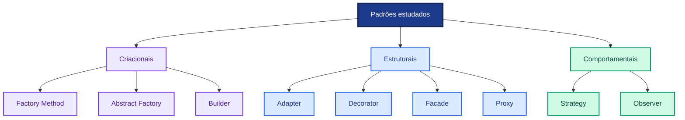

| Categoria | Pergunta principal | Padrões desta aula |
|---|---|---|
| Criacional | Como o objeto será criado? | Factory Method, Abstract Factory, Builder |
| Estrutural | Como objetos e classes serão conectados? | Adapter, Decorator, Facade, Proxy |
| Comportamental | Como o trabalho e a comunicação serão distribuídos? | Strategy, Observer |

> A categoria informa a intenção predominante do padrão. Um padrão pode influenciar criação, estrutura e comportamento ao mesmo tempo, mas sua classificação GoF considera o problema principal que ele procura resolver.

---

## Colinha de UML para Java

A UML representa classes, interfaces e relacionamentos antes de mostrar todos os detalhes do código. Nos diagramas desta aula, observe primeiro **o formato da linha**, **a ponta da seta** e **o lado em que aparece o losango**.

### Os seis relacionamentos mais importantes

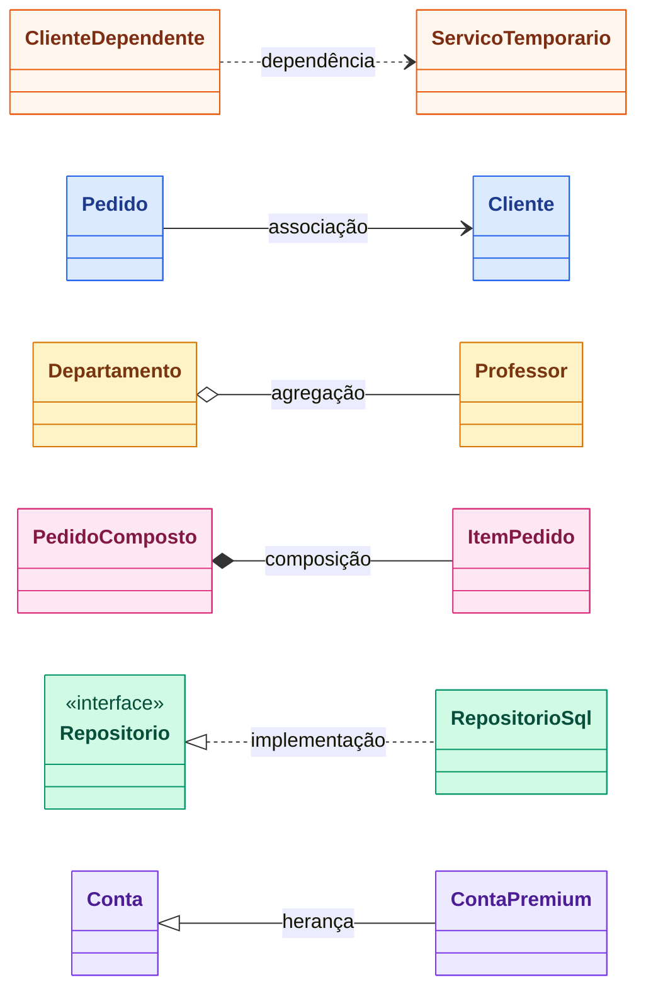

| Relação | Símbolo UML | Como reconhecer em Java | Significado prático |
|---|---|---|---|
| **Dependência** | linha tracejada com seta | parâmetro, variável local ou chamada estática | A usa B temporariamente |
| **Associação** | linha contínua | A mantém B em um campo | A conhece B durante parte relevante de sua vida |
| **Agregação** | losango vazio no todo | A recebe e guarda B, mas não controla sua existência | A reúne B; B também pode existir sozinho |
| **Composição** | losango preenchido no todo | A cria e controla B | B pertence a A e acompanha seu ciclo de vida |
| **Implementação** | linha tracejada e triângulo vazio | `class A implements B` | A cumpre o contrato da interface B |
| **Herança** | linha contínua e triângulo vazio | `class A extends B` | A é uma especialização de B |

### Regra para ler a direção

- A **seta comum** aponta para aquilo que a classe conhece ou utiliza.
- O **triângulo vazio** aponta para a abstração mais geral, como interface ou superclasse.
- O **losango** fica do lado do objeto que representa o todo ou proprietário.

### Dependência

A dependência é a relação mais fraca. A classe usa outra apenas para realizar uma operação e não precisa armazená-la.

```java
final class RelatorioService {
    void exportar(PdfWriter writer) {
        writer.write("relatório");
    }
}
```

`RelatorioService` depende de `PdfWriter` porque o recebe como parâmetro.

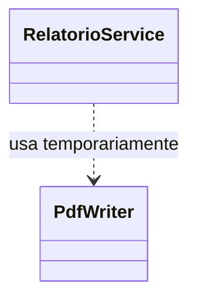

### Associação

Na associação, um objeto mantém uma referência para o outro. A relação costuma aparecer como um campo.

```java
final class Pedido {
    private final Cliente cliente;

    Pedido(Cliente cliente) {
        this.cliente = cliente;
    }
}
```

O `Pedido` conhece o `Cliente`, mas isso ainda não informa quem controla o ciclo de vida do cliente.

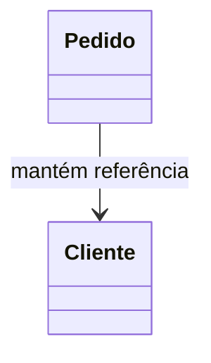

### Agregação

Agregação é uma associação do tipo todo-parte. A parte pode existir sem o todo e pode ser criada fora dele.

```java
final class Departamento {
    private final List<Professor> professores;

    Departamento(List<Professor> professores) {
        this.professores = List.copyOf(professores);
    }
}
```

Os professores já existem antes do departamento recebê-los. Excluir o departamento não implica excluir as pessoas.

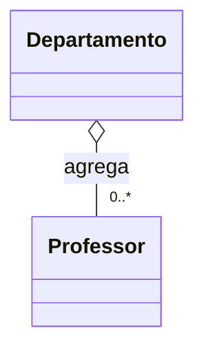

### Composição

Composição representa propriedade forte. O todo cria ou controla as partes, que fazem sentido dentro daquele objeto.

```java
final class Pedido {
    private final List<ItemPedido> itens = new ArrayList<>();

    void adicionar(Produto produto, int quantidade) {
        itens.add(new ItemPedido(produto, quantidade));
    }
}
```

`ItemPedido` pertence ao `Pedido`. O pedido controla a criação e a permanência de seus itens.

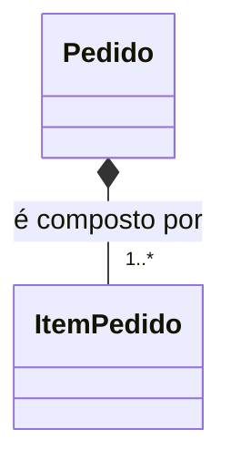

### Implementação de interface

Uma classe implementa as operações definidas por uma interface. O triângulo aponta para a interface, que é a abstração mais geral.

```java
interface Repositorio {
    void salvar(Pedido pedido);
}

final class RepositorioSql implements Repositorio {
    public void salvar(Pedido pedido) {
        System.out.println("INSERT...");
    }
}
```

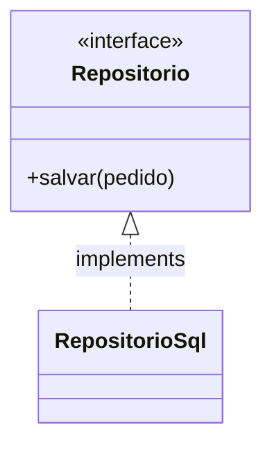

### Herança

Herança indica que uma subclasse especializa uma superclasse. O triângulo aponta para a classe mais geral.

```java
class Conta {
    void sacar(BigDecimal valor) { }
}

final class ContaPremium extends Conta {
    void solicitarBeneficio() { }
}
```

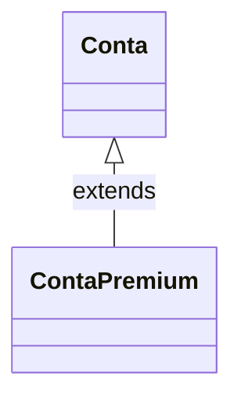

### Anatomia de uma classe UML

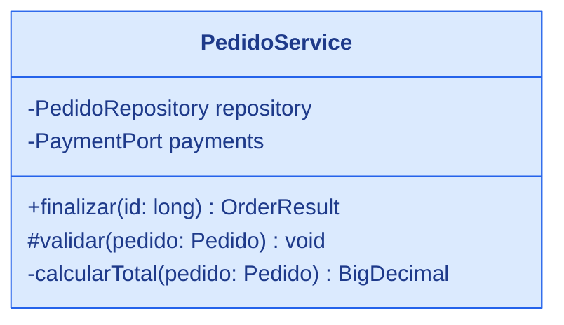

O retângulo pode ter três partes:

1. nome da classe;
2. atributos ou campos;
3. métodos ou operações.

| Símbolo | Visibilidade Java |
|---|---|
| `+` | `public` |
| `-` | `private` |
| `#` | `protected` |
| `~` | package-private |

### Multiplicidade

A multiplicidade indica quantos objetos podem participar da relação.

| Notação | Leitura |
|---|---|
| `1` | exatamente um |
| `0..1` | nenhum ou um |
| `*` ou `0..*` | nenhum ou vários |
| `1..*` | um ou vários |

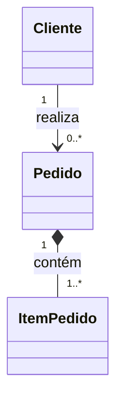

### Agregação ou composição?

Use estas perguntas:

1. A parte consegue existir sem o todo?
2. A parte foi criada fora e apenas entregue ao todo?
3. A mesma parte pode ser compartilhada por outros objetos?
4. O todo controla a criação e o descarte da parte?

Se a parte possui vida independente, a relação tende a ser **agregação**. Se o todo controla fortemente sua existência, tende a ser **composição**. Se essa diferença não for importante para o modelo, uma associação simples pode ser suficiente.

### Cores usadas nesta aula

- 🟢 Verde: interface ou abstração
- 🟠 Laranja: implementação concreta ou adapter/decorator
- 🔵 Azul: cliente, contexto ou serviço principal
- 🔴 Vermelho: desenho problemático ou acoplamento que merece atenção
- 🟣 Roxo: hierarquia ou criação

---

# 1. Factory Method

> 🟣 **Classificação GoF: padrão criacional** — concentra e flexibiliza a criação de um produto.

## Explicação

Em Java, frequentemente precisamos criar um objeto e logo depois utilizá-lo. O caminho mais direto é chamar `new` dentro da própria classe cliente. Isso funciona, mas faz o cliente depender daquela implementação concreta.

O **Factory Method** move essa decisão de criação para um método específico. A classe principal continua executando o fluxo de negócio, mas pede ao método fábrica um objeto que segue determinada interface. Subclasses podem sobrescrever esse método e fornecer implementações diferentes.

Assim, o fluxo principal sabe **o que o produto consegue fazer**, mas não precisa conhecer **qual classe concreta foi instanciada**. O padrão é especialmente útil quando a criação precisa variar sem duplicar o restante do processo.

## Problema

Imagine um processo de backup que envia arquivos para diferentes serviços:

```java
ObjectStorage storage;

if (provider.equals("aws")) {
    storage = new S3Storage();
} else if (provider.equals("azure")) {
    storage = new BlobStorage();
} else {
    storage = new LocalStorage();
}

storage.upload(file);
```

O `if` não é o verdadeiro problema. A dificuldade aparece quando:

- essa decisão se repete em várias partes;
- o fluxo de backup muda sempre que surge um provedor;
- o cliente precisa conhecer todas as classes concretas;
- a criação e a execução do caso de uso ficam misturadas.

## O que está errado e o que melhora

### Antes: o cliente cria e usa

`BackupService` escolhe o provedor, chama o construtor, conhece a configuração concreta e executa o upload. Ele acumula dois motivos para mudar:

- mudança no processo de backup;
- mudança na criação dos provedores.

Quando surge GCP, vários clientes podem precisar de um novo ramo. Testes também precisam preparar detalhes de AWS ou Azure mesmo quando o objetivo é testar apenas o fluxo de backup.

### Depois: o fluxo usa uma abstração

`BackupJob.execute` conserva a sequência comum. `createStorage` concentra a variação da criação. Uma subclasse escolhe o produto concreto sem reescrever validação e execução.

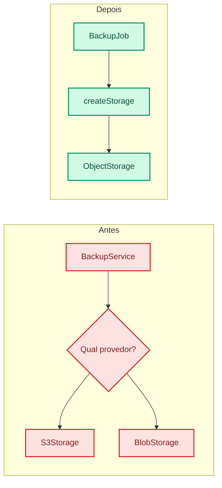

## Estrutura

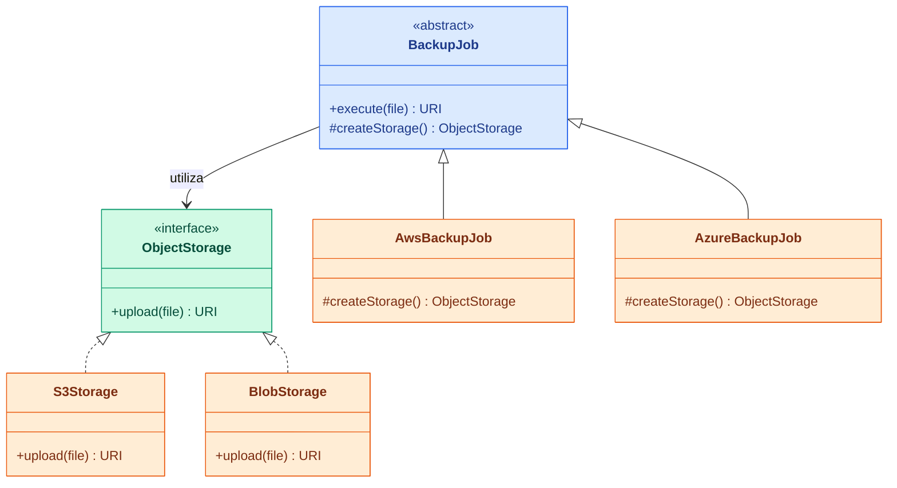

O método `execute` contém o fluxo comum. O método `createStorage` funciona como ponto de extensão.

## Exemplo simples em Java

```java
import java.net.URI;
import java.nio.file.Path;

interface ObjectStorage {
    URI upload(Path file);
}

final class S3Storage implements ObjectStorage {
    public URI upload(Path file) {
        System.out.println("Enviando para S3: " + file);
        return URI.create("s3://aula/" + file.getFileName());
    }
}

abstract class BackupJob {
    protected abstract ObjectStorage createStorage();

    public URI execute(Path file) {
        System.out.println("Validando arquivo");
        ObjectStorage storage = createStorage();
        return storage.upload(file);
    }
}

final class AwsBackupJob extends BackupJob {
    protected ObjectStorage createStorage() {
        return new S3Storage();
    }
}
```

### Uso

```java
BackupJob job = new AwsBackupJob();
URI location = job.execute(Path.of("notas.csv"));
System.out.println(location);
```

## Quando usar

- um fluxo comum precisa variar o produto utilizado;
- subclasses precisam decidir qual produto concreto criar;
- o código cliente deve trabalhar apenas com a abstração.

## Quando evitar

Se existe apenas uma escolha pequena e estável, injetar o produto pronto pode ser mais simples.

## Vantagens e custos

| Vantagens | Custos e limitações |
|---|---|
| Separa criação do fluxo principal | Introduz hierarquia de criadores |
| Cliente depende da interface do produto | Uma variante pode exigir uma nova subclasse |
| Facilita testes com produtos substitutos | A seleção inicial do criador ainda precisa existir |
| Permite extensão sem alterar o fluxo comum | Pode ser exagero quando apenas um produto existe |
| Reaproveita lógica comum da classe criadora | Herança pode acoplar subclasses à classe-base |

> **Pergunta para a turma:** qual classe precisa ser criada para adicionar um provedor GCP?

---

# 2. Abstract Factory

> 🟣 **Classificação GoF: padrão criacional** — cria famílias coerentes de produtos relacionados.

## Explicação

Alguns sistemas não precisam criar apenas um objeto. Eles precisam criar vários objetos relacionados que devem pertencer à mesma variante. Uma aplicação pode precisar, por exemplo, de armazenamento, fila e serviço de segredos da AWS ou dos equivalentes da Azure.

O **Abstract Factory** representa essa família por meio de uma interface. Em vez de o cliente escolher separadamente cada implementação, ele recebe uma fábrica concreta e solicita a ela todos os produtos necessários.

Isso evita combinações incoerentes e impede que o cliente dependa diretamente dos SDKs concretos. Trocar a fábrica significa trocar a família completa. A principal diferença para Factory Method é que Abstract Factory normalmente fornece **vários tipos de produtos relacionados**, não apenas um ponto de criação.

## Problema

Uma aplicação multicloud precisa de três serviços compatíveis:

- armazenamento;
- fila de mensagens;
- cofre de segredos.

Misturar `S3Storage`, `AzureQueue` e `GcpSecretStore` cria uma configuração incoerente. Queremos trocar a família completa de serviços.

## O que está errado e o que melhora

### Antes: decisões independentes criam combinações inválidas

Cada módulo escolhe sua dependência separadamente. O compilador aceita a mistura porque todos implementam suas interfaces, mas a configuração pode violar uma regra arquitetural: todos os serviços deveriam pertencer ao mesmo ambiente.

### Depois: uma fábrica representa a variante

A aplicação escolhe `AwsFactory` ou `AzureFactory` uma vez. A fábrica entrega apenas produtos daquela família. O cliente deixa de repetir decisões e não conhece SDKs concretos.

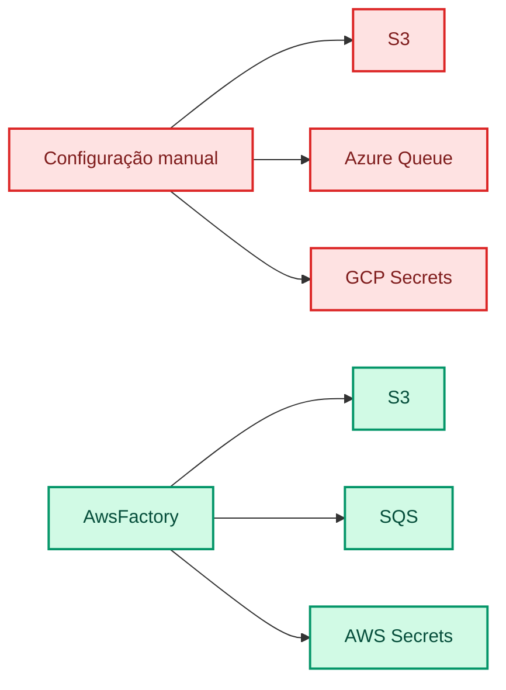

## Estrutura

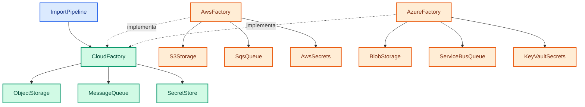

Cada fábrica concreta produz uma família coerente.

## Exemplo simples em Java

```java
interface ObjectStorage {
    void save(String name);
}

interface MessageQueue {
    void publish(String message);
}

interface CloudFactory {
    ObjectStorage storage();
    MessageQueue queue();
}

final class AwsFactory implements CloudFactory {
    public ObjectStorage storage() {
        return name -> System.out.println("S3: " + name);
    }

    public MessageQueue queue() {
        return message -> System.out.println("SQS: " + message);
    }
}

final class ImportPipeline {
    private final ObjectStorage storage;
    private final MessageQueue queue;

    ImportPipeline(CloudFactory factory) {
        this.storage = factory.storage();
        this.queue = factory.queue();
    }

    void importFile(String file) {
        storage.save(file);
        queue.publish("Arquivo importado: " + file);
    }
}
```

## Factory Method ou Abstract Factory?

| Situação | Padrão mais provável |
|---|---|
| Variar um produto usado por um fluxo | Factory Method |
| Variar uma família inteira | Abstract Factory |
| Subclasses escolhem o produto | Factory Method |
| Um objeto fábrica fornece vários produtos | Abstract Factory |

## Limitação importante

Adicionar uma nova família, como GCP, é simples. Adicionar um novo tipo de produto à interface `CloudFactory` exige mudar todas as fábricas existentes.

## Vantagens e custos

| Vantagens | Custos e limitações |
|---|---|
| Garante famílias coerentes de objetos | Interface da fábrica pode crescer demais |
| Oculta classes e SDKs concretos | Novo tipo de produto altera todas as fábricas |
| Troca toda a infraestrutura em um ponto | Cria várias interfaces e implementações |
| Facilita ambientes alternativos para testes | Pode esconder diferenças importantes entre provedores |
| Evita decisões repetidas em vários módulos | Não elimina a escolha da fábrica na inicialização |

> **Pergunta para a turma:** o que acontece se adicionarmos `MonitoringService monitoring()`?

---

# 3. Builder

> 🟣 **Classificação GoF: padrão criacional** — controla a construção gradual de um objeto complexo.

## Explicação

Um construtor funciona bem quando o objeto possui poucos dados obrigatórios. Quando aparecem muitos parâmetros opcionais, valores do mesmo tipo e várias combinações possíveis, a chamada ao construtor fica difícil de ler e fácil de preencher incorretamente.

O **Builder** funciona como um formulário de montagem. O cliente informa cada opção por meio de um método com nome claro, como `timeout`, `retries` ou `method`. Ao final, chama `build()` para validar os dados e criar o objeto definitivo.

O Builder pode ser mutável durante a montagem, enquanto o produto final permanece imutável. Ele melhora a legibilidade da criação, concentra valores padrão e oferece um local para impedir combinações inválidas antes que o objeto exista.

## Problema: construtor telescópico

```java
var request = new ApiRequest(
    "POST", url, headers, body,
    Duration.ofSeconds(10),
    3, true, null, false
);
```

Sem consultar a assinatura, não sabemos o significado de `3`, `true`, `null` e `false`.

## O que está errado e o que melhora

### Antes: posição determina significado

O construtor telescópico exige que o chamador conheça a ordem exata. Parâmetros opcionais obrigam o uso de `null`, valores padrão artificiais ou várias sobrecargas. Dois valores do mesmo tipo podem ser trocados sem erro de compilação.

### Depois: nomes expressam intenção

O Builder torna cada escolha explícita, aplica valores padrão e valida o conjunto antes de criar o produto. O objeto resultante pode permanecer imutável.

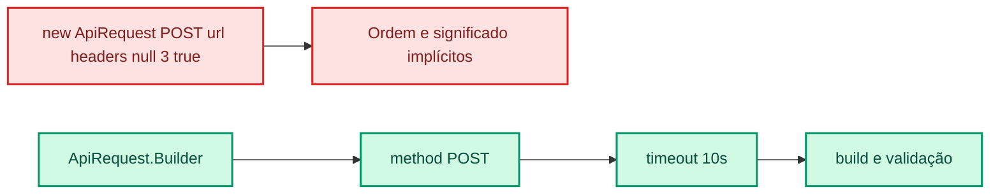

## Estrutura

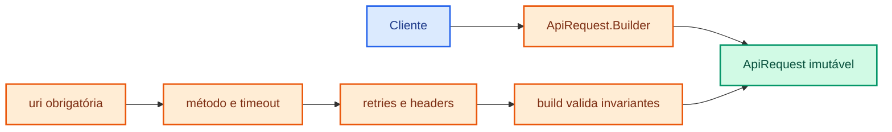

## Exemplo simples em Java

```java
import java.net.URI;
import java.time.Duration;
import java.util.Objects;

public record ApiRequest(
    URI uri,
    String method,
    Duration timeout,
    int retries
) {
    public static final class Builder {
        private final URI uri;
        private String method = "GET";
        private Duration timeout = Duration.ofSeconds(5);
        private int retries = 0;

        public Builder(URI uri) {
            this.uri = Objects.requireNonNull(uri);
        }

        public Builder method(String method) {
            this.method = method;
            return this;
        }

        public Builder timeout(Duration timeout) {
            this.timeout = timeout;
            return this;
        }

        public Builder retries(int retries) {
            this.retries = retries;
            return this;
        }

        public ApiRequest build() {
            if (retries < 0) {
                throw new IllegalStateException("Retries não pode ser negativo");
            }
            return new ApiRequest(uri, method, timeout, retries);
        }
    }
}
```

### Uso

```java
ApiRequest request = new ApiRequest.Builder(
        URI.create("https://api.exemplo.com/orders"))
    .method("POST")
    .timeout(Duration.ofSeconds(10))
    .retries(2)
    .build();
```

## Quando usar

- muitos parâmetros opcionais;
- objeto final imutável;
- construção em etapas;
- validação antes da criação;
- diferentes configurações do mesmo produto.

## Quando evitar

Uma classe com dois ou três parâmetros claros provavelmente não precisa de Builder.

## Vantagens e custos

| Vantagens | Custos e limitações |
|---|---|
| Chamadas legíveis por meio de métodos nomeados | Acrescenta uma classe e bastante código |
| Centraliza valores padrão e validação | Builder mutável pode ser reutilizado incorretamente |
| Facilita a criação de produtos imutáveis | Não garante validade se `build()` validar pouco |
| Evita muitas sobrecargas de construtor | Pode duplicar campos do produto |
| Permite construção gradual | Não compensa para objetos pequenos e simples |

> **Pergunta para a turma:** o Builder impede todos os estados inválidos ou apenas os que `build()` valida?

---

# 4. Adapter

> 🔵 **Classificação GoF: padrão estrutural** — conecta objetos que possuem interfaces incompatíveis.

## Explicação

Duas classes podem oferecer funcionalidades compatíveis e, ainda assim, não conseguir conversar. Uma pode trabalhar com `Money` e `Card`, enquanto uma biblioteca antiga recebe centavos, número do cartão e moeda como strings.

O **Adapter** fica entre esses dois lados. Para o domínio, ele apresenta a interface esperada. Internamente, converte os dados, chama o sistema existente e transforma a resposta novamente em tipos conhecidos pela aplicação.

É semelhante a um adaptador de tomada: ele não altera o aparelho nem a instalação elétrica, mas torna seus formatos compatíveis. Em arquitetura hexagonal, o domínio define a porta e o Adapter implementa essa porta para conversar com banco de dados, API, mensageria ou SDK externo.

## Problema

O domínio espera:

```java
interface PaymentPort {
    PaymentResult charge(Money amount, Card card);
}
```

O SDK legado fornece:

```java
LegacyReply makePayment(
    long cents,
    String cardNumber,
    String currency
);
```

O caso de uso não deve conhecer DTOs, códigos ou formatos do fornecedor.

## O que está errado e o que melhora

### Antes: o fornecedor invade o domínio

Se `CheckoutService` chama `LegacyGateway` diretamente, ele passa a conhecer centavos, strings de moeda, códigos como `"00"` e exceções específicas. Trocar o gateway exige alterar o caso de uso e seus testes.

### Depois: a fronteira traduz

O domínio define `PaymentPort` usando seus próprios tipos. `LegacyPaymentAdapter` faz a tradução nos dois sentidos. A dependência concreta fica na borda da aplicação.

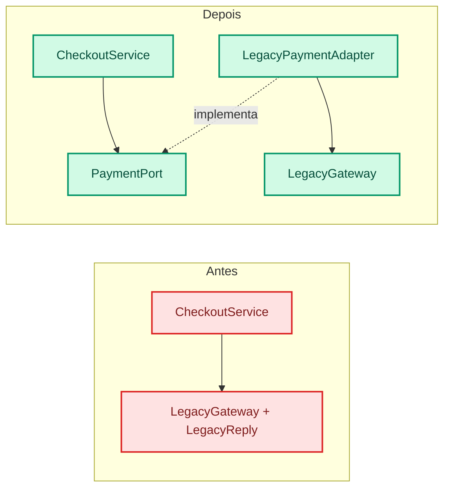

## Adapter na arquitetura hexagonal

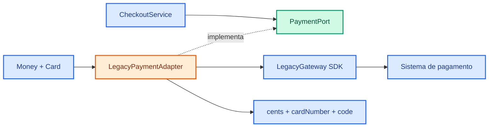

O domínio chama sua própria porta. O Adapter traduz a requisição, chama o SDK e traduz a resposta.

## Exemplo simples em Java

```java
interface PaymentPort {
    PaymentResult charge(Money amount, Card card);
}

final class LegacyPaymentAdapter implements PaymentPort {
    private final LegacyGateway gateway;

    LegacyPaymentAdapter(LegacyGateway gateway) {
        this.gateway = gateway;
    }

    public PaymentResult charge(Money amount, Card card) {
        LegacyReply reply = gateway.makePayment(
            amount.toCents(),
            card.number(),
            amount.currencyCode()
        );

        if (reply.code().equals("00")) {
            return PaymentResult.approved(reply.transactionId());
        }
        return PaymentResult.denied(reply.message());
    }
}
```

## Responsabilidade do Adapter

O Adapter pode:

- converter tipos;
- renomear operações;
- montar DTOs externos;
- traduzir códigos técnicos;
- normalizar exceções do fornecedor.

Ele não deve decidir políticas centrais do negócio.

## Vantagens e custos

| Vantagens | Custos e limitações |
|---|---|
| Impede tipos externos de contaminar o domínio | Cria código de mapeamento e tratamento de erros |
| Localiza mudanças do fornecedor | Pode ocultar diferenças que não são traduzíveis |
| Facilita testes do caso de uso | Um adapter muito grande vira uma segunda implementação do sistema externo |
| Permite trocar SDKs atrás da mesma porta | Conversões podem ter perda de informação |
| Explicita a fronteira arquitetural | Mudanças incompatíveis no fornecedor ainda exigem manutenção |

> **Pergunta para a turma:** a decisão de tentar outro gateway após uma recusa pertence ao Adapter?

---

# 5. Decorator

> 🔵 **Classificação GoF: padrão estrutural** — envolve objetos para combinar responsabilidades adicionais.

## Explicação

Às vezes queremos acrescentar logging, cache, métricas, compressão ou outra funcionalidade a um objeto. Criar uma subclasse para cada combinação faz a hierarquia crescer rapidamente e fixa as combinações em tempo de compilação.

O **Decorator** resolve o problema envolvendo o objeto original. O wrapper implementa a mesma interface, executa uma responsabilidade antes ou depois da chamada e delega o trabalho principal ao objeto que está dentro dele.

Como um decorator pode envolver outro decorator, o cliente monta camadas. Um serviço pode receber logging por fora, cache no meio e acesso remoto no centro. O cliente continua enxergando a mesma interface, mas a ordem das camadas passa a influenciar o comportamento.

## Problema: combinações por herança

Um serviço de preços precisa de logging, cache e métricas.

Criar subclasses para todas as combinações produz nomes como:

```text
LoggingPriceService
CachedPriceService
LoggingCachedPriceService
MetricsLoggingCachedPriceService
```

Cada nova funcionalidade multiplica as combinações.

## O que está errado e o que melhora

### Antes: herança representa combinações

Uma subclasse funciona enquanto existe apenas uma variação. Quando logging, cache, métricas e desconto podem ser combinados, a hierarquia precisa de uma classe para cada combinação e ordem. Alterar uma responsabilidade pode afetar várias subclasses.

### Depois: objetos representam camadas

Cada decorator possui uma responsabilidade, implementa `PriceService` e contém outro `PriceService`. O cliente monta apenas a combinação necessária.

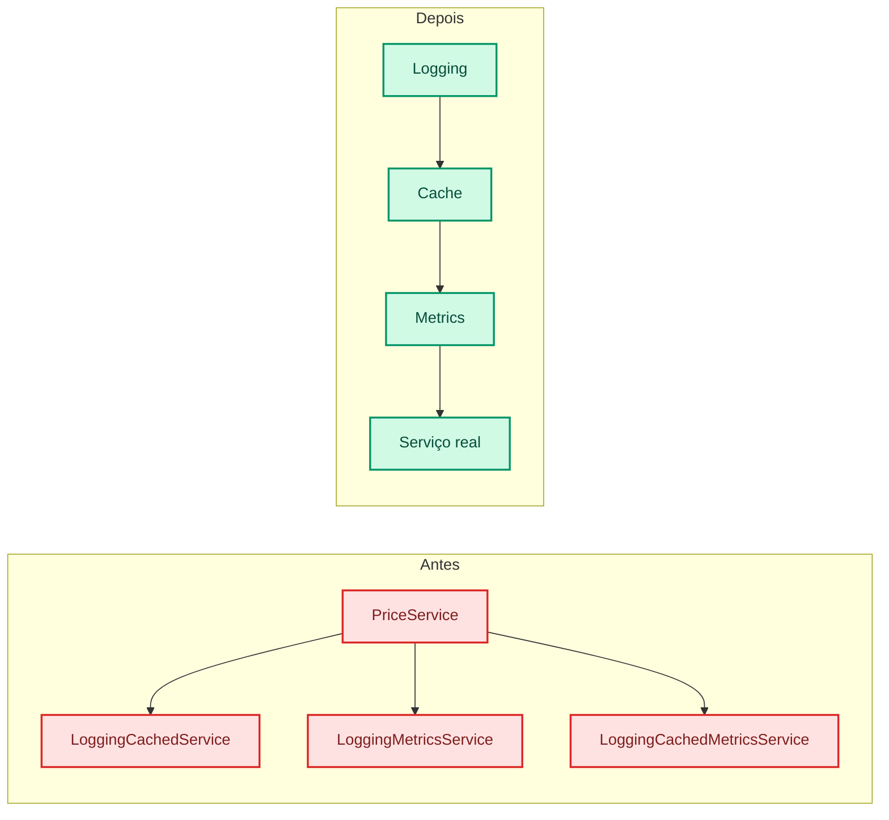

## Estrutura

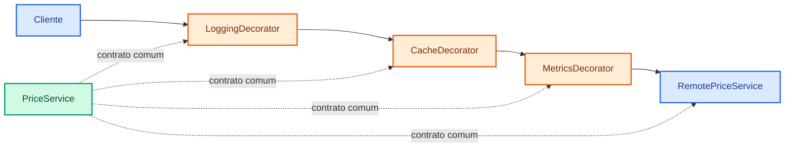

Cada camada pode executar algo antes ou depois da delegação. A ordem altera o resultado.

## Exemplo simples em Java

```java
import java.math.BigDecimal;

interface PriceService {
    BigDecimal findPrice(String sku);
}

record LoggingPriceService(PriceService delegate)
        implements PriceService {

    public BigDecimal findPrice(String sku) {
        long start = System.nanoTime();
        try {
            return delegate.findPrice(sku);
        } finally {
            long elapsed = System.nanoTime() - start;
            System.out.println(sku + " levou " + elapsed + " ns");
        }
    }
}

record DiscountPriceService(
    PriceService delegate,
    BigDecimal factor
) implements PriceService {

    public BigDecimal findPrice(String sku) {
        return delegate.findPrice(sku).multiply(factor);
    }
}
```

### Composição

```java
PriceService service = new LoggingPriceService(
    new DiscountPriceService(
        new RemotePriceService(),
        new BigDecimal("0.90")
    )
);
```

## A ordem importa

```mermaid
flowchart TB
    A[Logging fora do cache] --> A1[Mede cache e serviço remoto]
    B[Logging dentro do cache] --> B1[Mede apenas chamadas que chegam ao serviço]

    classDef question fill:#FEF3C7,stroke:#D97706,color:#78350F,stroke-width:2px;
    classDef answer fill:#E0E7FF,stroke:#4F46E5,color:#312E81,stroke-width:2px;

    class A,B question;
    class A1,B1 answer;
```

### Relações modernas

- `BufferedInputStream` envolve outro `InputStream` e acrescenta buffering.
- Bibliotecas de resiliência podem empilhar retry, circuit breaker e rate limiter.
- AOP e interceptadores possuem ideias semelhantes, mas frequentemente dependem também de Proxy e cadeias de interceptação.

> **Pergunta para a turma:** cache deve ficar antes ou depois de um decorator de métricas?

## Vantagens e custos

| Vantagens | Custos e limitações |
|---|---|
| Combina responsabilidades sem explosão de subclasses | Muitas camadas dificultam rastrear a chamada |
| Permite composição em tempo de execução | A ordem dos decorators pode gerar bugs sutis |
| Mantém o cliente dependente da mesma interface | Identidade e igualdade do objeto podem ficar confusas |
| Cada decorator pode ter testes isolados | Alguns componentes esperam a classe concreta, não a interface |
| Aplica responsabilidade única | Remover uma camada específica pode exigir reconstruir a cadeia |

---

# 6. Facade

> 🔵 **Classificação GoF: padrão estrutural** — oferece uma interface simplificada para um subsistema.

## Explicação

Um subsistema pode possuir muitas classes que precisam ser chamadas em determinada ordem. Se cada controller ou cliente precisar conhecer essa sequência, os detalhes internos se espalham pela aplicação e qualquer mudança afeta vários pontos.

O **Facade** cria uma entrada mais simples para esse subsistema. Em vez de o cliente coordenar estoque, pagamento e entrega separadamente, ele chama uma operação como `checkout` e recebe o resultado do caso de uso.

A fachada não substitui necessariamente os componentes internos. Ela apenas oferece um caminho conveniente e estável para os usos mais comuns. Pense na recepção de um hotel: o hóspede faz um pedido simples, enquanto a recepção coordena diferentes setores sem expor todo o funcionamento interno.

## Problema

Um controller precisa conhecer toda a sequência do checkout:

```mermaid
flowchart LR
    Controller[CheckoutController] --> Inventory[InventoryService]
    Controller --> Payment[PaymentService]
    Controller --> Shipping[ShippingService]
    Controller --> Email[EmailService]

    classDef controller fill:#FEE2E2,stroke:#DC2626,color:#7F1D1D,stroke-width:2px;
    classDef service fill:#DBEAFE,stroke:#2563EB,color:#1E3A8A,stroke-width:2px;

    class Controller controller;
    class Inventory,Payment,Shipping,Email service;
```

O cliente passa a conhecer ordem, conversões e tratamento de falhas do subsistema.

## O que está errado e o que melhora

### Antes: o cliente conhece o protocolo interno

O controller não apenas recebe HTTP. Ele decide a ordem dos serviços, converte resultados, libera estoque em caso de falha e conhece detalhes de pagamento e entrega. Uma mudança interna quebra vários clientes.

### Depois: uma operação representa o caso de uso

`CheckoutFacade.checkout` esconde o protocolo interno. O controller conhece uma entrada estável e recebe um resultado orientado ao caso de uso.

Isso não significa esconder todas as APIs. Clientes avançados ainda podem acessar componentes internos quando houver uma razão legítima.

## Estrutura com Facade

```mermaid
flowchart LR
    Controller[CheckoutController] --> Facade[CheckoutFacade]
    Facade --> Inventory[InventoryService]
    Facade --> Payment[PaymentService]
    Facade --> Shipping[ShippingService]
    Facade --> Email[EmailService]

    classDef facade fill:#FFEDD5,stroke:#EA580C,color:#7C2D12,stroke-width:2px;
    classDef client fill:#D1FAE5,stroke:#059669,color:#064E3B,stroke-width:2px;
    classDef service fill:#DBEAFE,stroke:#2563EB,color:#1E3A8A,stroke-width:2px;

    class Facade facade;
    class Controller client;
    class Inventory,Payment,Shipping,Email service;
```

O controller conhece uma operação orientada ao caso de uso: `checkout`.

## Exemplo simples em Java

```java
final class CheckoutFacade {
    private final InventoryService inventory;
    private final PaymentService payments;
    private final ShippingService shipping;

    CheckoutFacade(
        InventoryService inventory,
        PaymentService payments,
        ShippingService shipping
    ) {
        this.inventory = inventory;
        this.payments = payments;
        this.shipping = shipping;
    }

    OrderResult checkout(CheckoutCommand command) {
        Reservation reservation = inventory.reserve(command.items());

        try {
            Payment payment = payments.authorize(command.total());
            Shipment shipment = shipping.create(
                reservation,
                command.address()
            );
            return new OrderResult(payment.id(), shipment.id());
        } catch (RuntimeException error) {
            inventory.release(reservation);
            throw error;
        }
    }
}
```

## Quando usar

- endpoint precisa de uma operação de alto nível;
- biblioteca externa tem uma API extensa;
- cliente não deve conhecer a ordem interna;
- um subsistema precisa de uma entrada mais estável.

## Quando evitar

Uma Facade que absorve todas as regras da aplicação pode virar um **God Object**.

## Vantagens e custos

| Vantagens | Custos e limitações |
|---|---|
| Reduz o número de dependências do cliente | Pode concentrar responsabilidades demais |
| Esconde ordem e detalhes do subsistema | Pode oferecer uma API simplificada demais |
| Cria uma entrada estável para integrações | Alterações profundas no subsistema ainda podem chegar à fachada |
| Melhora legibilidade de controllers e consumidores | Pode duplicar operações já claras nos serviços internos |
| Facilita testes no nível do caso de uso | Uma fachada única para tudo vira gargalo de manutenção |

> **Pergunta para a turma:** o controller ainda deveria acessar `InventoryService` diretamente?

---

# 7. Proxy

> 🔵 **Classificação GoF: padrão estrutural** — posiciona um substituto diante do objeto real para controlar seu acesso.

## Explicação

Em alguns casos, o cliente não deve acessar diretamente o objeto que realiza o trabalho. Antes da chamada, pode ser necessário verificar permissão, consultar um cache, iniciar uma transação, carregar dados sob demanda ou acessar um serviço remoto.

O **Proxy** ocupa o lugar do objeto real e implementa a mesma interface. Por isso, o cliente pode utilizar o Proxy como se estivesse falando diretamente com o serviço. O Proxy decide o que precisa acontecer antes ou depois e, quando apropriado, delega a chamada ao objeto verdadeiro.

Ele funciona como um representante. Assim como uma pessoa autorizada pode agir em nome de outra, o Proxy recebe a solicitação em nome do serviço real. A diferença para Adapter é importante: o Proxy preserva o contrato; o Adapter converte um contrato em outro.

## Estrutura

```mermaid
flowchart LR
    Client[Cliente] --> Contract[ReportService]
    Proxy[SecuredReportService] -. implementa .-> Contract
    Real[DatabaseReportService] -. implementa .-> Contract
    Proxy --> Check[Verifica autorização]
    Check --> Real

    classDef interface fill:#D1FAE5,stroke:#059669,color:#064E3B,stroke-width:2px;
    classDef proxy fill:#FFEDD5,stroke:#EA580C,color:#7C2D12,stroke-width:2px;
    classDef service fill:#DBEAFE,stroke:#2563EB,color:#1E3A8A,stroke-width:2px;

    class Contract interface;
    class Proxy,Check proxy;
    class Client,Real service;
```

O cliente usa `ReportService`. O Proxy decide se e quando chama o serviço real.

## O que está errado e o que melhora

### Antes: cada cliente implementa o controle

Se controllers e serviços verificam permissão antes de cada consulta, a regra se repete. Alguns clientes podem esquecer a validação. O código de negócio também fica misturado a segurança, cache ou carregamento tardio.

### Depois: o acesso passa pelo substituto

O Proxy implementa a mesma interface do serviço real. Ele executa a responsabilidade de acesso e delega quando apropriado. Como o contrato é igual, o cliente não precisa mudar.

```mermaid
flowchart LR
    subgraph Antes
        C1[Cliente A] --> Check1[Verifica acesso]
        C2[Cliente B] --> Check2[Verifica acesso]
        Check1 --> Real1[Serviço real]
        Check2 --> Real1
    end

    subgraph Depois
        C3[Clientes] --> Proxy[Proxy de segurança]
        Proxy --> Real2[Serviço real]
    end

    classDef bad fill:#FEE2E2,stroke:#DC2626,color:#7F1D1D,stroke-width:2px;
    classDef good fill:#D1FAE5,stroke:#059669,color:#064E3B,stroke-width:2px;
    class C1,C2,Check1,Check2,Real1 bad;
    class C3,Proxy,Real2 good;
```

## Exemplo simples em Java

```java
interface ReportService {
    Report findById(long id);
}

record SecuredReportService(
    ReportService target,
    CurrentUser currentUser
) implements ReportService {

    public Report findById(long id) {
        if (!currentUser.hasRole("ANALYST")) {
            throw new SecurityException("Acesso negado");
        }
        System.out.println("Acesso autorizado");
        return target.findById(id);
    }
}
```

### Uso

```java
ReportService realService = new DatabaseReportService();
ReportService service = new SecuredReportService(realService, currentUser);

Report report = service.findById(10L);
```

## Variações

| Tipo | Responsabilidade |
|---|---|
| Protection Proxy | verifica permissão |
| Virtual Proxy | cria ou carrega somente quando necessário |
| Remote Proxy | representa um objeto em outro processo |
| Caching Proxy | devolve um resultado armazenado |
| Transactional Proxy | executa a chamada dentro de uma transação |

### Observação sobre frameworks

Frameworks Java podem gerar proxies dinamicamente para segurança, transações e outros interceptadores. Essa aplicação deve ser explicada depois que os alunos compreenderem o Proxy em Java puro. Não colocar Spring, Hibernate ou anotações no diagrama principal.

## Proxy, Adapter, Decorator e Facade

| Padrão | O que acontece com a interface? | Intenção principal |
|---|---|---|
| Proxy | permanece igual | controlar acesso |
| Decorator | permanece igual | combinar responsabilidades |
| Adapter | muda | converter contrato |
| Facade | simplifica | esconder um subsistema |

> **Pergunta para a turma:** o `SecuredReportService` poderia decidir retornar outro formato de relatório? Se mudasse o contrato, ele ainda seria Proxy?

## Vantagens e custos

| Vantagens | Custos e limitações |
|---|---|
| Centraliza controle de acesso | Acrescenta indireção e dificulta depuração |
| Preserva a interface do serviço real | Chamadas internas podem contornar certos proxies dinâmicos |
| Pode atrasar a criação de objetos caros | Lazy loading pode falhar fora do contexto necessário |
| Acrescenta cache, segurança ou transação sem alterar o alvo | Comportamento invisível pode surpreender o desenvolvedor |
| Permite substituir objetos remotos por representantes locais | Proxy remoto não elimina latência ou falhas de rede |

---

# 8. Strategy

> 🟢 **Classificação GoF: padrão comportamental** — separa algoritmos intercambiáveis do objeto que os utiliza.

## Explicação

Uma operação pode possuir várias formas válidas de execução. O frete pode ser calculado como padrão, expresso, retirada ou internacional. No início, um `if` ou `switch` é suficiente. Conforme cada alternativa ganha regras e dependências próprias, uma única classe passa a concentrar algoritmos que mudam por motivos diferentes.

O **Strategy** extrai cada algoritmo para uma classe separada. Todas implementam a mesma interface, pois resolvem a mesma categoria de problema. O objeto que precisa do cálculo recebe uma dessas estratégias e delega a operação.

Isso permite escolher ou trocar o algoritmo sem alterar o contexto que o utiliza. A seleção ainda precisa acontecer em algum lugar, mas fica separada da implementação de cada regra. Como resultado, cada estratégia pode ser compreendida e testada isoladamente.

## Problema

```java
BigDecimal calculate(Order order, ShippingType type) {
    return switch (type) {
        case STANDARD -> calculateStandard(order);
        case EXPRESS -> calculateExpress(order);
        case PICKUP -> BigDecimal.ZERO;
        case INTERNATIONAL -> calculateInternational(order);
    };
}
```

Um `switch` pequeno pode ser adequado. Strategy começa a ajudar quando cada ramo:

- possui várias regras;
- utiliza dependências diferentes;
- muda com frequência;
- precisa de testes independentes;
- pode ser selecionado dinamicamente.

## O que está errado e o que melhora

### Antes: seleção e algoritmos vivem juntos

`ShippingCalculator` conhece todos os tipos e contém todas as regras. Uma alteração na fórmula internacional abre o mesmo arquivo usado por frete expresso e retirada. Dependências específicas também acabam acumuladas no construtor da calculadora.

### Depois: cada política possui uma implementação

Cada `ShippingStrategy` guarda seu algoritmo e suas dependências. A calculadora apenas localiza a estratégia e delega. Testes podem verificar cada política isoladamente.

```mermaid
flowchart LR
    subgraph Antes
        Calc1[ShippingCalculator] --> Switch{switch type}
        Switch --> Rules[Quatro algoritmos internos]
    end

    subgraph Depois
        Calc2[ShippingCalculator] --> Contract[ShippingStrategy]
        Contract --> Standard[Standard]
        Contract --> Express[Express]
        Contract --> Pickup[Pickup]
    end

    classDef bad fill:#FEE2E2,stroke:#DC2626,color:#7F1D1D,stroke-width:2px;
    classDef good fill:#D1FAE5,stroke:#059669,color:#064E3B,stroke-width:2px;
    class Calc1,Switch,Rules bad;
    class Calc2,Contract,Standard,Express,Pickup good;
```

## Estrutura

```mermaid
classDiagram
    class ShippingStrategy {
        <<interface>>
        +calculate(order) BigDecimal
    }

    class StandardShipping
    class ExpressShipping
    class PickupShipping
    class ShippingCalculator

    ShippingStrategy <|.. StandardShipping
    ShippingStrategy <|.. ExpressShipping
    ShippingStrategy <|.. PickupShipping
    ShippingCalculator --> ShippingStrategy : seleciona e executa

    style ShippingStrategy fill:#D1FAE5,stroke:#059669,color:#064E3B
    style ShippingCalculator fill:#DBEAFE,stroke:#2563EB,color:#1E3A8A
    style StandardShipping fill:#FFEDD5,stroke:#EA580C,color:#7C2D12
    style ExpressShipping fill:#FFEDD5,stroke:#EA580C,color:#7C2D12
    style PickupShipping fill:#FFEDD5,stroke:#EA580C,color:#7C2D12
```

## Exemplo simples em Java

```java
import java.math.BigDecimal;
import java.util.Map;

interface ShippingStrategy {
    BigDecimal calculate(Order order);
}

final class StandardShipping implements ShippingStrategy {
    public BigDecimal calculate(Order order) {
        return order.total().multiply(new BigDecimal("0.05"));
    }
}

final class PickupShipping implements ShippingStrategy {
    public BigDecimal calculate(Order order) {
        return BigDecimal.ZERO;
    }
}

final class ShippingCalculator {
    private final Map<ShippingType, ShippingStrategy> strategies;

    ShippingCalculator(Map<ShippingType, ShippingStrategy> strategies) {
        this.strategies = Map.copyOf(strategies);
    }

    BigDecimal calculate(Order order, ShippingType type) {
        ShippingStrategy strategy = strategies.get(type);
        if (strategy == null) {
            throw new IllegalArgumentException("Frete não suportado: " + type);
        }
        return strategy.calculate(order);
    }
}
```

### Configuração

```java
var strategies = Map.of(
    ShippingType.STANDARD, new StandardShipping(),
    ShippingType.PICKUP, new PickupShipping()
);

var calculator = new ShippingCalculator(strategies);
```

## O que realmente melhorou?

- cada algoritmo ganhou uma classe e testes próprios;
- o cálculo deixou de conhecer implementações concretas;
- novas estratégias podem entrar por configuração;
- cada estratégia pode receber suas próprias dependências.

A decisão sobre qual estratégia usar ainda existe. Ela apenas ficou separada do algoritmo.

> **Pergunta para a turma:** quatro linhas estáveis em um switch justificam quatro classes?

## Vantagens e custos

| Vantagens | Custos e limitações |
|---|---|
| Isola algoritmos que mudam de forma independente | Aumenta o número de objetos e arquivos |
| Facilita testes unitários por política | O cliente ou configuração ainda precisa escolher a estratégia |
| Permite trocar comportamento em execução | Estratégias muito pequenas podem fragmentar o código |
| Evita uma classe com dependências de todos os algoritmos | Parâmetros muito diferentes podem tornar a interface artificial |
| Favorece composição e Open/Closed | Um switch estável pode continuar mais simples |

---

# 9. Observer

> 🟢 **Classificação GoF: padrão comportamental** — distribui notificações entre um publicador e seus assinantes.

## Explicação

Quando algo importante acontece, vários objetos podem precisar reagir. Depois de uma venda, por exemplo, o sistema pode enviar recibo, atualizar um painel e adicionar pontos de fidelidade. Se o caso de uso chamar todos esses serviços diretamente, ele passa a conhecer cada interessado.

O **Observer** cria uma relação de publicação e assinatura. O publicador mantém uma coleção de objetos que seguem uma interface de notificação. Quando ocorre o evento, ele percorre essa coleção e avisa cada assinante.

O publicador conhece o contrato, mas não as classes concretas. Novos interessados podem ser adicionados sem alterar a classe que publica o evento. O padrão é apropriado para reações independentes, mas exige decisões claras sobre ordem, falhas, cancelamento da inscrição e execução síncrona ou assíncrona.

## Problema

```java
void completeSale(Sale sale) {
    repository.save(sale);
    email.sendReceipt(sale);
    stock.decrease(sale.items());
    dashboard.refresh(sale);
    loyalty.addPoints(sale.customer());
}
```

O caso de uso muda sempre que aparece uma nova reação à venda.

Nem toda chamada deve virar evento. Persistência e invariantes centrais podem continuar no fluxo principal. Observer ajuda com reações independentes.

## O que está errado e o que melhora

### Antes: o publicador conhece todos os interessados

O caso de uso depende de e-mail, dashboard e fidelidade. Adicionar um novo interessado altera o fluxo da venda. Uma falha periférica pode impedir o processamento principal sem que essa decisão tenha sido discutida.

### Depois: interessados assinam um evento

O publicador emite `SaleCompleted`. Assinantes implementam `SaleListener` e podem entrar ou sair sem alterar o publicador. A aplicação ainda precisa decidir quais efeitos são obrigatórios e quais são reações independentes.

```mermaid
flowchart LR
    subgraph Antes
        Sale1[CompleteSale] --> Email1[Email]
        Sale1 --> Dash1[Dashboard]
        Sale1 --> Loyalty1[Loyalty]
    end

    subgraph Depois
        Sale2[CompleteSale] --> Event[SaleCompleted]
        Event --> Contract[SaleListener]
        Contract --> Email2[Email]
        Contract --> Dash2[Dashboard]
        Contract --> Loyalty2[Loyalty]
    end

    classDef bad fill:#FEE2E2,stroke:#DC2626,color:#7F1D1D,stroke-width:2px;
    classDef good fill:#D1FAE5,stroke:#059669,color:#064E3B,stroke-width:2px;
    class Sale1,Email1,Dash1,Loyalty1 bad;
    class Sale2,Event,Contract,Email2,Dash2,Loyalty2 good;
```

## Estrutura

```mermaid
flowchart LR
    Publisher[SaleEvents] --> Contract[SaleListener]
    Contract --> Email[EmailListener]
    Contract --> Dashboard[DashboardListener]
    Contract --> Loyalty[LoyaltyListener]

    Sale[SaleCompleted] --> Publisher

    classDef interface fill:#D1FAE5,stroke:#059669,color:#064E3B,stroke-width:2px;
    classDef concrete fill:#FFEDD5,stroke:#EA580C,color:#7C2D12,stroke-width:2px;
    classDef publisher fill:#DBEAFE,stroke:#2563EB,color:#1E3A8A,stroke-width:2px;

    class Contract interface;
    class Email,Dashboard,Loyalty concrete;
    class Publisher,Sale publisher;
```

## Exemplo simples em Java

```java
import java.util.ArrayList;
import java.util.List;

record SaleCompleted(Sale sale) { }

interface SaleListener {
    void onSaleCompleted(SaleCompleted event);
}

final class SaleEvents {
    private final List<SaleListener> listeners = new ArrayList<>();

    void subscribe(SaleListener listener) {
        listeners.add(listener);
    }

    void unsubscribe(SaleListener listener) {
        listeners.remove(listener);
    }

    void publish(SaleCompleted event) {
        for (SaleListener listener : List.copyOf(listeners)) {
            listener.onSaleCompleted(event);
        }
    }
}
```

### Assinante concreto

```java
final class EmailListener implements SaleListener {
    public void onSaleCompleted(SaleCompleted event) {
        System.out.println(
            "Enviando recibo da venda " + event.sale().id()
        );
    }
}
```

## Decisões importantes

```mermaid
flowchart TB
    Event[Evento publicado] --> Sync[Síncrono]
    Event --> Async[Assíncrono]

    Sync --> SyncResult[Falha retorna ao publicador]
    Async --> AsyncResult[Exige fila, retry e observabilidade]

    classDef event fill:#FEF3C7,stroke:#D97706,color:#78350F,stroke-width:2px;
    classDef option fill:#DBEAFE,stroke:#2563EB,color:#1E3A8A,stroke-width:2px;
    classDef result fill:#EDE9FE,stroke:#7C3AED,color:#4C1D95,stroke-width:2px;

    class Event event;
    class Sync,Async option;
    class SyncResult,AsyncResult result;
```

Perguntas que a implementação precisa responder:

- um listener com erro impede os demais?
- a ordem dos listeners possui significado?
- o evento carrega dados ou apenas identifica a mudança?
- quando a inscrição termina?
- a publicação acontece na mesma thread?

## Observer e mensageria

Kafka, RabbitMQ e serviços de eventos utilizam publicação e assinatura, mas não são apenas o Observer GoF em outra máquina. Eles acrescentam conceitos como:

- broker;
- serialização;
- persistência;
- grupos de consumidores;
- repetição de entrega;
- ordenação e falhas parciais.

Use Observer para introduzir desacoplamento por eventos. Depois, apresente mensageria distribuída como um problema arquitetural mais amplo.

> **Pergunta para a turma:** se `EmailListener` falhar, a venda deve ser cancelada?

## Vantagens e custos

| Vantagens | Custos e limitações |
|---|---|
| Publicador não conhece classes concretas dos assinantes | Fluxo de execução fica menos evidente |
| Novos assinantes entram sem alterar o publicador | Ordem e tratamento de falhas precisam de contrato |
| Permite inscrição dinâmica | Assinantes esquecidos podem causar vazamento de memória |
| Separa evento das reações periféricas | Eventos genéricos demais escondem significado do domínio |
| Serve como base didática para sistemas orientados a eventos | Execução assíncrona adiciona concorrência e consistência eventual |

---

# Comparação final

## Classificação consolidada

| Padrão | Categoria GoF | Elemento que varia |
|---|---|---|
| Factory Method | Criacional | produto criado por uma classe |
| Abstract Factory | Criacional | família de produtos |
| Builder | Criacional | etapas e configuração da construção |
| Adapter | Estrutural | forma de conectar dois contratos |
| Decorator | Estrutural | responsabilidades combinadas ao redor de um objeto |
| Facade | Estrutural | interface de acesso ao subsistema |
| Proxy | Estrutural | forma de controlar o acesso ao objeto real |
| Strategy | Comportamental | algoritmo utilizado |
| Observer | Comportamental | conjunto de objetos notificados |

## Qual problema cada padrão resolve?

| Problema percebido | Padrão a considerar |
|---|---|
| Um fluxo precisa variar o produto criado | Factory Method |
| Uma família completa precisa mudar | Abstract Factory |
| Um objeto exige construção gradual | Builder |
| Um sistema externo possui contrato incompatível | Adapter |
| Responsabilidades precisam ser combinadas | Decorator |
| Um cliente conhece um subsistema complexo | Facade |
| O acesso ao objeto precisa ser controlado | Proxy |
| Um algoritmo precisa ser intercambiável | Strategy |
| Vários interessados precisam receber eventos | Observer |

## Pares frequentemente confundidos

```mermaid
flowchart TB
    A[Preciso mudar a interface?] -->|Sim| Adapter
    A -->|Não| B[Preciso simplificar vários objetos?]
    B -->|Sim| Facade
    B -->|Não| C[Preciso controlar acesso?]
    C -->|Sim| Proxy
    C -->|Não| D[Preciso combinar responsabilidades?]
    D -->|Sim| Decorator

    classDef question fill:#FEF3C7,stroke:#D97706,color:#78350F,stroke-width:2px;
    classDef answer fill:#D1FAE5,stroke:#059669,color:#064E3B,stroke-width:2px;

    class A,B,C,D question;
    class Adapter,Facade,Proxy,Decorator answer;
```

---

# Exercício integrador

Uma plataforma de checkout precisa:

1. trocar toda a infraestrutura entre AWS e Azure;
2. integrar um gateway de pagamento legado;
3. criar requisições imutáveis com parâmetros opcionais;
4. selecionar regras de frete;
5. combinar logging e cache;
6. simplificar estoque, pagamento e entrega;
7. controlar acesso a relatórios;
8. avisar e-mail, dashboard e fidelidade após uma venda.

## Gabarito

| Necessidade | Padrão |
|---|---|
| Família AWS ou Azure | Abstract Factory |
| Gateway legado | Adapter |
| Requisição imutável | Builder |
| Regra de frete | Strategy |
| Logging e cache | Decorator |
| Orquestração do checkout | Facade |
| Controle de acesso | Proxy |
| Reações à venda | Observer |

O Factory Method pode aparecer dentro de um fluxo base que permita a subclasses escolher um único produto.

---

# Checklist de decisão

Antes de aplicar um padrão, responda:

- Existe uma mudança recorrente ou apenas uma hipótese?
- Uma solução direta ainda é mais legível?
- O padrão reduz dependências importantes?
- A equipe reconhecerá a intenção?
- As novas classes facilitam testes?
- O benefício justifica a complexidade?

> **Conclusão:** um padrão é útil quando torna a intenção do projeto mais clara e reduz o custo de mudanças reais.

---

# Referências

- SHVETS, Alexander. *Mergulho nos Padrões de Projeto*. Refactoring.Guru.
- GAMMA, Erich et al. *Design Patterns: Elements of Reusable Object-Oriented Software*.
- Oracle Java Documentation: `InputStream`, `FilterInputStream`, `Iterable` e `Iterator`.
