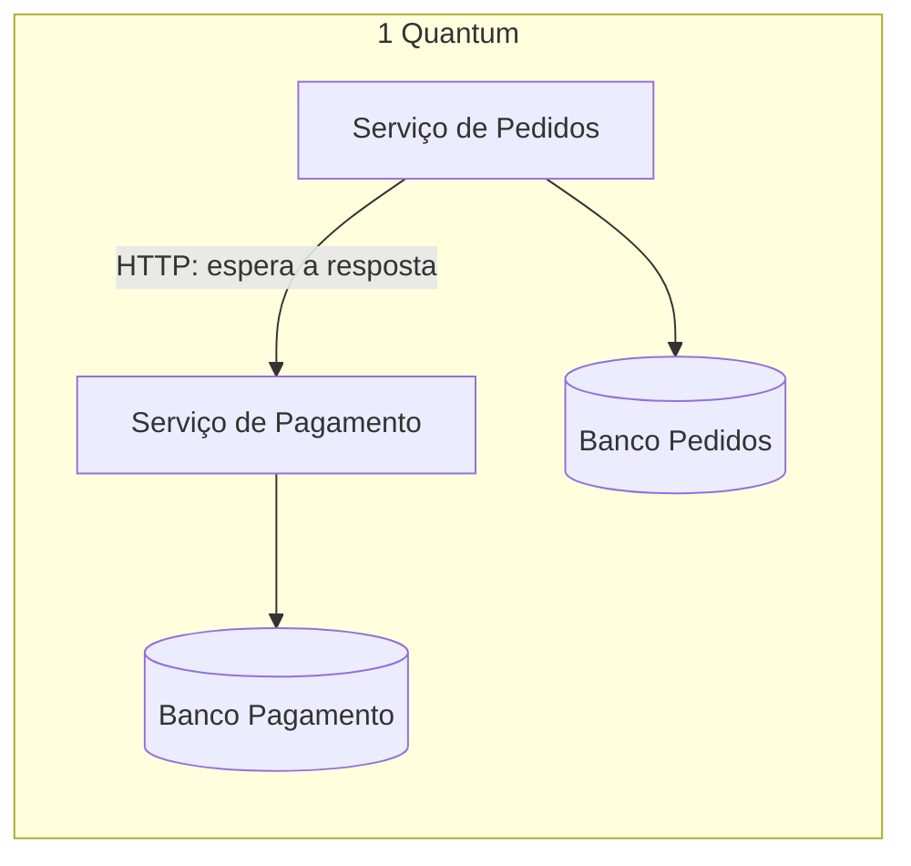
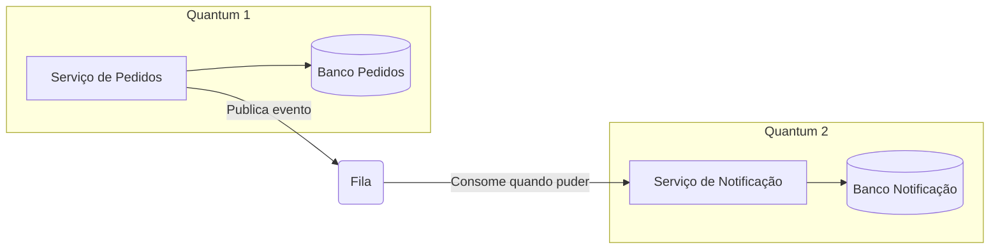
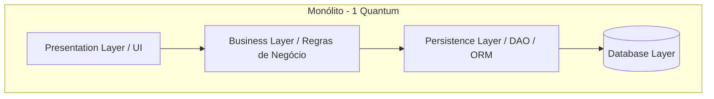
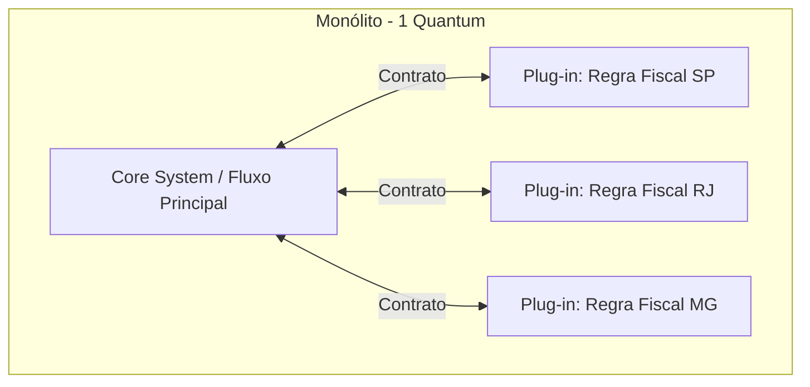
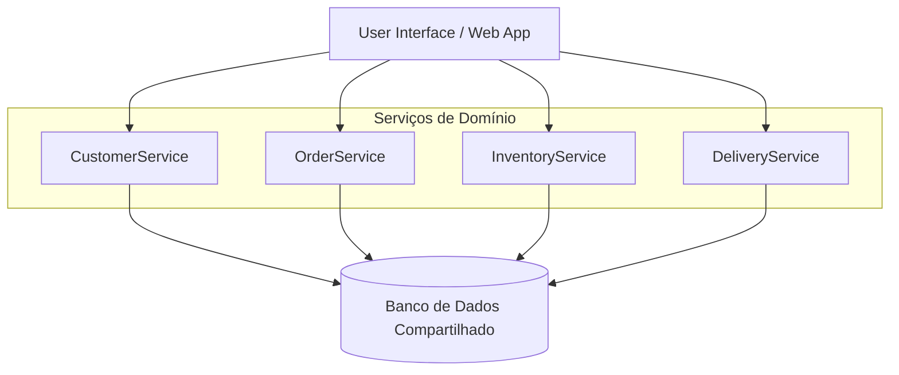
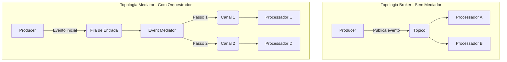
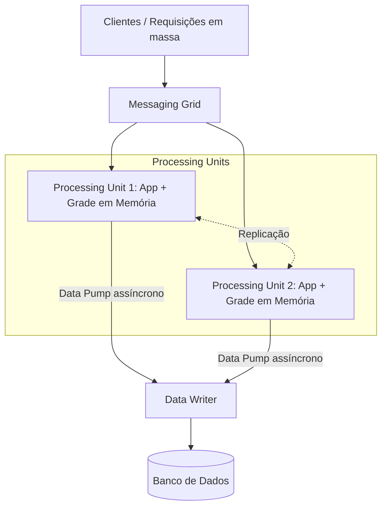
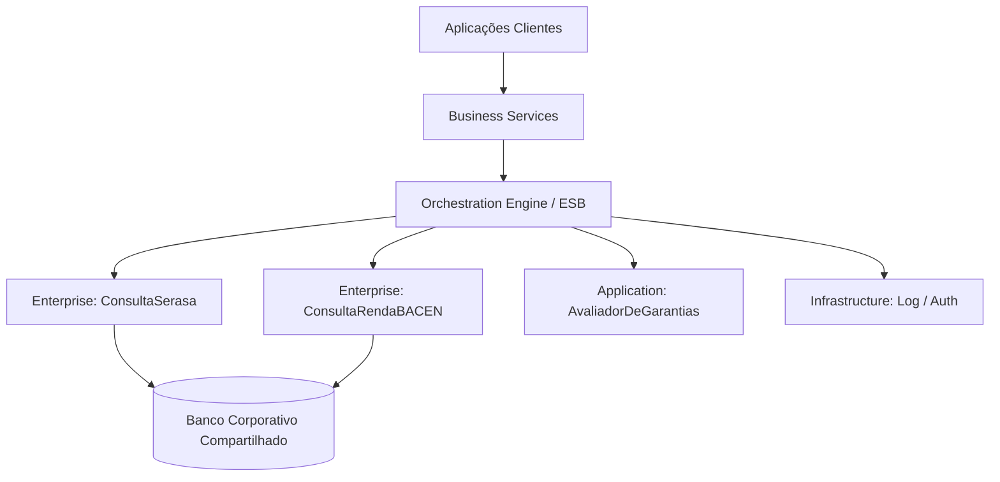

# Plano de Aula: Estilos Arquiteturais e Análise de Trade-Offs

**Disciplina:** Arquitetura de Software
**Livro-Texto Base:** *Fundamentals of Software Architecture: An Engineering Approach* (Mark Richards & Neal Ford)
**Objetivo Didático:** Capacitar os alunos a compreender a topologia, as características operacionais, as formas de particionamento e os *trade-offs* de cada estilo arquitetural do livro, com exemplos práticos e concretos.
---

## Sumário
1. **Fundamentos da Análise Arquitetural**
   - As Leis da Arquitetura de Software
   - Particionamento Técnico vs. Particionamento por Domínio
   - O Conceito de *Architectural Quantum*
   - As Falácias da Computação Distribuída
   - As Características Arquiteturais (*Architecture Characteristics*)
2. **Estilos Monolíticos (1 Quantum)**
   - Camadas (*Layered*)
   - Pipeline (*Pipes and Filters*)
   - Microkernel (*Plug-in*)
3. **Estilos Distribuídos**
   - Baseada em Serviços (*Service-Based*)
   - Orientada a Eventos (*Event-Driven*)
   - Baseada em Espaço (*Space-Based*)
   - SOA Orientada a Orquestração
   - Microsserviços
4. **Matriz Comparativa (Star Ratings)**

---

## 1. Fundamentos da Análise Arquitetural

### 1.1 As Leis da Arquitetura de Software
* **Primeira Lei:** *"Tudo em arquitetura de software é um trade-off."* Não existem decisões perfeitas, apenas escolhas com vantagens e desvantagens. Se você não enxerga um ponto negativo numa solução, é porque ainda não identificou o *trade-off*.
* **Segunda Lei:** *"Por que é mais importante do que como."* O arquiteto pode olhar um sistema e entender *como* ele está estruturado, mas o que se perde com o tempo é *por que* as decisões foram tomadas. Por isso o livro defende registrar o raciocínio (ex.: *Architecture Decision Records* — ADRs).

---

> ### 💡 *"Não há respostas erradas em arquitetura, apenas respostas caras."*

---

### 1.2 Particionamento de Alto Nível
Antes de escolher um estilo, o arquiteto define a forma primária de organizar o código:

* **Particionamento Técnico:** organiza o sistema por capacidades técnicas (Apresentação, Negócio, Persistência, Banco de Dados).
  * *Vantagens:* separação clara de responsabilidades técnicas; fácil navegação para desenvolvedores especializados.
  * *Desvantagens:* uma mudança de domínio atravessa todas as camadas.
  * *Mais usado em:* aplicações CRUD de pequeno e médio porte; frameworks MVC tradicionais (Spring MVC, Django, Laravel, ASP.NET MVC); sistemas internos com regras de negócio simples; empresas com times organizados por especialidade técnica (front-end, back-end, DBA).

* **Particionamento por Domínio:** organiza os componentes em torno de domínios ou fluxos de negócio (inspiração no DDD).
  * *Vantagens:* alinhamento com o negócio; favorece o *Inverse Conway Maneuver* (times multidisciplinares por domínio); isola mudanças e facilita uma futura migração para sistemas distribuídos.
  * *Desvantagens:* exige conhecer bem o negócio para traçar as fronteiras certas, e fronteiras erradas são caras de corrigir; código técnico comum (acesso a dados, logs, validações) tende a se repetir em cada domínio ou a exigir bibliotecas compartilhadas; é menos intuitivo para quem está acostumado a pensar em camadas.
  * *Mais usado em:* sistemas com vários fluxos de negócio distintos (vendas, estoque, financeiro); empresas com times organizados por produto ou área de negócio; monólitos modulares; arquiteturas distribuídas organizadas por serviços de negócio.

### 1.3 O Conceito de *Architectural Quantum*

**Definição do livro:** um artefato implantável de forma independente, com alta coesão funcional e conascência síncrona.

Decompondo a definição:
* **Implantável de forma independente:** pode ser colocado em produção sozinho, levando tudo de que precisa para funcionar, inclusive o seu banco de dados.
* **Alta coesão funcional:** faz um conjunto de coisas relacionadas, com um propósito de negócio claro.
* **Conascência síncrona:** *conascência* significa que duas partes estão ligadas de tal forma que uma depende da outra para funcionar corretamente. Ser *síncrona* quer dizer que, em tempo de execução, uma parte **fica esperando a resposta da outra** para poder continuar (ex.: uma chamada HTTP/REST que bloqueia até o retorno chegar).

> **Em uma frase:** um quantum é o conjunto de partes do sistema que **sobem juntas, funcionam juntas e caem juntas**.

**Por que isso importa:** as características arquiteturais (escalabilidade, disponibilidade, desempenho, segurança) valem para o quantum inteiro. Se duas partes estão no mesmo quantum, não é possível dar a elas características diferentes: se uma precisar escalar, ou se uma cair, a outra é afetada junto.

**Como identificar os quanta — o teste do "e se cair?":**
1. Escolha um componente e imagine que ele saiu do ar.
2. Quais outras partes param de funcionar imediatamente? Todas pertencem ao mesmo quantum.
3. As partes que continuam funcionando (e apenas processam o trabalho pendente quando o componente volta) estão em outro quantum.

| O que **une** partes num mesmo quantum | O que **separa** em quanta diferentes |
| :--- | :--- |
| Rodar no mesmo processo / mesma implantação | Implantação independente |
| Compartilhar o mesmo banco de dados | Cada parte com os seus próprios dados |
| Chamar a outra parte e esperar a resposta (síncrono) | Comunicar-se por mensagens ou eventos, sem esperar (assíncrono) |

**Exemplo A — 1 quantum:** Pedidos chama Pagamento por HTTP e espera a resposta. Mesmo com bancos separados, se Pagamento cair, nenhum pedido é concluído. Eles caem juntos.

**Exemplo B — 2 quanta:** Pedidos publica um evento numa fila e segue em frente. Se Notificação cair, os pedidos continuam sendo aceitos; as mensagens ficam na fila e são processadas quando o serviço voltar.

**Resumo:**
* **Monólitos:** sempre **1 quantum**, pois tudo roda junto e compartilha o mesmo banco.
* **Sistemas distribuídos:** de **1 a N quanta**. Dividir o sistema em vários serviços não garante vários quanta: se eles compartilham o banco ou dependem de chamadas síncronas, continuam sendo um só.

### 1.4 As 8 Falácias da Computação Distribuída
Premissas falsas que os desenvolvedores costumam assumir ao sair do monólito:
1. A rede é confiável.
2. A latência é zero.
3. A largura de banda é infinita.
4. A rede é segura.
5. A topologia nunca muda.
6. Existe apenas um administrador.
7. O custo de transporte é zero.
8. A rede é homogênea.

### 1.5 As Características Arquiteturais (*Architecture Characteristics*)
Cada estilo será avaliado pelas mesmas características, numa escala de 1 a 5 estrelas, como no livro. Estas palavras-chave são o vocabulário necessário para comparar os estilos.

> **Como ler as estrelas:** ⭐ significa que o estilo dificulta a característica e ⭐⭐⭐⭐⭐ significa que ele a favorece fortemente. As notas não são absolutas: comparam os estilos entre si, numa implementação típica.

#### Características ligadas ao esforço de construir e manter

* **Simplicidade:** o quão fácil é entender, construir e manter o sistema. Envolve o número de partes móveis, as tecnologias necessárias e o esforço mental para acompanhar o fluxo.
  * *Pergunta-chave:* um desenvolvedor recém-chegado consegue entender o sistema rapidamente?
  * *Exemplo:* um sistema que roda num único servidor, com um único banco, é mais simples de entender do que um que espalha o fluxo por dez serviços, filas e bancos diferentes.

* **Custo Geral:** o custo total de construir e operar o sistema, incluindo infraestrutura, licenças, tamanho e especialização do time e esforço de manutenção.
  * *Pergunta-chave:* quanto custa colocar e manter isso em produção?
  * *Exemplo:* um site institucional numa hospedagem simples custa pouco; um sistema replicado em vários data centers, com um time de operações dedicado, custa muito.

* **Modularidade:** o grau em que o sistema é dividido em partes coesas e independentes, com fronteiras claras entre elas.
  * *Pergunta-chave:* consigo mexer numa parte sem precisar entender ou alterar as outras?
  * *Exemplo:* num app de banco, o módulo de Pix pode ser alterado sem que o desenvolvedor precise abrir o código do módulo de investimentos.

* **Evolutividade:** a capacidade de o sistema absorver mudanças ao longo do tempo (novas funcionalidades, regras ou tecnologias) de forma incremental, sem grandes reescritas.
  * *Pergunta-chave:* quando o negócio mudar, o sistema acompanha ou trava?
  * *Exemplo:* uma loja online que passa a aceitar Pix apenas adicionando um novo meio de pagamento, sem reescrever o checkout.

* **Testabilidade:** a facilidade de testar o sistema de forma completa e confiável, considerando o escopo afetado por uma mudança e a dificuldade de montar o ambiente de teste.
  * *Pergunta-chave:* depois de uma mudança, quanto do sistema preciso retestar, e é fácil fazer isso?
  * *Exemplo:* se alterar o cálculo do frete obriga a rodar os testes de todo o sistema (cadastro, login, relatórios), a testabilidade é baixa.

* **Implantabilidade (*Deployability*):** a facilidade, a frequência e o risco de colocar uma nova versão em produção.
  * *Pergunta-chave:* posso fazer deploy de uma parte sem parar ou arriscar o resto?
  * *Exemplo:* precisar parar o sistema inteiro de madrugada só para corrigir um texto errado na tela de login indica baixa implantabilidade.

#### Características ligadas ao comportamento em produção

* **Desempenho:** a rapidez com que o sistema responde a uma requisição (latência) e o volume de trabalho que processa (vazão).
  * *Pergunta-chave:* quanto tempo o usuário espera pela resposta?
  * *Exemplo:* uma busca que retorna em 200 ms tem bom desempenho; uma que leva 8 segundos faz o usuário desistir.

* **Escalabilidade:** a capacidade de atender a um **aumento gradual e sustentado** de usuários ou carga, mantendo o desempenho.
  * *Pergunta-chave:* se o número de usuários dobrar ao longo do ano, o sistema aguenta?
  * *Exemplo:* um app de delivery que cresce de mil para cem mil usuários ao longo de dois anos.

* **Elasticidade:** a capacidade de responder a **picos repentinos** de carga, aumentando os recursos rapidamente e liberando-os depois.
  * *Pergunta-chave:* se a carga multiplicar por 50 em poucos minutos, o sistema reage a tempo?
  * *Exemplo:* o sistema da Receita Federal no último dia de entrega da declaração do Imposto de Renda.

* **Confiabilidade:** a capacidade de o sistema funcionar corretamente e de forma consistente ao longo do tempo, sem perder ou corromper dados.
  * *Pergunta-chave:* posso confiar que o sistema faz a coisa certa, sempre?
  * *Exemplo:* numa transferência bancária, o valor é debitado de uma conta e creditado na outra exatamente uma vez, sem duplicar nem sumir dinheiro.

* **Tolerância a Falhas:** a capacidade de o sistema continuar operando, ainda que parcialmente, quando uma das suas partes falha.
  * *Pergunta-chave:* se um componente cair, o resto continua de pé?
  * *Exemplo:* num app de banco, se a área de "ofertas" cair, o cliente ainda consegue consultar o saldo e fazer um Pix.

#### Pares que costumam confundir

| Par | Diferença |
| :--- | :--- |
| **Escalabilidade × Elasticidade** | Escalabilidade é crescer de forma gradual e planejada; elasticidade é reagir a picos repentinos e encolher depois. |
| **Confiabilidade × Tolerância a Falhas** | Confiabilidade é funcionar corretamente; tolerância a falhas é continuar funcionando quando algo quebra. |
| **Desempenho × Escalabilidade** | Desempenho é a velocidade de uma requisição; escalabilidade é manter essa velocidade com mais usuários. Um sistema pode ser rápido para 10 usuários e travar com 10 mil. |
| **Modularidade × Implantabilidade** | Modularidade é como o código é organizado; implantabilidade é como ele vai para produção. Um sistema bem modularizado pode, ainda assim, precisar ser implantado inteiro de uma vez. |

---

## 2. Estilos Arquiteturais Monolíticos (1 Quantum)

> Cada estilo segue a mesma estrutura: **Topologia → Exemplo Prático → Outros Exemplos → Armadilha Comum → Destaques**.

### 2.1 Arquitetura em Camadas (*Layered Architecture*)

#### Topologia
Organização técnica em camadas lógicas sobrepostas. A forma clássica tem 4 camadas: **Apresentação**, **Negócio**, **Persistência** e **Banco de Dados**.
* **Camadas Fechadas:** a requisição passa obrigatoriamente pela camada imediatamente inferior, o que garante o **isolamento de camadas**.
* **Camadas Abertas:** permitem pular uma camada intermediária (ex.: uma camada de serviços compartilhados que pode ser ignorada quando não é necessária).

#### 💡 Exemplo Prático: Sistema de Gestão Escolar (ERP Acadêmico)
* **Cenário:** aplicação web para uma escola gerenciar alunos, notas e matrículas.
* **Como funciona:**
  1. **Apresentação:** o professor clica em "Lançar Nota" numa tela web.
  2. **Negócio (`NotaService`):** valida se a nota está entre 0 e 10, calcula a média parcial e verifica o limite de faltas.
  3. **Persistência (`NotaDAO`/ORM):** monta o `UPDATE nota SET valor = ... WHERE aluno_id = ...`.
  4. **Banco de Dados:** executa a transação no PostgreSQL centralizado.
* **Por que este estilo:** tráfego previsível, lógica CRUD bem definida e equipe pequena.
* **Quando quebra:** no último dia do semestre, 10.000 alunos acessam o boletim às 23h59. Não dá para escalar *só* a consulta de boletim: a aplicação inteira precisa ser duplicada, e o banco único vira gargalo de conexões.

#### Outros Exemplos
* Sistemas internos de cadastro (RH, almoxarifado, controle de patrimônio).
* Aplicações web tradicionais construídas com frameworks MVC.
* A primeira versão de um produto, quando o domínio ainda não está claro.

#### Armadilha Comum: *Architecture Sinkhole*
Requisições atravessam várias camadas apenas repassando dados, sem nenhuma lógica relevante. O livro sugere a regra 80-20: se mais de 20% das requisições forem simples "repasses", o estilo talvez não seja o adequado.

#### Destaques
* **Particionamento:** Técnico | **Quanta:** 1
* **Brilha em:** Simplicidade e Custo (⭐⭐⭐⭐⭐)
* **Sofre em:** Implantabilidade, Escalabilidade, Elasticidade e Tolerância a Falhas (⭐)

---

### 2.2 Arquitetura Pipeline (*Pipes and Filters*)

#### Topologia
Os dados fluem por canais unidirecionais (*Pipes*) entre unidades funcionais independentes (*Filters*). Tipos de filtro:
1. *Producer:* origem dos dados (leitura de arquivo, stream de entrada).
2. *Tester:* valida ou filtra os dados com base em critérios.
3. *Transformer:* modifica ou enriquece os dados.
4. *Consumer:* destino final (gravação em banco, geração de relatório).

#### 💡 Exemplo Prático: Processador de Extratos Bancários (ETL de Conciliação)
* **Cenário:** uma empresa recebe diariamente milhares de extratos (CSV, OFX, TXT) para importar no sistema contábil.
* **Como funciona:**
  1. **Producer:** lê o arquivo bruto do diretório de entrada.
  2. **Tester:** descarta linhas corrompidas ou com datas inválidas.
  3. **Transformer 1:** converte moedas estrangeiras para BRL com a cotação do dia.
  4. **Transformer 2:** categoriza o lançamento (ex.: "Posto Shell" → "Combustível").
  5. **Consumer:** grava os registros tratados na base financeira.
* **Por que este estilo:** cada etapa é independente. Se a regra de conversão de moeda mudar, só o *Transformer 1* é alterado.
* **Quando quebra:** quando o sistema exige interação bidirecional em tempo real com o usuário (ex.: um formulário web cuja resposta depende de vários cliques de navegação).

#### Outros Exemplos
* Comandos encadeados no terminal Unix (`cat logs.txt | grep ERROR | awk '{print $3}'`).
* Transcodificação de áudio e vídeo (decodificar → redimensionar → comprimir → salvar).
* Compiladores (análise léxica → análise sintática → otimização → geração de código).

#### Armadilha Comum: o Filtro "Faz-Tudo"
Filtros que acumulam várias responsabilidades, guardam estado ou dependem de outros filtros. Cada filtro deve fazer **uma única tarefa**, de forma independente; caso contrário, perde-se a reutilização e uma mudança volta a afetar o pipeline inteiro.

#### Destaques
* **Particionamento:** Técnico | **Quanta:** 1
* **Brilha em:** Simplicidade e Custo (⭐⭐⭐⭐⭐)
* **Sofre em:** Escalabilidade, Elasticidade e Tolerância a Falhas (⭐)

---

### 2.3 Arquitetura Microkernel (*Plug-in Architecture*)

#### Topologia
1. **Core System:** a funcionalidade mínima necessária para o sistema rodar.
2. **Plug-in Components:** módulos independentes que adicionam funcionalidades ou regras específicas.
3. **Registry e Contratos:** o *core* usa um registro para descobrir os plug-ins disponíveis e contratos bem definidos (interfaces) para se comunicar com eles.

#### 💡 Exemplo Prático: Emissor de Nota Fiscal Multi-Estado
* **Cenário:** um sistema que emite notas fiscais eletrônicas para empresas de vários estados, cada um com regras fiscais complexas e que mudam com frequência.
* **Como funciona:**
  1. **Core:** recebe a venda, controla a numeração sequencial, gera o PDF e transmite a nota.
  2. **Registry:** identifica o estado da operação e carrega o plug-in correspondente.
  3. **Plug-ins:** `PluginImpostoSP`, `PluginImpostoRJ`, `PluginImpostoMG` calculam os impostos segundo a legislação de cada estado.
* **Por que este estilo:** em vez de dezenas de `if/else` no core, cada estado fica isolado. Quando a legislação de MG muda, só o `PluginImpostoMG` é atualizado, sem risco para as emissões de SP.
* **Quando quebra:** no fechamento do mês, quando o volume de emissões explode. Não é possível escalar apenas o plug-in mais usado: o sistema inteiro precisa ser duplicado, porque core e plug-ins formam um único quantum.

#### Outros Exemplos
* IDEs como VS Code e Eclipse: o core é um editor de texto e as extensões adicionam linguagens, Git e depuração.
* Navegadores com extensões (bloqueadores de anúncio, gerenciadores de senha).
* CMSs como o WordPress, em que plugins adicionam loja, formulários e SEO.

#### Armadilha Comum: Plug-ins Acoplados ou Remotos
* **Plug-ins dependentes entre si**, ou um core que vai acumulando regras específicas (`if estado == "MG"`), destroem o isolamento que justificava o estilo.
* **Transformar plug-ins em serviços remotos** para escalá-los individualmente torna o sistema distribuído e traz de volta latência, falhas de rede e custo de infraestrutura (Seção 1.4).

#### Destaques
* **Particionamento:** Domínio e Técnico | **Quanta:** 1
* **Brilha em:** Custo (⭐⭐⭐⭐⭐) e Simplicidade (⭐⭐⭐⭐)
* **Sofre em:** Escalabilidade, Elasticidade e Tolerância a Falhas (⭐)

---

## 3. Estilos Arquiteturais Distribuídos

> Cada estilo segue a mesma estrutura: **Topologia → Exemplo Prático → Outros Exemplos → Armadilha Comum → Destaques**.

### 3.1 Arquitetura Baseada em Serviços (*Service-Based Architecture*)

#### Topologia
Um dos estilos **mais pragmáticos** do livro. Consiste numa interface de usuário, em **serviços de domínio de granularidade grossa** (*coarse-grained*, tipicamente entre 4 e 12) e, em geral, num banco de dados compartilhado.

#### 💡 Exemplo Prático: e-Commerce de Médio Porte (Varejo de Calçados)
* **Cenário:** uma rede de lojas físicas que expandiu para o online e quer isolar responsabilidades sem a complexidade de microsserviços.
* **Como funciona:**
  1. `CustomerService`: cadastro, endereços e autenticação.
  2. `OrderService`: carrinho, pedido **e** cobrança (integração com meios de pagamento).
  3. `InventoryService`: estoque unificado (lojas físicas e depósito central).
  4. `DeliveryService`: frete e rastreio das transportadoras.
  * Todos acessam o **mesmo banco SQL**, com esquemas logicamente separados.
* **Por que este estilo:**
  * O time de logística faz *deploy* do `DeliveryService` sem retestar o `CustomerService`.
  * **Transações ACID continuam simples:** como o `OrderService` é um serviço grande, que cuida do pedido inteiro (itens, pagamento, confirmação), a finalização da compra acontece numa única transação local, **dentro desse serviço**, sem precisar de Sagas.
* **Quando quebra:** na Black Friday, os picos de leitura do `InventoryService` sobrecarregam o banco compartilhado e acabam afetando o cadastro de clientes no `CustomerService`.

#### Outros Exemplos
* Sistemas de gestão de clínicas ou hospitais (Agendamento, Prontuário, Faturamento, Farmácia).
* Plataformas de ensino a distância (Matrícula, Conteúdo, Avaliações, Certificados).
* Um primeiro passo na migração de um monólito: dividir por domínios grandes antes de pensar em microsserviços.

#### Armadilha Comum: Serviços Pequenos Demais
Quebrar o sistema em serviços cada vez menores, que passam a chamar uns aos outros o tempo todo. O estilo perde sua principal vantagem (transações locais e pouca comunicação pela rede) e vira um "microsserviço mal feito", com o custo da distribuição e sem os benefícios.

#### Destaques
* **Particionamento:** Domínio | **Quanta:** 1 a muitos
* **Brilha em:** Implantabilidade, Testabilidade, Tolerância a Falhas, Confiabilidade, Modularidade e Custo (⭐⭐⭐⭐)
* **Sofre em:** Elasticidade (⭐⭐)

---

### 3.2 Arquitetura Orientada a Eventos (*Event-Driven Architecture*)

#### Topologia
Baseada na produção e no processamento **assíncrono** de eventos. Tem duas topologias:
* **Broker:** sem coordenador central; os processadores reagem aos eventos de forma encadeada.
* **Mediator:** um mediador orquestra os passos de um fluxo que exige ordem e controle.

#### 💡 Exemplo Prático
**Broker — App de Entregas (iFood / Uber Eats)**
* **Cenário:** quando o entregador retira o pedido, o app publica o evento `PedidoSaiuParaEntrega` num tópico (ex.: Kafka).
* **Como funciona:** três serviços reagem de forma independente e ao mesmo tempo:
  1. *Notificação:* envia um push para o cliente.
  2. *Rastreamento:* começa a exibir o GPS do entregador no mapa.
  3. *Analytics:* registra o horário para medir a eficiência das entregas no bairro.
* **Por que este estilo:** o entregador não espera ninguém; cada serviço reage no seu tempo.
* **Quando quebra:** ninguém "enxerga" o fluxo inteiro. Se a notificação falhar, não há um coordenador para perceber e reagir.

**Mediator — Sinistro de Seguro Auto**
* **Cenário:** o cliente registra uma colisão e o evento `SinistroRegistrado` entra numa fila.
* **Como funciona:** um *Mediador de Sinistros* coordena os passos em ordem:
  1. Aciona o *Serviço de Fraude* para validar a apólice.
  2. Com a validação, solicita a *Vistoria Técnica*.
  3. Com o laudo aprovado, aciona o *Financeiro* para agendar a indenização.
* **Por que este estilo:** controle do *workflow* e tratamento de erros centralizado (ex.: vistoria negada).
* **Quando quebra:** o mediador vira um ponto de acoplamento e de possível gargalo.

#### Outros Exemplos
* Notificações de redes sociais (curtida → notificar autor, atualizar contador, alimentar recomendações).
* Sistemas de IoT (sensores publicam leituras e vários serviços reagem: alerta, painel, histórico).
* Detecção de fraude em cartões (cada transação gera um evento analisado em tempo real).

#### Armadilha Comum: Fluxo Invisível
Com muitos eventos encadeados, ninguém sabe mais "quem reage a quê". Depurar um erro vira uma caça ao tesouro entre filas e serviços, e eventos podem se perder ou ser processados duas vezes. Sem rastreamento (*tracing*) e tratamento de erros planejados desde o início, o sistema fica impossível de entender.

#### Destaques
* **Particionamento:** Técnico | **Quanta:** 1 a muitos
* **Brilha em:** Desempenho, Escalabilidade, Tolerância a Falhas e Evolutividade (⭐⭐⭐⭐⭐)
* **Sofre em:** Simplicidade (⭐) e Testabilidade (⭐⭐)

---

### 3.3 Arquitetura Baseada em Espaço (*Space-Based Architecture*)

#### Topologia
Projetada para **picos extremos e imprevisíveis de acesso**.

**Ideia central:** tirar o banco de dados do caminho síncrono da transação. A aplicação roda em **Processing Units** que guardam os dados em **grades de dados em memória replicadas** (*in-memory data grids*). As alterações chegam ao banco de forma assíncrona, por meio de **Data Pumps** e **Data Writers**.

#### 💡 Exemplo Prático: Venda de Ingressos para um Megashow
* **Cenário:** 500.000 pessoas acessam o site às 10h00 para disputar 50.000 ingressos.
* **Como funciona:**
  1. **Sem banco no caminho crítico:** 500.000 requisições simultâneas no PostgreSQL esgotariam conexões e I/O em segundos.
  2. **Dados em memória:** as *Processing Units* mantêm o mapa de assentos na RAM replicada (ex.: Hazelcast, Apache Ignite).
  3. **Reserva instantânea:** verificar e reservar o assento leva milissegundos.
  4. **Escrita cadenciada:** a compra confirmada vai para uma fila, e o *Data Writer* grava no banco num ritmo que ele suporta.
* **Por que este estilo:** o gargalo (o banco) sai do caminho, e novas *Processing Units* podem ser criadas em segundos durante o pico.
* **Quando quebra:** se o sistema precisar de consistência imediata e total dos dados, ou se o orçamento for limitado (RAM massiva em nuvem e licenças de *data grid*).

#### Outros Exemplos
* Leilões online com lances simultâneos.
* Promoções relâmpago em e-commerce (ex.: "1 hora de ofertas").
* Sistemas de apostas esportivas durante uma partida.

#### Armadilha Comum: Colisão de Dados
Duas *Processing Units* atualizam o mesmo dado ao mesmo tempo, antes de a replicação terminar (ex.: o mesmo assento vendido duas vezes). Quanto mais unidades e mais lenta a replicação, maior a chance. É preciso estimar esse risco e definir como resolver as colisões.

#### Destaques
* **Particionamento:** Domínio e Técnico | **Quanta:** 1 a muitos
* **Brilha em:** Escalabilidade, Elasticidade e Desempenho (⭐⭐⭐⭐⭐)
* **Sofre em:** Simplicidade e Testabilidade (⭐) e Custo (⭐⭐)

---

### 3.4 SOA Orientada a Orquestração (*Orchestration-Driven SOA*)

#### Topologia
Estilo histórico, criado para maximizar o **reuso em nível corporativo**. Define uma taxonomia rígida de serviços, coordenados por um **motor de orquestração** (geralmente um ESB — *Enterprise Service Bus*):

1. *Business Services:* o ponto de entrada; descrevem processos de negócio em alto nível, sem código.
2. *Enterprise Services:* serviços reutilizáveis e de granularidade fina, compartilhados pela empresa (ex.: `CreateCustomer`).
3. *Application Services:* serviços específicos de uma única aplicação.
4. *Infrastructure Services:* preocupações operacionais (log, autenticação, monitoramento).
5. *Orchestration Engine:* conecta tudo, faz transformação de mensagens e coordena transações.

#### 💡 Exemplo Prático: Empréstimo Imobiliário num Banco Tradicional
* **Cenário:** um grande banco com sistemas legados (Mainframe/Cobol, Java, .NET) quer reaproveitar funcionalidades sem reescrevê-las.
* **Como funciona:**
  1. O cliente pede um empréstimo no app.
  2. O ESB chama `ConsultaSerasa` (Enterprise Service).
  3. Em seguida, chama `AvaliadorDeGarantias` (Application Service).
  4. Por fim, chama `ConsultaRendaBACEN` (Enterprise Service).
  * Durante o fluxo, o ESB converte protocolos e formatos (SOAP/XML ↔ JSON, EBCDIC ↔ ASCII).
* **Por que este estilo:** permite integrar sistemas legados heterogêneos e reaproveitar serviços já existentes em toda a empresa.
* **Quando quebra:** quando o negócio precisa mudar rápido. Qualquer alteração passa pelo ESB e por serviços compartilhados, exigindo alinhamento entre muitos times.

#### Outros Exemplos
* Grandes bancos e seguradoras dos anos 2000, com barramentos corporativos integrando dezenas de sistemas.
* Órgãos governamentais integrando sistemas legados de diferentes departamentos.
* Operadoras de telecomunicações com processos de ativação e cobrança orquestrados.

#### Armadilha Comum: Reuso Máximo, Acoplamento Máximo
Um "modelo canônico" único de Cliente, compartilhado por toda a empresa, faz qualquer mudança exigir alinhamento entre dezenas de times. O ESB vira um ponto central gigantesco e frágil. Foi esse o principal motivo do declínio do estilo na indústria.

#### Destaques
* **Particionamento:** Técnico | **Quanta:** 1 (acoplamento via ESB e banco compartilhado)
* **Brilha em:** Escalabilidade (⭐⭐⭐⭐)
* **Sofre em:** Implantabilidade, Evolutividade, Simplicidade, Testabilidade e Custo (⭐)

---

### 3.5 Arquitetura de Microsserviços (*Microservices Architecture*)

#### Topologia
A materialização física do *Bounded Context* do DDD.
* **Desacoplamento extremo:** cada serviço é implantado de forma independente, roda no seu próprio processo, tem **seu próprio banco de dados** e é mantido por um time próprio.
* **Heterogeneidade permitida:** cada serviço pode escolher a tecnologia e o banco mais adequados (*polyglot persistence*), sem obrigatoriedade.

```mermaid
graph TD
    Client[API Gateway / Frontend]
    subgraph Cluster [Microsserviços - Bounded Contexts]
        MS1[AuthService]
        MS2[CatalogService]
        MS3[RecommendationService]
        MS4[BillingService]
    end
    Client --> MS1
    Client --> MS2
    Client --> MS3
    Client --> MS4
    MS1 --> DB1[(Redis)]
    MS2 --> DB2[(Cassandra)]
    MS3 --> DB3[(Neo4j)]
    MS4 --> DB4[(PostgreSQL)]
```

#### 💡 Exemplo Prático: Plataforma Global de Streaming (estilo Netflix)
* **Cenário:** centenas de engenheiros trabalhando ao mesmo tempo, com cada área precisando de autonomia e tecnologia própria.
* **Como funciona:**
  1. `AuthService`: tokens de sessão (Redis).
  2. `CatalogService`: capas e detalhes de filmes (Cassandra, leitura rápida em larga escala).
  3. `RecommendationService`: "filmes que você pode gostar" (Python + banco de grafos Neo4j).
  4. `BillingService`: assinaturas e cobranças recorrentes (PostgreSQL, ACID local).
* **Por que este estilo:** o time de recomendação pode fazer *deploy* várias vezes por dia sem nenhum risco para a cobrança ou para a reprodução de vídeo.
* **Quando quebra:** numa startup com 5 desenvolvedores. Manter dezenas de bancos, um cluster Kubernetes, testes de integração distribuídos, *tracing* (Jaeger/Zipkin) e consistência eventual via Sagas consome boa parte do tempo do time, que deixa de entregar funcionalidade.

#### Outros Exemplos
* Grandes plataformas de comércio eletrônico, com times separados para busca, carrinho, pagamento e logística.
* Apps de mobilidade urbana (corridas, preço dinâmico, pagamento, avaliação).
* Bancos digitais, com serviços independentes para conta, cartão, Pix e investimentos.

#### Armadilha Comum: Monólito Distribuído
Serviços que compartilham o mesmo banco ou dependem de longas cadeias de chamadas síncronas entre si. Na prática, continuam sendo um único quantum: não podem ser implantados nem escalados de forma independente, mas pagam todo o custo da rede (Seções 1.3 e 1.4).

#### Destaques
* **Particionamento:** Domínio | **Quanta:** 1 a muitos (tipicamente o maior número entre os estilos)
* **Brilha em:** Modularidade, Escalabilidade, Elasticidade e Evolutividade (⭐⭐⭐⭐⭐)
* **Sofre em:** Simplicidade e Custo (⭐) e Desempenho (⭐⭐)

---

## 4. Matriz Comparativa (Star Ratings)

| Característica | Camadas | Pipeline | Microkernel | Service-Based | Event-Driven | Space-Based | SOA | Microsserviços |
| :--- | :---: | :---: | :---: | :---: | :---: | :---: | :---: | :---: |
| **Particionamento** | Técnico | Técnico | Domínio/Técnico | Domínio | Técnico | Domínio/Técnico | Técnico | Domínio |
| **Quanta** | 1 | 1 | 1 | 1 a muitos | 1 a muitos | 1 a muitos | 1 | 1 a muitos |
| **Simplicidade** | ⭐⭐⭐⭐⭐ | ⭐⭐⭐⭐⭐ | ⭐⭐⭐⭐ | ⭐⭐⭐ | ⭐ | ⭐ | ⭐ | ⭐ |
| **Custo Geral** | ⭐⭐⭐⭐⭐ | ⭐⭐⭐⭐⭐ | ⭐⭐⭐⭐⭐ | ⭐⭐⭐⭐ | ⭐⭐⭐ | ⭐⭐ | ⭐ | ⭐ |
| **Modularidade** | ⭐ | ⭐⭐⭐ | ⭐⭐⭐ | ⭐⭐⭐⭐ | ⭐⭐⭐⭐ | ⭐⭐⭐ | ⭐⭐⭐ | ⭐⭐⭐⭐⭐ |
| **Implantabilidade** | ⭐ | ⭐⭐ | ⭐⭐⭐ | ⭐⭐⭐⭐ | ⭐⭐⭐ | ⭐⭐⭐ | ⭐ | ⭐⭐⭐⭐ |
| **Testabilidade** | ⭐⭐ | ⭐⭐⭐ | ⭐⭐⭐ | ⭐⭐⭐⭐ | ⭐⭐ | ⭐ | ⭐ | ⭐⭐⭐⭐ |
| **Confiabilidade** | ⭐⭐⭐ | ⭐⭐⭐ | ⭐⭐⭐ | ⭐⭐⭐⭐ | ⭐⭐⭐ | ⭐⭐⭐⭐ | ⭐⭐ | ⭐⭐⭐⭐ |
| **Tolerância a Falhas** | ⭐ | ⭐ | ⭐ | ⭐⭐⭐⭐ | ⭐⭐⭐⭐⭐ | ⭐⭐⭐ | ⭐⭐⭐ | ⭐⭐⭐⭐ |
| **Desempenho** | ⭐⭐ | ⭐⭐ | ⭐⭐⭐ | ⭐⭐⭐ | ⭐⭐⭐⭐⭐ | ⭐⭐⭐⭐⭐ | ⭐⭐ | ⭐⭐ |
| **Escalabilidade** | ⭐ | ⭐ | ⭐ | ⭐⭐⭐ | ⭐⭐⭐⭐⭐ | ⭐⭐⭐⭐⭐ | ⭐⭐⭐⭐ | ⭐⭐⭐⭐⭐ |
| **Elasticidade** | ⭐ | ⭐ | ⭐ | ⭐⭐ | ⭐⭐⭐ | ⭐⭐⭐⭐⭐ | ⭐⭐⭐ | ⭐⭐⭐⭐⭐ |
| **Evolutividade** | ⭐ | ⭐⭐⭐ | ⭐⭐⭐ | ⭐⭐⭐ | ⭐⭐⭐⭐⭐ | ⭐⭐⭐ | ⭐ | ⭐⭐⭐⭐⭐ |

> **Leitura da matriz em sala:** note como as linhas de cima (Simplicidade, Custo) e as de baixo (Escalabilidade, Elasticidade) são quase espelhadas. É a Primeira Lei em forma de tabela: nenhum estilo ganha em tudo.

---

> 📝 **Estudos de caso e exercícios:** veja o arquivo [03-estudos-de-caso-e-exercicios.md](03-estudos-de-caso-e-exercicios.md).
