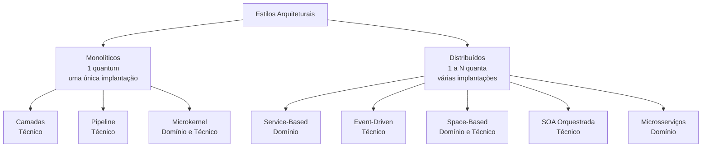
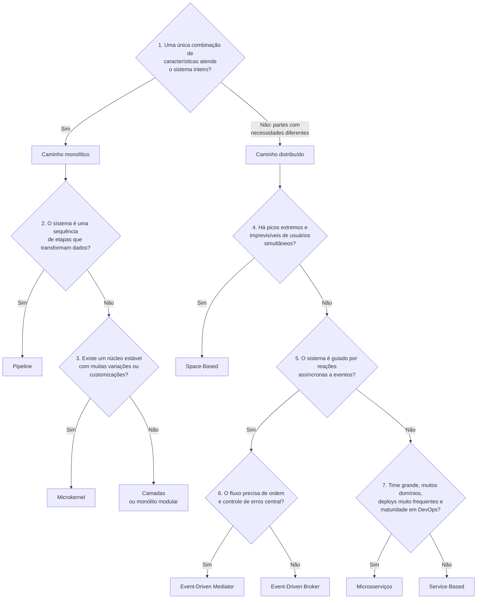

# Big Picture e Guia de Decisão: Estilos Arquiteturais

**Disciplina:** Arquitetura de Software
**Livro-Texto Base:** *Fundamentals of Software Architecture: An Engineering Approach* (Mark Richards & Neal Ford)
**Material de apoio:** [01-estilos-arquiteturais.md](01-estilos-arquiteturais.md)

---

## Parte 1 — Big Picture

### 1.1 O Mapa dos Estilos

Os 8 estilos da aula se dividem primeiro em **monolíticos** (1 quantum) e **distribuídos** (1 a N quanta), e depois pela forma de **particionamento**.

### 1.2 Cada Estilo em Uma Linha

| Estilo | Ideia central | Use quando… | Evite quando… |
| :--- | :--- | :--- | :--- |
| **Camadas** | Separar o sistema por responsabilidade técnica | Sistema simples, CRUD, orçamento e prazo curtos | Precisa escalar partes isoladas ou fazer deploys frequentes |
| **Pipeline** | Dados passam por etapas independentes em sequência | Processamento em lote, ETL, transformações em etapas | Há interação constante com o usuário |
| **Microkernel** | Núcleo estável + plug-ins para variações | Muitas regras ou customizações que mudam com frequência | Precisa de alta escalabilidade |
| **Service-Based** | Poucos serviços grandes, por domínio, com banco compartilhado | Quer modularidade e deploy independente sem a complexidade de microsserviços | Precisa de elasticidade extrema |
| **Event-Driven** | Componentes reagem a eventos de forma assíncrona | Alto desempenho, muitas reações independentes a um mesmo fato | O fluxo exige respostas imediatas e consistência forte |
| **Space-Based** | Dados em memória replicada; banco fora do caminho crítico | Picos extremos e imprevisíveis de usuários simultâneos | Orçamento limitado ou dados que exigem consistência total imediata |
| **SOA Orquestrada** | Reuso corporativo máximo via barramento central (ESB) | Integrar sistemas legados heterogêneos (contexto histórico) | Sistemas novos que precisam evoluir rápido |
| **Microsserviços** | Serviços pequenos, independentes, cada um com seus dados | Times grandes, muitos domínios, deploys independentes e frequentes | Time pequeno, orçamento curto ou baixa maturidade em DevOps |

### 1.3 O Espectro dos Trade-Offs

Os estilos podem ser vistos numa linha: de um lado, sistemas **simples e baratos**; do outro, sistemas **escaláveis, elásticos e complexos**. Andar para a direita traz capacidades, mas cobra em simplicidade e custo.

| ⬅️ Mais para a esquerda | Mais para a direita ➡️ |
| :--- | :--- |
| Mais simples de entender e testar | Mais partes móveis, rede, filas e bancos |
| Mais barato de construir e operar | Mais caro (infraestrutura e time especializado) |
| Um único quantum: tudo sobe e cai junto | Vários quanta: partes isoladas e independentes |
| Escala duplicando o sistema inteiro | Escala só a parte que precisa |

> **Lembrete da Primeira Lei:** não existe um estilo "melhor". O SOA ficou fora do espectro porque é complexo e caro sem entregar a mesma evolutividade dos demais distribuídos; hoje ele aparece principalmente em sistemas legados.

---

## Parte 2 — Como o Arquiteto Escolhe um Estilo

### 2.1 Antes de Escolher: O Que o Arquiteto Precisa Saber

O livro destaca que a escolha de um estilo depende de vários fatores ao mesmo tempo:

1. **Domínio:** entender o negócio, seus fluxos e o que muda com frequência.
2. **Características arquiteturais:** quais são as 3 a 7 características mais importantes (escalabilidade, custo, disponibilidade…). Não dá para priorizar todas.
3. **Dados:** o sistema precisa de transações ACID fortes? Os dados podem ficar separados por domínio?
4. **Fatores organizacionais:** orçamento, prazo, tamanho e maturidade do time, estrutura das equipes.
5. **Processos e ferramentas:** a empresa tem automação de deploy, monitoramento e cultura DevOps?

### 2.2 Fluxo de Decisão

### 2.3 As Perguntas, Uma a Uma

#### Pergunta 1 — Uma única combinação de características atende o sistema inteiro?
* **Por que importa:** é a pergunta do **quantum**. Se todas as partes do sistema precisam das mesmas características (mesma escalabilidade, mesma disponibilidade), um único quantum basta, e um monólito é mais simples e barato.
* **Sinais de "Não":** uma parte do sistema recebe muito mais acesso que as outras; uma parte precisa ficar no ar 24×7 e outra pode parar; times diferentes precisam fazer deploy em ritmos diferentes.
* **Exemplo:** num sistema de leilão, o leiloeiro precisa de baixa latência e confiabilidade, enquanto milhares de compradores só assistem ao vídeo. Necessidades diferentes → distribuído.

#### Pergunta 2 — O sistema é uma sequência de etapas que transformam dados?
* **Por que importa:** quando o problema é "entra dado → passa por etapas → sai resultado", o Pipeline é natural e muito simples.
* **Sinais de "Sim":** importação de arquivos, ETL, geração de relatórios, processamento de mídia.
* **Exemplo:** importar extratos bancários, validar, converter moeda, categorizar e gravar.

#### Pergunta 3 — Existe um núcleo estável com muitas variações ou customizações?
* **Por que importa:** o Microkernel isola o que muda (plug-ins) do que é estável (core), evitando o código cheio de `if/else`.
* **Sinais de "Sim":** regras diferentes por cliente, estado, país ou produto; necessidade de adicionar funcionalidades sem mexer no núcleo.
* **Exemplo:** emissor de nota fiscal com regras por estado; IDEs com extensões.
* **Se "Não":** **Camadas** é o ponto de partida mais simples. Se o domínio for rico, considere um **monólito modular** (organizado por domínio), que facilita uma migração futura.

#### Pergunta 4 — Há picos extremos e imprevisíveis de usuários simultâneos?
* **Por que importa:** quando o banco de dados vira o gargalo inevitável, só tirando-o do caminho crítico (Space-Based) o sistema aguenta.
* **Sinais de "Sim":** vendas de ingressos, leilões, promoções relâmpago, inscrições com prazo final.
* **Cuidado:** é o estilo mais caro e complexo. Pergunte se o pico justifica o investimento.

#### Pergunta 5 — O sistema é guiado por reações assíncronas a eventos?
* **Por que importa:** se um fato do negócio dispara várias ações independentes que não precisam acontecer na hora, o Event-Driven traz desempenho, escalabilidade e tolerância a falhas.
* **Sinais de "Sim":** "quando X acontecer, avise A, atualize B e registre C"; o usuário não precisa esperar todas as ações terminarem.
* **Exemplo:** pedido saiu para entrega → notificação, rastreamento e analytics.

#### Pergunta 6 — O fluxo precisa de ordem e controle de erros central?
* **Por que importa:** define a topologia do Event-Driven.
* **Sim → Mediator:** os passos têm ordem obrigatória e um erro precisa ser tratado de forma coordenada (ex.: sinistro de seguro).
* **Não → Broker:** cada reação é independente e o sistema ganha em desempenho e desacoplamento (ex.: notificações de um app de entregas).

#### Pergunta 7 — Time grande, muitos domínios, deploys muito frequentes e maturidade em DevOps?
* **Por que importa:** microsserviços entregam o máximo de modularidade, escalabilidade e evolutividade, mas cobram caro em custo, simplicidade e desempenho. Só compensam quando a organização consegue pagar essa conta.
* **Sinais de "Sim":** vários times trabalhando em paralelo; cada área precisa evoluir e escalar de forma independente; já existe automação de deploy, monitoramento e *tracing*.
* **Se "Não":** **Service-Based** é a escolha pragmática: deploy independente por domínio, transações ACID locais e custo muito menor.

### 2.4 Perguntas Complementares (Valem para Qualquer Caminho)

| Pergunta | Se a resposta for "Sim"… |
| :--- | :--- |
| O sistema depende de transações ACID entre várias entidades? | Prefira estilos com banco compartilhado ou serviços grandes (Camadas, Service-Based). Microsserviços exigem Sagas e consistência eventual. |
| O orçamento e o prazo são apertados? | Comece pelo monolítico mais simples que resolva o problema. |
| O time é pequeno ou pouco experiente em sistemas distribuídos? | Evite Microsserviços, Space-Based e Event-Driven como primeira escolha. |
| O sistema vai crescer muito, mas ainda não se sabe como? | Um **monólito modular** ou **Service-Based** permite evoluir depois sem reescrever tudo. |
| É necessário integrar muitos sistemas legados heterogêneos? | Esse é o contexto em que o SOA surgiu; hoje, avalie integrações por eventos ou APIs antes de adotar um ESB. |

### 2.5 Fechamento

* **Combinar estilos é normal:** sistemas reais costumam ser híbridos (ex.: Microsserviços que se comunicam por eventos, ou Space-Based apenas na parte que sofre picos).
* **Comece simples e evolua:** é mais barato partir de um monólito bem modularizado e distribuir depois do que desfazer uma distribuição prematura.
* **Registre o porquê:** pela Segunda Lei, a decisão deve ser documentada com o seu raciocínio e os *trade-offs* aceitos, por exemplo num ADR (*Architecture Decision Record*).

> ### 💡 *"Não há respostas erradas em arquitetura, apenas respostas caras."*
