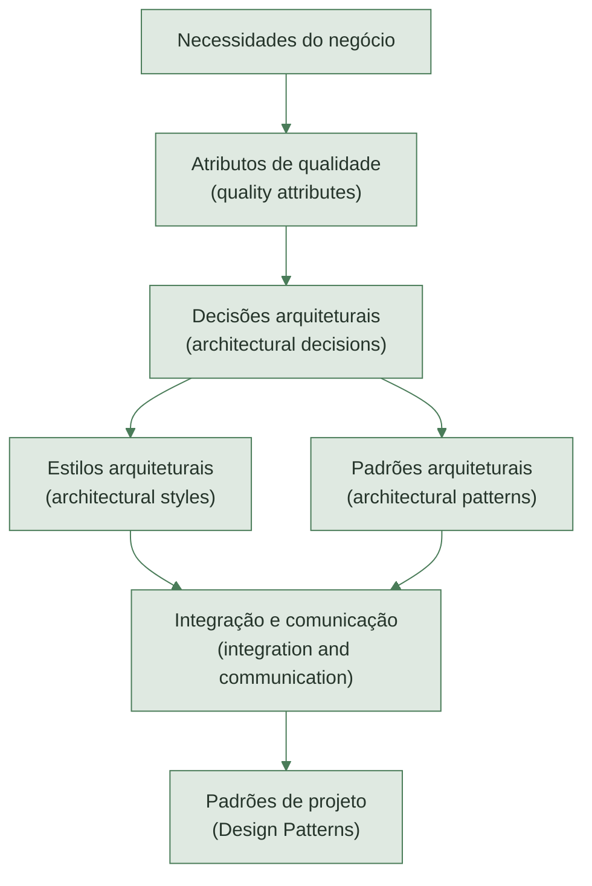
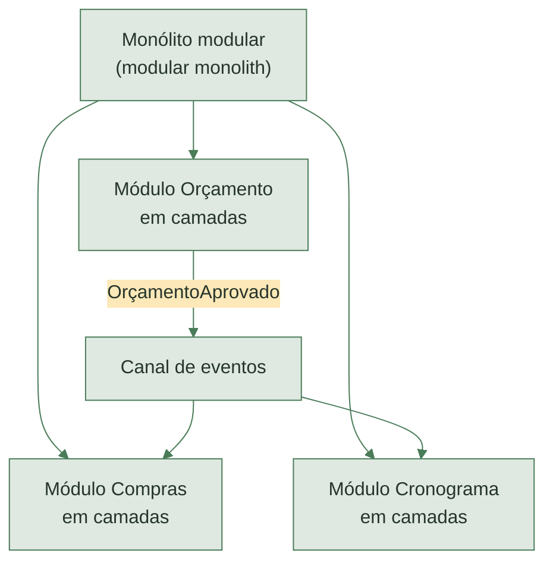
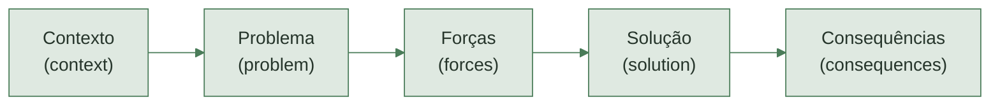
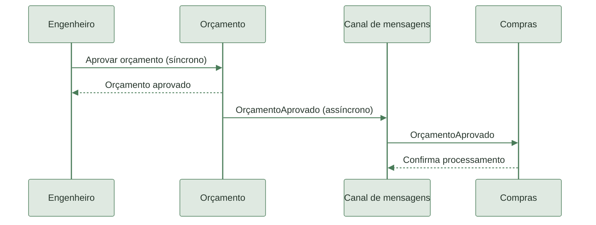
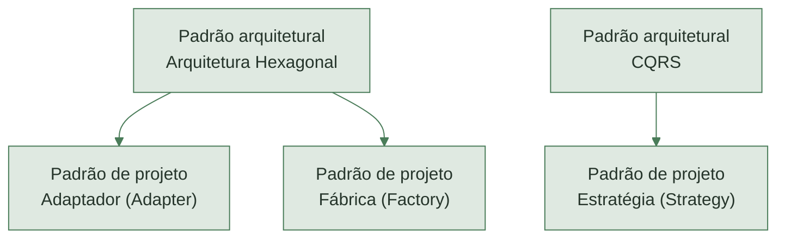
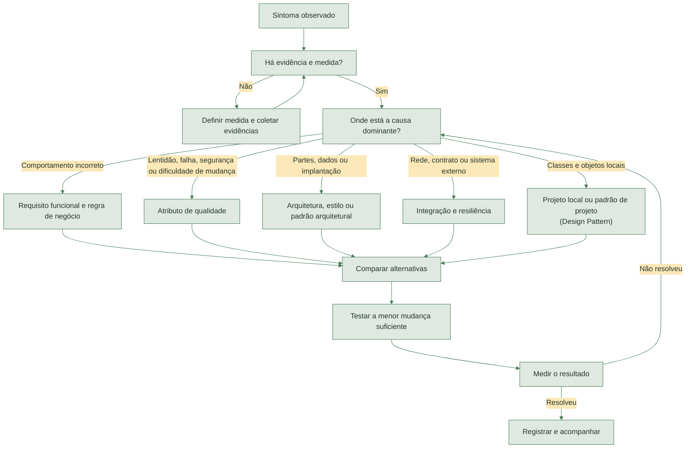

  

  

# Aula 1 – Panorama da Arquitetura de Software

**Técnicas Avançadas de Programação**  
**Bloco:** Arquitetura de Software  
**Duração:** 4 horas

---

## Objetivos da aula

Ao final da aula, o estudante deverá ser capaz de:

- explicar o que é arquitetura de software (*software architecture*);
- distinguir atributos de qualidade, estilos, padrões arquiteturais, integração e padrões de projeto;
- reconhecer exemplos de cada conceito;
- relacionar uma necessidade do negócio a uma decisão arquitetural;
- identificar benefícios e custos de uma decisão;
- registrar uma decisão simples em um registro de decisão arquitetural (*Architecture Decision Record – ADR*).

---

## Caso condutor: Obra360

A Obra360 é uma plataforma utilizada por uma construtora para administrar suas obras:

- orçamento, cronograma, compras e diário de obra estão no mesmo sistema;
- engenheiros e mestres de obras acessam a plataforma pelo celular no canteiro;
- a conexão com a internet é instável em algumas obras;
- alterações no orçamento afetam compras e cronograma;
- o serviço externo de cotação de materiais apresenta falhas;
- a construtora está assumindo mais obras e precisa crescer sem perder o controle.

Durante a aula, usaremos esse caso para responder:

> [!TIP]
>> **Pergunta condutora:** que decisões estruturais ajudam a Obra360 a atender suas necessidades, e quais custos acompanham essas decisões?

---

## Resumo da analogia: software e obra de um condomínio

| Engenharia de software | Obra de um condomínio |
|---|---|
| Arquitetura de software (*software architecture*) | Planta geral e estrutura do empreendimento |
| Atributos de qualidade (*quality attributes*) | Normas e metas de segurança, conforto, acessibilidade e manutenção |
| Estilos arquiteturais (*architectural styles*) | Tipo geral da construção: casa única, prédio ou condomínio de casas |
| Padrões arquiteturais (*architectural patterns*) | Soluções consagradas, como portaria única, entrada de serviço e proteção por disjuntores |
| Integração e comunicação (*integration and communication*) | Instalações elétricas e hidráulicas, interfone e circulação interna |
| Padrões de projeto (*Design Patterns*) | Técnicas locais de marcenaria e acabamento dentro dos apartamentos |

> [!IMPORTANT]
> **A grande lição:** quanto mais estrutural for uma decisão, mais cedo deve ser considerada e mais caro será modificá-la depois. Trocar um puxador de armário — comparável a uma decisão local de projeto — é relativamente simples; mover as fundações do prédio — comparável a uma decisão arquitetural — pode exigir refazer grande parte da obra.

> [!NOTE]
> A analogia ajuda a visualizar a escala das decisões, mas não torna arquitetura civil e arquitetura de software atividades equivalentes.

---

## O mapa da aula

> [!NOTE]
> Os conceitos não são alternativas concorrentes. Eles respondem a perguntas diferentes e podem coexistir no mesmo sistema.

---

# 1.  Arquitetura de software (*software architecture*)

---

## 1.1 Definições de autores

| Referência | Ideia central |
|---|---|
| Bass, Clements e Kazman (2021) | Arquitetura compreende as estruturas necessárias para raciocinar sobre o sistema, formadas por elementos, relações e propriedades. |
| Fowler (2003) | Arquitetura envolve as partes importantes do sistema, especialmente as decisões percebidas como difíceis de mudar. |
| Perry e Wolf (1992) | Arquitetura combina elementos, forma e justificativa das escolhas. |

As definições enfatizam aspectos complementares: **estrutura**, **importância**, **custo de mudança** e **justificativa**.

---

## 1.2 Definição adotada

> [!IMPORTANT]
>> **Definição adotada:** arquitetura de software (*software architecture*) é o conjunto das decisões estruturais importantes de um sistema, das relações entre suas partes e das razões que justificam essas decisões.

Uma decisão tende a ser arquitetural quando:

- afeta várias partes do sistema;
- influencia atributos de qualidade;
- envolve dados, integrações ou equipes;
- possui custo elevado de reversão.

---

## 1.3 Elementos da arquitetura

| Elemento | Pergunta | Exemplo geral em engenharia de software |
|---|---|---|
| Partes (*elements*) | Quais são as grandes unidades? | Autenticação, Catálogo e Relatórios |
| Relações (*relationships*) | Quem depende de quem? | Relatórios consulta dados do Catálogo |
| Propriedades (*properties*) | O que cada parte deve garantir? | Autenticação deve proteger credenciais |
| Restrições (*constraints*) | Que regras limitam as soluções? | Utilizar a infraestrutura já contratada |
| Justificativas (*rationale*) | Por que a decisão foi tomada? | Separar autenticação para centralizar o controle de acesso |

---

## 1.4 Comparação com a obra de um condomínio

Na construção de um condomínio, a arquitetura define decisões estruturais importantes: quantos blocos existirão, como serão distribuídos no terreno, onde ficarão os acessos, quais áreas serão comuns e como ocorrerá a circulação. Escolher que cada apartamento terá dois quartos também influencia dimensões, instalações e organização dos espaços.

No software, acontece algo semelhante. Definir que a Obra360 será separada nos módulos Orçamento, Cronograma, Compras e Diário de Obra estabelece as grandes partes e suas relações. Trocar a cor de uma tela tem impacto local; separar um módulo depois que todo o sistema já depende dele pode exigir uma reconstrução extensa — assim como trocar um acabamento é muito mais simples que mover um bloco ou alterar as fundações.

---

## 1.5 Arquitetura, projeto e implementação

| Nível | Pergunta principal | Alcance típico | Exemplo geral em engenharia de software |
|---|---|---|---|
| Arquitetura (*architecture*) | Quais são as grandes partes e como se relacionam? | Sistema, dados, integrações e equipes | Separar o sistema em aplicação web, API e processamento assíncrono |
| Projeto (*design*) | Como responsabilidades e objetos se organizam dentro de uma parte? | Módulo ou componente | Organizar autenticação com serviços, políticas e repositórios |
| Implementação (*implementation*) | Como este comportamento será codificado? | Classe, função ou arquivo | Implementar uma função de validação de senha |

A fronteira entre os níveis é contínua. A mesma decisão pode ter importância diferente conforme o contexto do sistema.

---

## 1.6 Questionário

### Questão 1

Qual alternativa melhor representa arquitetura de software?

- **a)** O *framework* utilizado pelo projeto
- **b)** O conjunto de decisões estruturais importantes e suas justificativas
- **c)** A estrutura de pastas do código
- **d)** Qualquer diagrama criado pela equipe

### Questão 2

Qual indício ajuda a reconhecer uma decisão arquitetural?

- **a)** A decisão possui alto custo de reversão
- **b)** A decisão foi tomada primeiro
- **c)** A decisão utiliza uma tecnologia recente
- **d)** A decisão foi desenhada em UML

### Questão 3

Qual item representa uma relação arquitetural?

- **a)** O nome de uma variável
- **b)** O formato de um comentário
- **c)** O módulo de Compras depender do módulo de Orçamento
- **d)** A cor de um botão

---

## 1.6 Gabarito

| Questão | Resposta | Justificativa |
|---:|:---:|---|
| 1 | **b** | Arquitetura envolve decisões estruturais importantes e as razões dessas decisões. |
| 2 | **a** | Quanto mais difícil e cara for a reversão, maior tende a ser a relevância arquitetural. |
| 3 | **c** | A dependência entre módulos é uma relação estrutural do sistema. |

---

# 2. Atributos de qualidade (*quality attributes*)

---

## 2.1 Definições de autores

| Referência | Ideia central |
|---|---|
| Bass, Clements e Kazman (2021) | Atributos de qualidade descrevem propriedades mensuráveis ou testáveis usadas para avaliar se o sistema atende às necessidades das partes interessadas. |
| ISO/IEC 25010:2023 | Qualidade do produto é organizada em características que permitem avaliar o atendimento às necessidades explícitas e implícitas. |
| Richards e Ford (2025) | Características arquiteturais representam aspectos não funcionais importantes que influenciam a estrutura do sistema. |

---

## 2.2 Definição adotada

> [!IMPORTANT]
>>  **Definição adotada:** atributo de qualidade (*quality attribute*) descreve quão bem o sistema deve realizar suas funções e sob quais condições esse comportamento deve ocorrer.

Compare:

- **Requisito funcional (*functional requirement*):** o sistema deve permitir consultar o cronograma de uma obra.
- **Atributo de qualidade:** mesmo com conexão móvel instável, 95% das consultas ao cronograma devem exibir os dados disponíveis em até 2 segundos.
- **Restrição (*constraint*):** o sistema deve utilizar o banco de dados já contratado pela empresa.

---

## 2.3 Principais atributos de qualidade

| Atributo | Pergunta principal | Exemplo geral em engenharia de software |
|---|---|---|
| Desempenho (*performance*) | Com que rapidez e com quais recursos? | Responder 95% das consultas em até 2 segundos |
| Disponibilidade (*availability*) | Por quanto tempo o serviço permanece acessível? | Operar 99,9% do mês |
| Confiabilidade (*reliability*) | O sistema continua correto ao longo do tempo e diante de falhas? | Não perder uma transação confirmada |
| Segurança (*security*) | Como dados e acessos são protegidos? | Restringir dados administrativos a usuários autorizados |
| Modificabilidade (*modifiability*) | Quanto custa realizar uma alteração? | Trocar um provedor externo sem alterar regras de negócio |
| Escalabilidade (*scalability*) | Como reage ao crescimento da demanda? | Suportar dez vezes mais usuários simultâneos |
| Testabilidade (*testability*) | Com que facilidade verificamos o comportamento? | Testar regras sem acessar serviços externos |
| Usabilidade (*usability*) | Com que facilidade uma pessoa utiliza o sistema? | Concluir uma tarefa frequente sem treinamento |

Esses atributos podem entrar em conflito. Favorecer um deles geralmente cria custo em outro.

---

## 2.4 Comparação com a obra de um condomínio

Na construção, dizer que um apartamento terá três quartos descreve o que será entregue. Dizer que esses quartos devem receber iluminação natural, permanecer confortáveis no verão e reduzir o ruído externo descreve qualidades esperadas. Para orientar o projeto, essas qualidades precisam ser verificáveis: por exemplo, “o nível de ruído no quarto não deverá ultrapassar determinado limite com as janelas fechadas”.

No software, “registrar o avanço da obra” é uma funcionalidade. “Permitir o registro em até dois segundos, mesmo com conexão móvel instável” é um atributo de qualidade. Assim como segurança, conforto e acessibilidade influenciam materiais e soluções construtivas, desempenho, disponibilidade e modificabilidade influenciam a estrutura do software.

---

## 2.5 Cenário de qualidade (*quality attribute scenario*)

Um atributo vago, como “o sistema deve ser rápido”, não orienta nem permite avaliar uma decisão.

| Parte | Pergunta | Exemplo geral em engenharia de software |
|---|---|---|
| Fonte (*source*) | Quem ou o que provoca a situação? | Usuário autenticado |
| Estímulo (*stimulus*) | O que acontece? | Solicita uma consulta |
| Ambiente (*environment*) | Em quais condições? | Horário de pico |
| Artefato (*artifact*) | Que parte é afetada? | Serviço de consultas |
| Resposta (*response*) | O que o sistema deve fazer? | Exibir os dados solicitados |
| Medida da resposta (*response measure*) | Como o resultado será verificado? | 95% em até 2 segundos |

---

## 2.6 Questionário

### Questão 1

Qual alternativa apresenta um atributo de qualidade mensurável?

- **a)** Cadastrar uma obra
- **b)** Emitir uma ordem de compra
- **c)** Responder 95% das consultas em até 2 segundos no horário de pico
- **d)** Utilizar o banco de dados definido pela empresa

### Questão 2

Em um cenário de qualidade, qual parte informa as condições de operação?

- **a)** Fonte
- **b)** Ambiente
- **c)** Artefato
- **d)** Resposta

### Questão 3

Qual atributo está mais diretamente relacionado ao esforço necessário para trocar uma integração externa?

- **a)** Usabilidade
- **b)** Disponibilidade
- **c)** Modificabilidade
- **d)** Desempenho

---

## 2.6 Gabarito

| Questão | Resposta | Justificativa |
|---:|:---:|---|
| 1 | **c** | A alternativa descreve comportamento, condição e medida verificável. |
| 2 | **b** | O ambiente informa condições como operação normal, pico ou falha parcial. |
| 3 | **c** | Modificabilidade avalia o custo e o impacto das alterações. |

---

# 3. Estilos arquiteturais (*architectural styles*)

---

## 3.1 Definições de autores

| Referência | Ideia central |
|---|---|
| Garlan e Shaw (1994) | Um estilo define tipos de componentes, tipos de conectores e restrições sobre como podem ser combinados. |
| Fielding (2000) | Um estilo é um conjunto coordenado de restrições arquiteturais que produz propriedades desejadas. |
| Richards e Ford (2025) | Um estilo descreve a estrutura fundamental e as características predominantes de uma arquitetura. |

---

## 3.2 Definição adotada

> [!IMPORTANT]
>>  **Definição adotada:** estilo arquitetural (*architectural style*) é uma forma geral de organizar o sistema, definindo tipos de partes, maneiras de interação e restrições estruturais.

Um estilo:

- não é uma implementação pronta;
- orienta várias decisões;
- favorece certos atributos de qualidade;
- cria benefícios, limitações e custos;
- pode ser combinado com outros estilos.

---

## 3.3 Principais estilos arquiteturais

| Estilo | Organização | Favorece | Custo principal | Exemplo geral em engenharia de software |
|---|---|---|---|---|
| Monólito (*monolith*) | Uma unidade de implantação | Simplicidade operacional e transacional | Pode perder organização sem disciplina | Sistema administrativo publicado como uma única aplicação |
| Monólito modular (*modular monolith*) | Uma implantação com módulos e fronteiras explícitas | Modificabilidade com operação simples | Fronteiras exigem verificação e disciplina | Aplicação única dividida em Clientes, Faturamento e Relatórios |
| Arquitetura em camadas (*layered architecture*) | Responsabilidades organizadas por níveis lógicos | Separação de responsabilidades | Mudanças podem atravessar várias camadas | Apresentação, negócio e acesso a dados |
| Microsserviços (*microservices*) | Serviços implantáveis independentemente | Autonomia e escalabilidade independente | Operação e dados distribuídos | Serviços independentes de Catálogo, Cobrança e Entrega |
| Arquitetura orientada a eventos (*event-driven architecture*) | Produtores publicam fatos e consumidores reagem | Desacoplamento temporal e extensibilidade | Fluxos difíceis de acompanhar e consistência eventual | Faturamento reage ao evento `VendaConcluída` |

---

## 3.4 Comparação com a obra de um condomínio

Na construção, escolher entre uma casa única, um edifício vertical ou um condomínio de casas determina a organização geral do empreendimento. Cada opção favorece necessidades diferentes: um prédio aproveita melhor um terreno pequeno, enquanto casas independentes oferecem outra forma de acesso, manutenção e privacidade. Essa escolha não define cada porta ou acabamento, mas condiciona grande parte do projeto.

Um estilo arquitetural exerce papel semelhante no software. Um monólito reúne a implantação em uma unidade; microsserviços distribuem partes implantáveis independentemente; uma arquitetura orientada a eventos organiza parte das interações por fatos publicados. Assim como um condomínio pode combinar blocos, áreas comuns e construções auxiliares, um sistema pode combinar mais de um estilo.

---

## 3.5 Os estilos podem coexistir

Nesse exemplo, a Obra360 pode ser:

- um monólito modular quanto à implantação;
- organizada em camadas internamente;
- orientada a eventos em parte da comunicação.

> [!NOTE]
> Adotar eventos não obriga a adotar microsserviços.

---

## 3.6 Questionário

### Questão 1

O que caracteriza um monólito?

- **a)** Código necessariamente desorganizado
- **b)** Uma única unidade de implantação
- **c)** Ausência de módulos
- **d)** Execução em apenas um servidor físico

### Questão 2

Qual estilo combina uma única implantação com fronteiras internas explícitas?

- **a)** Monólito modular
- **b)** Microsserviços
- **c)** Cliente-servidor
- **d)** Publicar-assinar

### Questão 3

Qual afirmação está correta?

- **a)** Um sistema só pode adotar um estilo
- **b)** Arquitetura orientada a eventos exige microsserviços
- **c)** Estilos podem ser combinados no mesmo sistema
- **d)** Microsserviços sempre possuem menor custo operacional

---

## 3.6 Gabarito

| Questão | Resposta | Justificativa |
|---:|:---:|---|
| 1 | **b** | Monólito descreve principalmente uma unidade de implantação, não a qualidade do código. |
| 2 | **a** | O monólito modular preserva uma implantação, mas define módulos internos explícitos. |
| 3 | **c** | Diferentes estilos podem descrever aspectos distintos do mesmo sistema. |

---

# 4. Padrões arquiteturais (*architectural patterns*)

---

## 4.1 Definições de autores

| Referência | Ideia central |
|---|---|
| Buschmann et al. (1996) | Um padrão arquitetural expressa um esquema fundamental de organização para sistemas de software e descreve responsabilidades e relações entre subsistemas. |
| Fowler (2002) | Um padrão descreve um problema recorrente e o núcleo de uma solução, permitindo diferentes implementações. |
| Richards e Ford (2025) | Padrões oferecem soluções conhecidas para problemas arquiteturais específicos, acompanhadas de benefícios e custos. |

Os autores nem sempre usam “estilo” e “padrão” da mesma maneira. Nesta disciplina, adotaremos uma distinção didática explícita.

---

## 4.2 Definição adotada

> [!IMPORTANT]
>> **Definição adotada:** padrão arquitetural (*architectural pattern*) é uma solução estrutural conhecida para um problema recorrente, aplicável em determinado contexto e acompanhada de consequências.

Para este bloco:

- o **estilo arquitetural** descreve a forma geral predominante do sistema;
- o **padrão arquitetural** resolve um problema estrutural mais específico.

Essa classificação é uma convenção da disciplina, pois a literatura apresenta divergências.

---

## 4.3 Principais padrões arquiteturais

| Padrão | Problema que ajuda a resolver | Comentário breve | Exemplo geral em engenharia de software |
|---|---|---|---|
| Modelo-Visão-Controlador (*Model-View-Controller – MVC*) | Interface misturada com lógica de interação | Separa representação, estado e tratamento das entradas | Uma tela de cadastro separa formulário, dados e tratamento das ações |
| Arquitetura Hexagonal (*Hexagonal Architecture/Ports and Adapters*) | Regras de negócio presas a banco, interface ou serviço externo | Coloca as regras no centro e acessa tecnologias por portas e adaptadores | Um sistema troca o provedor de e-mail por outro adaptador |
| Segregação de Responsabilidade de Comando e Consulta (*Command Query Responsibility Segregation – CQRS*) | Leitura e escrita possuem necessidades diferentes | Permite modelos distintos para modificar e consultar dados | Escrita normalizada e painel alimentado por modelo de leitura |
| Saga (*Saga*) | Operação distribuída sem uma única transação global | Coordena etapas e utiliza ações compensatórias diante de falhas | Reservar item, cobrar e programar entrega com compensações |
| Caixa de Saída Transacional (*Transactional Outbox*) | O dado é salvo, mas a mensagem pode não ser publicada | Grava dado e mensagem na mesma transação local | Salvar cadastro e registrar o evento a publicar na mesma transação |

Esses padrões serão aprofundados nas aulas seguintes.

---

## 4.4 Comparação com a obra de um condomínio

Projetos de condomínios enfrentam problemas recorrentes e aproveitam soluções já conhecidas. Uma portaria única pode controlar o acesso; a concentração de áreas molhadas pode reduzir a extensão das tubulações; disjuntores permitem proteger e isolar circuitos. Essas soluções não são plantas completas: cada uma responde a um problema específico e possui consequências.

Padrões arquiteturais cumprem função semelhante no software. A Arquitetura Hexagonal ajuda a isolar regras de negócio de tecnologias externas; a Saga ajuda a coordenar uma operação distribuída; a Caixa de Saída Transacional reduz o risco de salvar um dado sem publicar sua mensagem. Como na construção, a solução só faz sentido quando o contexto e o problema realmente existem.

---

## 4.5 Anatomia de um padrão

- **Contexto:** situação em que o padrão pode ser considerado.
- **Problema:** dificuldade recorrente que precisa ser resolvida.
- **Forças:** necessidades ou restrições em conflito.
- **Solução:** organização proposta pelo padrão.
- **Consequências:** benefícios, limitações e novos custos.

> [!WARNING]
> Citar o nome de um padrão não justifica sua utilização.

---

## 4.6 Questionário

### Questão 1

Nesta disciplina, qual é a principal diferença entre estilo e padrão arquitetural?

- **a)** O padrão é sempre um *framework*
- **b)** O estilo descreve a forma geral; o padrão resolve um problema estrutural específico
- **c)** O padrão nunca possui custos
- **d)** O estilo atua somente em classes

### Questão 2

Qual padrão protege as regras de negócio de tecnologias externas por meio de portas e adaptadores?

- **a)** MVC
- **b)** Saga
- **c)** Arquitetura Hexagonal
- **d)** CQRS

### Questão 3

Por que as consequências fazem parte da descrição de um padrão?

- **a)** Porque toda solução cria benefícios e custos
- **b)** Porque padrões eliminam a necessidade de decisões
- **c)** Porque padrões são códigos prontos
- **d)** Porque todo padrão exige microsserviços

---

## 4.6 Gabarito

| Questão | Resposta | Justificativa |
|---:|:---:|---|
| 1 | **b** | Essa é a convenção didática adotada no bloco. |
| 2 | **c** | A Arquitetura Hexagonal isola as regras por meio de portas e adaptadores. |
| 3 | **a** | Um padrão realiza trocas e não constitui uma solução gratuita ou universal. |

---

# 5. Integração e comunicação (*integration and communication*)

---

## 5.1 Definições de autores

| Referência | Ideia central |
|---|---|
| Hohpe e Woolf (2003) | Integração conecta aplicações independentes para que trabalhem em conjunto, frequentemente por mensagens e canais. |
| Kleppmann (2017) | Em sistemas distribuídos, partes executam em processos ou máquinas diferentes e coordenam suas ações por comunicação em rede. |
| Nygard (2018) | A comunicação remota precisa considerar latência, indisponibilidade e falhas parciais. |

---

## 5.2 Definição adotada

> [!IMPORTANT]
>>  **Definição adotada:** integração e comunicação (*integration and communication*) compreendem os mecanismos e contratos usados pelas partes do sistema para trocar dados, solicitar ações, informar fatos e lidar com falhas.

Quando uma interação passa pela rede, aparecem novos problemas:

- latência variável;
- indisponibilidade parcial;
- perda, atraso ou duplicação;
- incerteza sobre a execução;
- evolução independente dos contratos.

> [!CAUTION]
> Uma chamada remota não possui as mesmas garantias de uma chamada local.

---

## 5.3 Tipos de comunicação

| Tipo | Funcionamento | Benefício | Custo ou risco | Exemplo geral em engenharia de software |
|---|---|---|---|---|
| Síncrona (*synchronous*) | O emissor aguarda uma resposta para continuar | Fluxo direto e resultado imediato | Acoplamento temporal e falhas em cascata | Aplicação solicita dados de endereço e aguarda a resposta |
| Assíncrona (*asynchronous*) | O processamento do receptor não precisa ocorrer durante a chamada do emissor | Maior independência de disponibilidade | Duplicação, atraso e consistência eventual | Sistema publica `CadastroConcluído` para processamento posterior |

Comunicação assíncrona não elimina todo o acoplamento: ainda existem contratos, significados e expectativas de entrega.

---

## 5.4 Comparação com a obra de um condomínio

Em um condomínio, instalações conectam partes diferentes. A rede elétrica leva energia aos apartamentos; a tubulação distribui água; o interfone permite comunicação entre a portaria e os moradores. Essas ligações precisam de interfaces compatíveis, capacidade adequada e mecanismos de isolamento. Um problema em um circuito não deveria desligar todo o empreendimento.

No software, módulos e serviços também trocam informações por conexões e contratos. Quando Orçamento publica `OrçamentoAprovado`, Compras pode iniciar suas atividades sem conhecer os detalhes internos de Orçamento. Limites de espera, novas tentativas e disjuntores de software ajudam a impedir que a falha de um serviço externo se espalhe pelo sistema — de maneira comparável aos registros hidráulicos e disjuntores que isolam partes de uma instalação.

---

## 5.5 Mensagens e canais

### Tipos de mensagem

| Tipo | Intenção | Forma usual do nome | Exemplo geral em engenharia de software |
|---|---|---|---|
| Comando (*command*) | Solicitar que uma ação seja executada | Imperativo | `EnviarNotificação` |
| Evento (*event*) | Informar um fato que já ocorreu | Passado | `CadastroConcluído` |
| Consulta (*query*) | Solicitar dados sem intenção de alterar o estado | Pergunta ou substantivo | `ConsultarCliente` |

### Tipos de canal

| Canal | Entrega | Exemplo geral em engenharia de software |
|---|---|---|
| Ponto a ponto (*point-to-point/queue*) | Cada mensagem é processada por um consumidor do grupo | Distribuir tarefas entre processadores de relatórios |
| Publicar-assinar (*publish-subscribe*) | Cada assinatura interessada pode receber uma cópia | Notificar vários módulos quando um cadastro é concluído |

Confiabilidade da entrega depende da tecnologia e da configuração utilizada.

---

## 5.6 Lidando com falhas

| Mecanismo | Finalidade | Exemplo geral em engenharia de software |
|---|---|---|
| Limite de espera (*timeout*) | Impedir espera indefinida | Cancelar a consulta após cinco segundos sem resposta |
| Nova tentativa com espera progressiva (*retry with backoff*) | Repetir falhas possivelmente temporárias sem sobrecarregar o destino | Repetir o envio de uma notificação com intervalos crescentes |
| Disjuntor (*circuit breaker*) | Interromper temporariamente chamadas a um destino que está falhando | Suspender chamadas a um provedor indisponível |
| Idempotência (*idempotency*) | Permitir repetição sem reaplicar o efeito da operação | Evitar a criação duplicada de uma cobrança |

Esses mecanismos não tornam a rede confiável; ajudam o sistema a reagir de maneira controlada às falhas.

---

## 5.7 Questionário

### Questão 1

Qual é um risco característico da comunicação síncrona?

- **a)** Acoplamento temporal
- **b)** Ausência de resposta
- **c)** Impossibilidade de falha
- **d)** Eliminação da latência

### Questão 2

Qual nome representa melhor um evento?

- **a)** `AprovarOrçamento`
- **b)** `ConsultarOrçamento`
- **c)** `OrçamentoAprovado`
- **d)** `RecalcularAgora`

### Questão 3

Por que a idempotência é importante quando existem novas tentativas?

- **a)** Para aumentar o tamanho das mensagens
- **b)** Para impedir que a mesma repetição reaplique o efeito da operação
- **c)** Para eliminar contratos
- **d)** Para substituir o limite de espera

---

## 5.7 Gabarito

| Questão | Resposta | Justificativa |
|---:|:---:|---|
| 1 | **a** | Emissor e receptor precisam estar disponíveis durante a interação. |
| 2 | **c** | Eventos comunicam fatos e normalmente são nomeados no passado. |
| 3 | **b** | Uma operação idempotente pode ser repetida sem duplicar seu efeito. |

---

# 6. Padrões de projeto (*Design Patterns*)

---

## 6.1 Definições de autores

| Referência | Ideia central |
|---|---|
| Gamma et al. (1994) | Padrões de projeto nomeiam e descrevem soluções recorrentes para problemas de projeto orientado a objetos. |
| Fowler (2002) | Um padrão descreve um problema que ocorre repetidamente e o núcleo de uma solução reutilizável. |
| Larman (2007) | Padrões apoiam a atribuição de responsabilidades a objetos e classes. |

---

## 6.2 Definição adotada

> [!IMPORTANT]
> **Definição adotada:** padrão de projeto (*Design Pattern*) é uma solução conhecida para um problema recorrente de organização e colaboração entre poucas classes ou objetos.

Um padrão de projeto:

- possui nome, problema, solução e consequências;
- atua geralmente em escala local;
- não é uma biblioteca nem um trecho de código a copiar;
- pode ajudar a implementar uma decisão arquitetural;
- não determina sozinho a arquitetura do sistema.

---

## 6.3 Principais tipos

| Tipo | Objetivo | Padrões representativos | Comentário breve | Exemplo geral em engenharia de software |
|---|---|---|---|---|
| Criacional (*creational*) | Controlar e flexibilizar a criação de objetos | Método Fábrica (*Factory Method*), Fábrica Abstrata (*Abstract Factory*) | Reduz dependência de classes concretas durante a criação | Uma fábrica escolhe o tipo de notificador a instanciar |
| Estrutural (*structural*) | Organizar a composição entre classes e objetos | Adaptador (*Adapter*), Fachada (*Facade*) | Compatibiliza interfaces ou simplifica o acesso a um conjunto complexo | Um Adaptador compatibiliza a API de um provedor de e-mail |
| Comportamental (*behavioral*) | Distribuir responsabilidades e interações | Estratégia (*Strategy*), Observador (*Observer*) | Encapsula comportamentos ou propaga mudanças entre objetos | Uma Estratégia permite trocar o cálculo de desconto |

Na introdução, o objetivo é reconhecer a escala dos padrões, não memorizar todo o catálogo.

---

## 6.4 Comparação com a obra de um condomínio

Dentro de um apartamento, marceneiros e profissionais de acabamento utilizam técnicas conhecidas para resolver problemas locais: uma dobradiça adequada ao tipo de porta, um encaixe para unir peças ou um módulo repetível de armário. Essas escolhas contribuem para a qualidade do resultado, mas não definem a estrutura do condomínio.

Padrões de projeto também resolvem problemas locais. O Adaptador (*Adapter*) compatibiliza interfaces diferentes; a Estratégia (*Strategy*) permite trocar um comportamento; o Observador (*Observer*) propaga mudanças para interessados. Encontrar um Adaptador no código não revela, sozinho, se o sistema é monolítico, distribuído ou orientado a eventos — assim como observar uma dobradiça não revela a planta do edifício.

---

## 6.5 Escala e relação com a arquitetura

- Uma Arquitetura Hexagonal frequentemente utiliza adaptadores.
- Encontrar um Adaptador no código não prova que o sistema seja hexagonal.
- Um padrão acrescenta classes, interfaces e indireção.
- Seu uso deve ser justificado pelo problema que resolve.

> [!NOTE]
> Arquitetura trata da estrutura importante do sistema; padrões de projeto ajudam a organizar soluções locais no código.

---

## 6.6 Questionário

### Questão 1

Em qual escala um padrão de projeto normalmente atua?

- **a)** Organização de poucas classes e objetos
- **b)** Infraestrutura de toda a empresa
- **c)** Topologia física da rede
- **d)** Estratégia comercial

### Questão 2

Qual padrão pertence ao grupo estrutural?

- **a)** Estratégia (*Strategy*)
- **b)** Observador (*Observer*)
- **c)** Adaptador (*Adapter*)
- **d)** Método Fábrica (*Factory Method*)

### Questão 3

Se um sistema utiliza Adaptador (*Adapter*), podemos concluir que:

- **a)** Ele obrigatoriamente utiliza Arquitetura Hexagonal
- **b)** Ele obrigatoriamente utiliza microsserviços
- **c)** Ele obrigatoriamente é orientado a eventos
- **d)** Não é possível determinar sua arquitetura completa apenas por esse padrão local

---

## 6.6 Gabarito

| Questão | Resposta | Justificativa |
|---:|:---:|---|
| 1 | **a** | Padrões de projeto atuam geralmente em uma parte local do código. |
| 2 | **c** | Adaptador compatibiliza interfaces e pertence ao grupo estrutural. |
| 3 | **d** | Uma solução local não determina a forma geral do sistema. |

---

# 7. Síntese: da necessidade à decisão arquitetural

Este tópico é diferente dos anteriores: em vez de apresentar uma nova categoria, ele integra o raciocínio desenvolvido durante a aula.

---

## 7.1 Reconstruindo a definição

No início da aula, adotamos:

> [!IMPORTANT]
>>  **Arquitetura de software (*software architecture*) é o conjunto das decisões estruturais importantes de um sistema, das relações entre suas partes e das razões que justificam essas decisões.**

Agora podemos completar o raciocínio:

> [!TIP]
> **Arquitetar é tomar e comunicar decisões estruturais para atender atributos de qualidade, escolhendo estilos, padrões e formas de integração adequados ao contexto e reconhecendo os custos de cada escolha.**

---

## 7.2 O raciocínio arquitetural

```mermaid
%%{init: {"theme": "base", "themeVariables": {"primaryColor": "#dfe9e1", "primaryTextColor": "#26352b", "primaryBorderColor": "#4a7c59", "lineColor": "#4a7c59", "secondaryColor": "#fce8b8", "tertiaryColor": "#f2d8cf", "fontFamily": "DejaVu Sans"}}}%%
flowchart LR
    N["1. Necessidade<br/>Uso no canteiro sem conexão estável"] --> Q["2. Qualidade<br/>Disponibilidade"]
    Q --> C["3. Cenário<br/>Registrar avanço mesmo sem rede"]
    C --> D["4. Decisão<br/>Operação local e sincronização posterior"]
    D --> S["5. Solução<br/>Estilo + padrão + integração"]
    S --> T["6. Trocas<br/>Conflitos e consistência eventual"]
    T --> V["7. Verificação<br/>Testes offline e métricas de sincronização"]
```

A arquitetura não começa pela escolha de uma tecnologia. Começa pela compreensão do problema, das qualidades prioritárias e das restrições.

---

## 7.3 Ordem para construir um software novo

A construção de um software novo não precisa seguir um processo rígido, mas existe uma ordem de raciocínio que reduz decisões prematuras:

1. **Entender o problema e os objetivos:** quem utilizará o sistema, qual necessidade será atendida e que resultado o negócio espera.
2. **Identificar as partes interessadas (*stakeholders*):** usuários, clientes, operação, segurança, desenvolvimento e outros afetados.
3. **Definir o escopo funcional:** quais capacidades o sistema precisa oferecer e o que ficará fora da primeira versão.
4. **Priorizar atributos de qualidade:** transformar desempenho, segurança, disponibilidade e modificabilidade em cenários verificáveis.
5. **Levantar restrições e riscos:** prazo, orçamento, legislação, tecnologias existentes, integrações obrigatórias e conhecimento da equipe.
6. **Modelar responsabilidades e dados:** identificar módulos, fronteiras, informações importantes e relações entre as partes.
7. **Escolher a arquitetura inicial:** selecionar estilos, padrões e formas de integração que respondam às qualidades e restrições prioritárias.
8. **Atacar os riscos primeiro:** criar provas de conceito (*proofs of concept – PoCs*) para decisões incertas ou caras de reverter.
9. **Registrar decisões:** documentar contexto, escolha e consequências em registros de decisão arquitetural (*Architecture Decision Records – ADRs*).
10. **Implementar e verificar incrementalmente:** entregar partes pequenas, medir os cenários de qualidade e ajustar a arquitetura com evidências.

> [!NOTE]
> A ordem orienta o raciocínio, mas o processo é iterativo. Novas evidências podem exigir a revisão de requisitos, qualidades e decisões.

---

## 7.4 Fluxo para identificar o que atacar em um problema

Ao investigar um sistema existente, comece pelo sintoma observado, não pelo nome de uma solução. “Precisamos de microsserviços” não descreve um problema; “as implantações interrompem todo o sistema e impedem equipes de trabalhar independentemente” descreve.

### Passos de diagnóstico

1. **Descrever o sintoma:** o que aconteceu, com quem, quando e com que frequência?
2. **Medir o impacto:** qual usuário, processo ou resultado do negócio foi prejudicado?
3. **Coletar evidências:** métricas, registros (*logs*), rastros, testes, código e relatos de usuários.
4. **Localizar o alcance:** o problema está em uma função, classe, módulo, integração, banco de dados, implantação ou sistema inteiro?
5. **Classificar a preocupação dominante:** funcionalidade, atributo de qualidade, estrutura, comunicação ou projeto local.
6. **Encontrar a causa:** perguntar por que o sintoma ocorre e evitar tratar apenas sua manifestação.
7. **Comparar alternativas:** avaliar benefício, custo, risco e reversibilidade de cada opção.
8. **Atacar no menor nível suficiente:** uma correção local não deve virar uma reconstrução arquitetural sem necessidade.
9. **Validar em pequena escala:** executar teste, experimento ou prova de conceito.
10. **Medir novamente:** confirmar se a causa foi reduzida sem criar um problema maior.

### Sinais e primeiro ponto de investigação

| Sinal observado | Investigue primeiro | Evite concluir imediatamente |
|---|---|---|
| Respostas lentas | Cenário de desempenho, métricas, consultas e dependências | “Precisamos de microsserviços” |
| Sistema inteiro cai quando um serviço externo falha | Integração, limite de espera, isolamento e disjuntor | “Precisamos trocar de linguagem” |
| Uma alteração afeta muitos módulos | Acoplamento, fronteiras e direção das dependências | “Precisamos aplicar todos os padrões” |
| Mensagem é processada duas vezes | Garantia de entrega e idempotência | “A fila está quebrada” |
| Código local possui muitos condicionais para variar um comportamento | Responsabilidades e padrão Estratégia (*Strategy*) | “Precisamos redesenhar o sistema inteiro” |
| Equipes não conseguem implantar independentemente | Unidade de implantação, módulos, contratos e organização das equipes | “Microsserviços são obrigatórios” |

> [!TIP]
> **Regra prática:** ataque a causa no menor nível capaz de resolver o problema e só amplie a mudança quando as evidências mostrarem que o problema é estrutural.

---

## 7.5 Registro de decisão arquitetural (*Architecture Decision Record – ADR*)

| Seção | Conteúdo |
|---|---|
| Título (*title*) | Nome curto da decisão |
| Estado (*status*) | Proposta, aceita, substituída ou rejeitada |
| Contexto (*context*) | Problema, atributos de qualidade e restrições |
| Decisão (*decision*) | O que será feito |
| Consequências (*consequences*) | Benefícios, custos, riscos e trabalho futuro |

### Exemplo resumido

> [!NOTE]
> **Exemplo de ADR**  
> **Título:** Isolar serviços de cotação por adaptadores  
> **Estado:** Aceita  
> **Contexto:** A troca do fornecedor de cotações altera regras e testes do módulo de Compras.  
> **Decisão:** O módulo de Compras exporá uma porta própria e cada fornecedor será implementado por um Adaptador.  
> **Consequências:** Trocas e testes ficam mais simples, mas haverá mais interfaces e classes.

---

## 7.6 Percurso das próximas aulas

```mermaid
%%{init: {"theme": "base", "themeVariables": {"primaryColor": "#dfe9e1", "primaryTextColor": "#26352b", "primaryBorderColor": "#4a7c59", "lineColor": "#4a7c59", "secondaryColor": "#fce8b8", "tertiaryColor": "#f2d8cf", "fontFamily": "DejaVu Sans"}}}%%
flowchart LR
    A1["1<br/>Panorama"] --> A2["2<br/>Camadas"]
    A2 --> A3["3<br/>MVC"]
    A3 --> A4["4<br/>Hexagonal"]
    A4 --> A5["5<br/>Modelagem do domínio"]
    A5 --> A6["6<br/>Microsserviços e integração"]
    A6 --> A7["7<br/>Eventos e consistência"]
    A7 --> A8["8<br/>CQRS e projeto final"]
```

---

# Referências básicas

- BASS, L.; CLEMENTS, P.; KAZMAN, R. *Software Architecture in Practice*. 4. ed. Addison-Wesley, 2021.
- BUSCHMANN, F. et al. *Pattern-Oriented Software Architecture, Volume 1*. Wiley, 1996.
- FIELDING, R. T. *Architectural Styles and the Design of Network-based Software Architectures*. Tese, University of California, Irvine, 2000.
- FOWLER, M. *Patterns of Enterprise Application Architecture*. Addison-Wesley, 2002.
- FOWLER, M. Who Needs an Architect? *IEEE Software*, v. 20, n. 5, 2003.
- GAMMA, E. et al. *Design Patterns: Elements of Reusable Object-Oriented Software*. Addison-Wesley, 1994.
- GARLAN, D.; SHAW, M. *An Introduction to Software Architecture*. CMU-CS-94-166, 1994.
- HOHPE, G.; WOOLF, B. *Enterprise Integration Patterns*. Addison-Wesley, 2003.
- ISO/IEC 25010:2023. *Systems and software engineering — Systems and software Quality Requirements and Evaluation (SQuaRE) — Product quality model*. ISO, 2023.
- KLEPPMANN, M. *Designing Data-Intensive Applications*. O’Reilly, 2017.
- LARMAN, C. *Applying UML and Patterns*. 3. ed. Prentice Hall, 2004.
- NYGARD, M. T. *Release It!*. 2. ed. Pragmatic Bookshelf, 2018.
- PERRY, D. E.; WOLF, A. L. Foundations for the Study of Software Architecture. *ACM SIGSOFT Software Engineering Notes*, v. 17, n. 4, 1992.
- RICHARDS, M.; FORD, N. *Fundamentals of Software Architecture*. 2. ed. O’Reilly, 2025.

