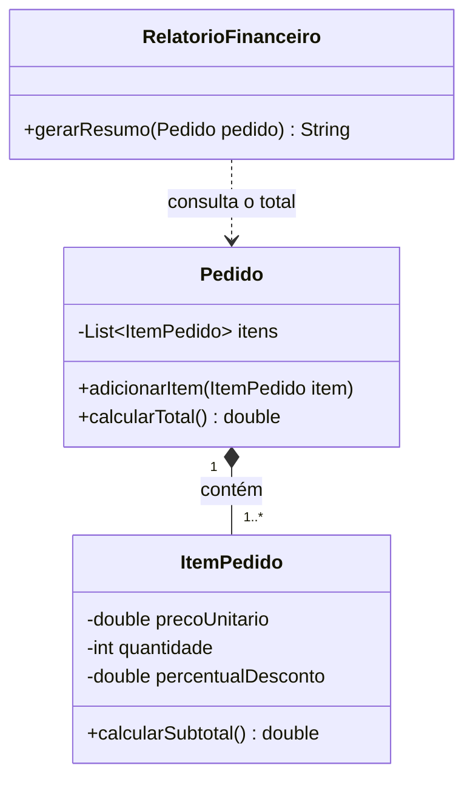
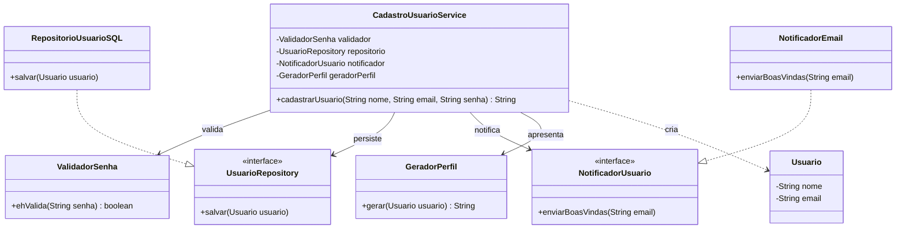
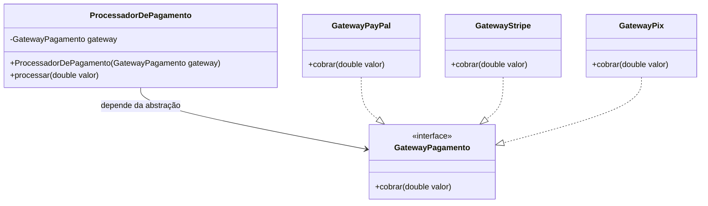
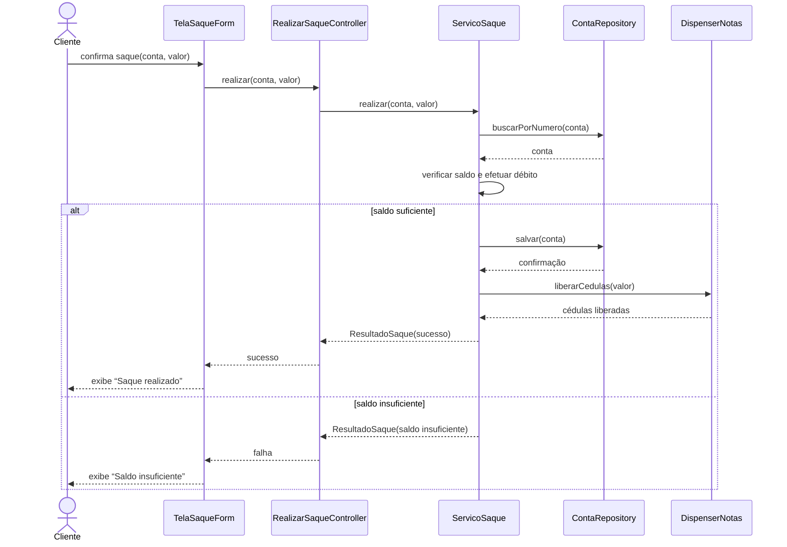

# Gabarito comentado — Princípios de Design de Software

Este gabarito apresenta uma resposta possível para cada subpergunta. Mais importante do que decorar os exemplos é compreender **qual problema de design existe**, **quais consequências ele produz** e **como a refatoração reduz essas consequências**.

---

### Questão 1

#### 1. Cenários distintos de mudança

A classe `Pedido` possui dois motivos independentes para mudar:

1. **Mudança na regra de negócio:** a empresa pode alterar preços, descontos, impostos ou a fórmula usada para calcular o total do pedido. Nesse caso, seria necessário modificar `calcularTotal()`.
2. **Mudança na persistência:** o banco pode mudar de MySQL para PostgreSQL, a estrutura da tabela pode ser alterada ou o sistema pode passar a usar uma API. Nesse caso, seria necessário modificar `salvarNoBanco()`.

Esses motivos pertencem a contextos diferentes. O cálculo interessa ao negócio; a gravação interessa à infraestrutura. Colocá-los na mesma classe viola a ideia de que uma classe deve ter apenas uma razão para mudar.

#### 2. Impacto nos testes unitários

Um teste da regra de cálculo deveria criar um pedido, executar o cálculo e comparar o resultado, sem precisar de banco de dados. Quando a classe também conhece SQL e conexão, o teste pode acabar dependendo de configuração externa, bibliotecas de banco ou objetos simulados desnecessários.

Mesmo que `calcularTotal()` não acesse o banco diretamente, a classe fica mais difícil de construir, configurar e isolar. O teste deixa de verificar apenas a regra de negócio e pode falhar por motivos que não têm relação com o cálculo.

#### 3. Benefício da separação

Uma solução é manter o cálculo em `Pedido` e transferir a persistência para um repositório:

```java
public class Pedido {
    public double calcularTotal() {
        return 100.0;
    }
}

public class PedidoRepository {
    public void salvar(Pedido pedido) {
        // Conexão e comando SQL
    }
}
```

Assim, uma alteração de imposto afeta apenas `Pedido`, enquanto uma alteração no banco afeta apenas `PedidoRepository`. As classes ficam menores, mais coesas, reutilizáveis e fáceis de testar.

---

### Questão 2

#### 1. Complicação ao adicionar novos tipos

Cada novo tipo exige abrir `CalculadoraDesconto`, acrescentar outro `if` ou `else if` e testar novamente todos os caminhos antigos. Depois de cinco novos tipos, o método terá muitas decisões e ficará cada vez mais difícil de ler.

Também aumenta o risco de uma alteração quebrar descontos que já funcionavam. A classe não está realmente fechada para modificação, porque toda expansão do negócio exige editar o mesmo arquivo.

#### 2. Como o polimorfismo resolve

Uma interface define o contrato de cálculo. Cada tipo de cliente recebe sua própria implementação. Para adicionar um novo desconto, cria-se outra classe, sem modificar as implementações existentes.

O código cliente trabalha com a abstração `PoliticaDesconto`, e não com textos como `"COMUM"` ou `"VIP"`. A decisão de qual política usar pode ficar em uma fábrica, configuração ou mecanismo de injeção de dependência.

#### 3. Refatoração

```java
public interface PoliticaDesconto {
    double calcular(double valor);
}

public class DescontoClienteComum implements PoliticaDesconto {
    @Override
    public double calcular(double valor) {
        return valor * 0.05;
    }
}

public class DescontoClienteVip implements PoliticaDesconto {
    @Override
    public double calcular(double valor) {
        return valor * 0.15;
    }
}

public class CalculadoraDesconto {
    private final PoliticaDesconto politica;

    public CalculadoraDesconto(PoliticaDesconto politica) {
        this.politica = politica;
    }

    public double calcular(double valor) {
        return politica.calcular(valor);
    }
}
```

Exemplo de uso:

```java
CalculadoraDesconto calculadora =
        new CalculadoraDesconto(new DescontoClienteVip());

double desconto = calculadora.calcular(200.0);
```

Para criar uma categoria `PREMIUM`, basta implementar outra `PoliticaDesconto`.

---

### Questão 3

#### 1. O que acontece de errado

`Garagem` chama `ligarMotor()` acreditando que recebeu um carro real. Com `CarroDeControleRemoto`, o método não liga nada e também não informa falha. Em seguida, o fluxo continua com `acelerar()`, como se o veículo estivesse pronto para viajar.

O problema não é apenas técnico. A classe-base criou uma expectativa de comportamento: todo `Carro` possui um motor que pode ser ligado. A subclasse aceita a chamada, mas não entrega o resultado prometido.

#### 2. Por que a herança foi mal escolhida

No uso cotidiano, os dois objetos podem ser chamados de “carro”, mas isso não significa que possuam o mesmo contrato no software. Herança deve representar uma relação substituível de “é um”. Um brinquedo não pode substituir um veículo real em operações como preparar uma viagem, abastecer ou transportar passageiros.

A semelhança no nome ou na aparência não é suficiente para justificar herança.

#### 3. Reestruturação

Podemos modelar os conceitos separadamente:

```java
public interface VeiculoMotorizado {
    void ligarMotor();
    void acelerar();
}

public class Carro implements VeiculoMotorizado {
    @Override
    public void ligarMotor() {
        System.out.println("Motor ligado com sucesso!");
    }

    @Override
    public void acelerar() {
        System.out.println("O carro está andando...");
    }
}

public class CarroDeControleRemoto {
    public void ligarControle() {
        System.out.println("Controle remoto ligado.");
    }

    public void mover() {
        System.out.println("O brinquedo está se movendo...");
    }
}

public class Garagem {
    public void prepararCarroParaViagem(VeiculoMotorizado veiculo) {
        veiculo.ligarMotor();
        veiculo.acelerar();
    }
}
```

Agora, o método da garagem só aceita objetos que cumprem o contrato de um veículo motorizado real.

---

### Questão 4

#### 1. Problema dos métodos vazios ou com exceções

Um método vazio cria uma falsa impressão de sucesso. Quem chama `escanear()` acredita que o documento foi escaneado, mas nada acontece. Lançar `UnsupportedOperationException` também é problemático, pois a interface afirma que o objeto possui uma operação que, na prática, ele não suporta.

Isso enfraquece o contrato e obriga o código cliente a conhecer detalhes de cada implementação antes de chamar um método.

#### 2. Efeito de adicionar `grampearDocumento()`

Todas as classes que implementam `DispositivoMultifuncional` terão que ser alteradas, inclusive impressoras que não grampeiam. Elas precisarão criar mais um método vazio ou lançar outra exceção. Uma mudança destinada a poucos equipamentos se espalha por classes não relacionadas ao recurso.

#### 3. Refatoração em interfaces menores

```java
public interface Imprimivel {
    void imprimir();
}

public interface Escaneavel {
    void escanear();
}

public interface EnviadorFax {
    void enviarFax();
}

public interface Grampeador {
    void grampearDocumento();
}

public class ImpressoraSimples implements Imprimivel {
    @Override
    public void imprimir() {
        System.out.println("Imprimindo...");
    }
}

public class MultifuncionalCompleta
        implements Imprimivel, Escaneavel, EnviadorFax {

    @Override
    public void imprimir() { /* implementação */ }

    @Override
    public void escanear() { /* implementação */ }

    @Override
    public void enviarFax() { /* implementação */ }
}
```

Cada equipamento implementa somente as capacidades que realmente oferece.

---

### Questão 5

#### 1. Motivo do acoplamento rígido

Ao executar `new MailSender()` dentro de `ServicoNotificacao`, a própria classe escolhe sua dependência. Ela conhece o tipo concreto, a forma de construção e o método específico `enviarEmail()`.

Não é possível entregar outra implementação pelo construtor. Por isso, a regra de alto nível “notificar cliente” fica presa ao detalhe de baixo nível “enviar por SMTP”.

#### 2. Troca para SMS ou WhatsApp

Seria necessário editar `ServicoNotificacao`, trocar o campo, a instanciação e provavelmente o método chamado. Se o sistema precisar escolher o canal em tempo de execução, a classe passará a ter condicionais para cada tecnologia.

Isso aumenta o risco de regressão e mistura a regra de notificação com detalhes de fornecedores externos.

#### 3. Interface e injeção pelo construtor

```java
public interface ProvedorNotificacao {
    void enviar(String mensagem);
}

public class ProvedorEmail implements ProvedorNotificacao {
    @Override
    public void enviar(String mensagem) {
        // Envio via SMTP
    }
}

public class ProvedorSms implements ProvedorNotificacao {
    @Override
    public void enviar(String mensagem) {
        // Integração com serviço de SMS
    }
}

public class ServicoNotificacao {
    private final ProvedorNotificacao provedor;

    public ServicoNotificacao(ProvedorNotificacao provedor) {
        this.provedor = provedor;
    }

    public void notificarCliente(String mensagem) {
        provedor.enviar(mensagem);
    }
}
```

Em produção, pode-se injetar `ProvedorEmail`. Em um teste, pode-se injetar uma implementação falsa em memória. A classe de alto nível permanece igual nos dois casos.

---

### Questão 6

#### 1. Três responsabilidades

A classe reúne:

1. **Acesso a dados:** `buscarDadosDoBanco()` conhece a origem dos dados.
2. **Apresentação/formatação:** `formatarParaPDF()` decide o formato do relatório.
3. **Comunicação:** `enviarPorEmail()` conhece rede e SMTP.

São responsabilidades com razões de mudança independentes: banco, layout do PDF e provedor de e-mail.

#### 2. Impacto de uma falha de rede

Quem deseja apenas mostrar o relatório na tela não deveria depender do serviço de e-mail. Entretanto, quando tudo está na mesma classe, configurações, inicialização e tratamento de erros de SMTP podem afetar o componente inteiro.

Por exemplo, a construção da classe pode tentar configurar o cliente SMTP, uma biblioteca de e-mail ausente pode impedir o carregamento e um método de fluxo único pode abortar antes de devolver o PDF. A falha de uma responsabilidade passa a contaminar outra.

#### 3. Divisão sugerida

```java
public class RepositorioVendas {
    public String buscarDados() {
        return "Dados de Vendas";
    }
}

public class FormatadorPDF {
    public String formatar(String dados) {
        return "[PDF] " + dados;
    }
}

public class ServicoEmail {
    public void enviar(String arquivo) {
        // Envio por SMTP
    }
}
```

Agora o `FormatadorPDF` pode ser usado na tela, em um download ou em um e-mail. Cada classe também pode ser testada e substituída separadamente.

---

### Questão 7

#### 1. Crescimento de tamanho e complexidade

Cada meio de pagamento acrescenta outra condição e outra integração à mesma classe. O método passa a conhecer boleto, Pix, cartão, criptomoeda, voucher e vale-refeição. Além de ficar longo, ele acumula dependências externas, validações e tratamentos de erro diferentes.

Esse crescimento aumenta a complexidade ciclomática: existem mais caminhos possíveis para entender e testar.

#### 2. Problema para os testes

Editar uma classe consolidada pode causar regressões nos meios antigos. A equipe precisa repetir testes de boleto, Pix e cartão mesmo quando adicionou apenas voucher. Conflitos de código também se tornam mais prováveis quando várias pessoas alteram o mesmo arquivo.

#### 3. Refatoração polimórfica

```java
public interface MeioPagamento {
    void processar(double valor);
}

public class PagamentoBoleto implements MeioPagamento {
    @Override
    public void processar(double valor) {
        // Geração do boleto
    }
}

public class PagamentoPix implements MeioPagamento {
    @Override
    public void processar(double valor) {
        // Integração com a API do Pix
    }
}

public class PagamentoCartao implements MeioPagamento {
    @Override
    public void processar(double valor) {
        // Comunicação com a adquirente
    }
}

public class ProcessadorPagamento {
    public void processar(MeioPagamento meio, double valor) {
        meio.processar(valor);
    }
}
```

Para aceitar voucher, cria-se `PagamentoVoucher implements MeioPagamento`. O processador não precisa ser alterado.

---

### Questão 8

#### 1. Erro no fluxo de pagamento

Quando recebe `ContaInvestimentoBloqueada`, o serviço chama `sacar()`, mas o saldo não muda. Mesmo assim, `pagarBoleto()` imprime que o boleto foi pago. O sistema registra sucesso sem ter retirado o dinheiro.

O problema é agravado porque `saldoInicial` é lido, mas nunca usado para confirmar o resultado da operação.

#### 2. Quebra da expectativa

Para uma `ContaBancaria` comum, uma chamada válida a `sacar(valor)` reduz o saldo. A subclasse sobrescreve o método, aceita a mesma chamada, mas anula o efeito esperado. Como não retorna resultado nem lança erro, o chamador não percebe a violação.

Isso demonstra que `ContaInvestimentoBloqueada` não pode substituir corretamente `ContaBancaria` em todos os contextos. Observação adicional: em um sistema real, a classe-base também deveria impedir saldo negativo e comunicar falhas explicitamente.

#### 3. Reestruturação

Uma opção é separar a capacidade de saque em uma interface:

```java
public abstract class Conta {
    protected double saldo;

    public void depositar(double valor) {
        if (valor <= 0) {
            throw new IllegalArgumentException("Valor inválido");
        }
        saldo += valor;
    }

    public double getSaldo() {
        return saldo;
    }
}

public interface ContaMovimentavel {
    void sacar(double valor);
    double getSaldo();
}

public class ContaCorrente extends Conta implements ContaMovimentavel {
    @Override
    public void sacar(double valor) {
        if (valor <= 0 || valor > saldo) {
            throw new IllegalArgumentException("Saldo ou valor inválido");
        }
        saldo -= valor;
    }
}

public class ContaInvestimentoBloqueada extends Conta {
    public void resgatarNoVencimento() {
        // Regra própria do investimento
    }
}

public class ServicoDePagamentos {
    public void pagarBoleto(ContaMovimentavel conta, double valor) {
        conta.sacar(valor);
        System.out.println("Boleto pago com sucesso!");
    }
}
```

O compilador agora impede que uma conta não movimentável seja enviada ao serviço de pagamentos.

---

### Questão 9

#### 1. Problemas para `OperadorAtendimento`

O operador precisa implementar `aprovarOrcamento()` mesmo sem possuir essa função. Ele poderá criar um método vazio, lançar exceção ou, pior, implementar uma ação que não deveria estar disponível ao seu perfil.

Além de gerar código sem sentido, a interface deixa de representar corretamente as capacidades do objeto.

#### 2. Coesão e segurança

A interface mistura autenticação, orçamento e folha de pagamento, que pertencem a papéis diferentes. Por isso, ela tem baixa coesão.

Também existe risco de segurança: ao implementar um contrato amplo, uma classe pode acabar expondo métodos privilegiados. Controle de acesso não deve depender de métodos vazios; o ideal é que objetos comuns nem recebam capacidades administrativas que não precisam possuir.

#### 3. Contratos menores

```java
public interface UsuarioAutenticavel {
    void fazerLogin();
    void alterarSenha();
}

public interface AprovadorOrcamento {
    void aprovarOrcamento();
}

public interface OperadorFolhaPagamento {
    void rodarFolhaPagamento();
}

public class OperadorAtendimento implements UsuarioAutenticavel {
    @Override
    public void fazerLogin() { /* ... */ }

    @Override
    public void alterarSenha() { /* ... */ }
}

public class Diretor
        implements UsuarioAutenticavel, AprovadorOrcamento {
    // Implementações dos contratos correspondentes
}

public class ProfissionalRH
        implements UsuarioAutenticavel, OperadorFolhaPagamento {
    // Implementações dos contratos correspondentes
}
```

Cada papel depende apenas das operações que realmente utiliza.

---

### Questão 10

#### 1. Motivo do forte acoplamento

`PedidoService` declara o tipo concreto `MySQLRepository` e o instancia diretamente. Portanto, conhece tanto a tecnologia escolhida quanto sua construção. A regra de negócio não consegue funcionar sem essa classe específica.

Trocar MySQL por PostgreSQL, arquivo ou armazenamento em nuvem exige editar `PedidoService`.

#### 2. Dificuldade no teste unitário

Como não há forma de fornecer outro repositório, o teste pode acabar dependendo de um MySQL real. Isso exige servidor, esquema, credenciais e limpeza de dados. O teste fica lento, frágil e mais próximo de um teste de integração do que de unidade.

#### 3. Interface e injeção de dependência

```java
public interface ContratoRepositorio {
    void salvar(String dados);
}

public class MySQLRepository implements ContratoRepositorio {
    @Override
    public void salvar(String dados) {
        System.out.println("Salvando no banco MySQL...");
    }
}

public class PedidoService {
    private final ContratoRepositorio repository;

    public PedidoService(ContratoRepositorio repository) {
        this.repository = repository;
    }

    public void processar(String pedido) {
        // Regra de processamento
        repository.salvar(pedido);
    }
}
```

Para um teste rápido:

```java
public class RepositorioEmMemoria implements ContratoRepositorio {
    private String ultimoDadoSalvo;

    @Override
    public void salvar(String dados) {
        ultimoDadoSalvo = dados;
    }

    public String getUltimoDadoSalvo() {
        return ultimoDadoSalvo;
    }
}
```

O teste injeta `RepositorioEmMemoria`; a produção injeta `MySQLRepository`.

---

### Questão 11

#### 1. Problema de fazer `ConsultorPJ` herdar de `Funcionario`

Ao herdar de `Funcionario`, o consultor seria obrigado a possuir `nome` e `salarioBase`, além de chamar o construtor da classe-base. Porém, segundo o enunciado, esses dados pertencem à folha interna e não representam o contrato de um prestador externo.

Para satisfazer a herança, o desenvolvedor talvez passasse valores artificiais, como salário igual a zero. Isso produz estado inválido, confunde quem lê o código e permite que métodos próprios de funcionário sejam usados indevidamente no consultor.

O problema central é usar herança apenas para reaproveitar a assinatura de um método. Herança deve expressar uma relação conceitual verdadeira, e não servir como atalho para compartilhar um contrato.

#### 2. Interface ou classe abstrata?

O melhor é **manter `Funcionario` como classe abstrata** e criar uma interface separada chamada `Pagavel`.

- `Funcionario` continua reunindo estado e código comum a funcionários reais, como nome e salário-base.
- `Pagavel` representa somente a capacidade de calcular um pagamento.
- `Desenvolvedor` é funcionário e também é pagável.
- `ConsultorPJ` não é funcionário, mas também é pagável.

Transformar `Funcionario` inteiramente em interface faria a classe perder justamente o estado e o reuso de código que são válidos para seus verdadeiros descendentes.

#### 3. Refatoração

```java
public interface Pagavel {
    double calcularPagamento();
}

public abstract class Funcionario implements Pagavel {
    private final String nome;
    private final double salarioBase;

    protected Funcionario(String nome, double salarioBase) {
        this.nome = nome;
        this.salarioBase = salarioBase;
    }

    public String getNome() {
        return nome;
    }

    protected double getSalarioBase() {
        return salarioBase;
    }
}

public class Desenvolvedor extends Funcionario {
    public Desenvolvedor(String nome, double salarioBase) {
        super(nome, salarioBase);
    }

    @Override
    public double calcularPagamento() {
        return getSalarioBase();
    }
}

public class ConsultorPJ implements Pagavel {
    private final double valorHora;
    private final int horasTrabalhadas;

    public ConsultorPJ(double valorHora, int horasTrabalhadas) {
        this.valorHora = valorHora;
        this.horasTrabalhadas = horasTrabalhadas;
    }

    @Override
    public double calcularPagamento() {
        return valorHora * horasTrabalhadas;
    }
}

public class SistemaPagamentos {
    public double obterValorAPagar(Pagavel pagavel) {
        return pagavel.calcularPagamento();
    }
}
```

O sistema pode tratar ambos de forma uniforme por meio de `Pagavel`, sem afirmar que o consultor é um funcionário.

---

### Questão 12

#### 1. Partes repetidas

As duas classes repetem:

- a implementação de `escreverCabecalho()`;
- a sequência do algoritmo `abrirArquivo()` → `escreverCabecalho()` → `escreverCorpo()` → `fecharArquivo()`;
- parte da lógica de fechamento e salvamento;
- a própria implementação de `exportar()`.

Mesmo quando alguns detalhes de abrir ou fechar variam pelo formato, a **estrutura geral do algoritmo** é idêntica.

#### 2. Por que apenas uma interface não resolve

Uma interface tradicional declara o que deve existir, mas não centraliza automaticamente o estado e todas as etapas comuns. Por isso, cada implementação acaba copiando o mesmo algoritmo.

Uma classe abstrata pode oferecer implementações compartilhadas e usar o padrão **Template Method**: o método-base define a ordem fixa do processo, enquanto métodos abstratos representam os pontos que variam.

Não é obrigatório abandonar a interface. Em um projeto maior, pode-se manter uma interface pública `ExportadorRelatorio` e criar uma classe abstrata que a implemente. Assim, preserva-se o contrato e também se obtém reuso.

#### 3. Refatoração

```java
public abstract class ExportadorRelatorio {

    // Template Method: define o fluxo comum.
    public final void exportar(String dados) {
        abrirArquivo();
        escreverCabecalho();
        escreverCorpo(dados);
        fecharArquivo();
    }

    protected void escreverCabecalho() {
        System.out.println("Cabeçalho padrão da Empresa X");
    }

    protected void fecharArquivo() {
        System.out.println("Salvando arquivo.");
    }

    protected abstract void abrirArquivo();
    protected abstract void escreverCorpo(String dados);
}

public class ExportadorPDF extends ExportadorRelatorio {
    @Override
    protected void abrirArquivo() {
        System.out.println("Criando arquivo .pdf...");
    }

    @Override
    protected void escreverCorpo(String dados) {
        System.out.println("PDF: " + dados);
    }
}

public class ExportadorCSV extends ExportadorRelatorio {
    @Override
    protected void abrirArquivo() {
        System.out.println("Criando arquivo .csv...");
    }

    @Override
    protected void escreverCorpo(String dados) {
        System.out.println("CSV: " + dados);
    }
}
```

O modificador `final` em `exportar()` evita que as subclasses alterem acidentalmente a ordem estabelecida pelo algoritmo-base.

---

### Questão 13

#### 1. Problemas de clareza e nomenclatura

Há vários problemas; entre eles:

1. `Processador` é um nome genérico e não informa o que está sendo processado.
2. `proc` não revela a finalidade do método.
3. Os parâmetros `p` e `t` não explicam o que recebem.
4. As variáveis `s` e `i` escondem os conceitos de total e preço do item.
5. Os valores `1` e `2` representam tipos, mas isso não está expresso no tipo do parâmetro.
6. `1.05`, `1.10` e `100` são números mágicos.
7. O método soma valores, escolhe taxa, aplica taxa e toma uma decisão; portanto, concentra etapas distintas.
8. `if (condicao) return true; else return false;` pode ser substituído pelo retorno direto da condição.

Os comentários tentam compensar nomes que não comunicam intenção. Um código autoexplicativo diminui essa dependência.

#### 2. Benefício de nomes e constantes

`valorMinimoParaAprovacao` comunica uma regra; `100` sozinho não. Uma constante fornece nome, ponto único de alteração e reduz o risco de valores inconsistentes.

Um `enum` impede valores inválidos como `t = 99` e deixa claro quais tipos são aceitos. Métodos pequenos permitem testar separadamente o cálculo do subtotal e a aplicação da taxa.

#### 3. Refatoração

```java
public enum TipoEntrega {
    PADRAO(0.05),
    EXPRESSA(0.10);

    private final double taxa;

    TipoEntrega(double taxa) {
        this.taxa = taxa;
    }

    public double aplicarTaxa(double subtotal) {
        return subtotal * (1 + taxa);
    }
}

public class AvaliadorPedido {
    private static final double VALOR_MINIMO_APROVACAO = 100.0;

    public boolean pedidoAtingeValorMinimo(
            List<Double> precosDosItens,
            TipoEntrega tipoEntrega
    ) {
        double subtotal = calcularSubtotal(precosDosItens);
        double totalComTaxa = tipoEntrega.aplicarTaxa(subtotal);
        return totalComTaxa > VALOR_MINIMO_APROVACAO;
    }

    private double calcularSubtotal(List<Double> precosDosItens) {
        return precosDosItens.stream()
                .mapToDouble(Double::doubleValue)
                .sum();
    }
}
```

Agora os nomes descrevem a regra sem depender de comentários. Em aplicações financeiras reais, seria melhor usar `BigDecimal` em vez de `double` para evitar erros de precisão.

---

### Questão 14

#### 1. Sobrecomplicações

O código apresenta várias operações desnecessárias:

- muitos `if` aninhados para formar uma única condição booleana;
- `split("@")` apenas para verificar uma estrutura básica;
- um laço que conta caracteres, embora `senha.length()` já forneça o tamanho;
- comparações como `emailValido == true`;
- um `if/else` final que apenas devolve o valor de uma condição.

Isso é “reinventar a roda” porque a própria linguagem já oferece operações diretas para essas tarefas.

#### 2. Por que o excesso aumenta bugs

Cada nível de condição adiciona um novo caminho de execução. O programador precisa acompanhar mais estados intermediários, como `emailValido` e `senhaValida`, e pode esquecer um caso de borda.

Estruturas profundas também dificultam revisão e testes. Uma regra simples fica escondida, tornando mais provável que uma futura alteração seja feita no lugar errado.

#### 3. Refatoração KISS

```java
public class ValidadorUsuario {
    private static final int TAMANHO_MINIMO_SENHA = 8;

    public boolean validarCadastro(String email, String senha) {
        return emailEhValido(email) && senhaEhValida(senha);
    }

    private boolean emailEhValido(String email) {
        if (email == null) {
            return false;
        }

        int posicaoArroba = email.indexOf('@');
        int ultimaPosicaoArroba = email.lastIndexOf('@');
        int posicaoPonto = email.lastIndexOf('.');

        return posicaoArroba > 0
                && posicaoArroba == ultimaPosicaoArroba
                && posicaoPonto > posicaoArroba + 1
                && posicaoPonto < email.length() - 1;
    }

    private boolean senhaEhValida(String senha) {
        return senha != null && senha.length() >= TAMANHO_MINIMO_SENHA;
    }
}
```

A verificação de e-mail continua intencionalmente simples. Validar todos os formatos possíveis de e-mail é complexo; em produção, a equipe deve usar uma biblioteca confiável ou enviar uma mensagem de confirmação. KISS significa usar a solução mais simples que cumpra o requisito real, não ignorar requisitos importantes.

---

### Questão 15

#### 1. Regra duplicada

Os dois métodos repetem:

```java
double subtotal = valorProduto * quantidade;
double imposto = subtotal * 0.15;
```

A regra duplicada é o cálculo do subtotal e do imposto padrão de 15%. A venda online apenas acrescenta o frete ao resultado.

#### 2. Risco ao mudar para 18%

Seria necessário localizar e modificar todos os lugares onde `0.15` aparece. Se alguém atualizar a venda online e esquecer a venda de balcão, o sistema aplicará alíquotas diferentes sem intenção.

Em um sistema grande, cópias podem estar espalhadas por dezenas de classes. Isso gera inconsistência financeira, dificuldade de auditoria e maior custo de testes.

#### 3. Refatoração

```java
public class GerenciadorDeVendas {
    private static final double ALIQUOTA_IMPOSTO = 0.15;

    public double calcularVendaBalcao(
            double valorProduto,
            int quantidade
    ) {
        double total = calcularSubtotalComImposto(valorProduto, quantidade);
        registrar("Venda Balcão", total);
        return total;
    }

    public double calcularVendaOnline(
            double valorProduto,
            int quantidade,
            double frete
    ) {
        double total = calcularSubtotalComImposto(valorProduto, quantidade)
                + frete;
        registrar("Venda Online", total);
        return total;
    }

    private double calcularSubtotalComImposto(
            double valorProduto,
            int quantidade
    ) {
        double subtotal = valorProduto * quantidade;
        return subtotal + calcularImposto(subtotal);
    }

    private double calcularImposto(double subtotal) {
        return subtotal * ALIQUOTA_IMPOSTO;
    }

    private void registrar(String tipoVenda, double total) {
        System.out.println(tipoVenda + " registrada no valor de: " + total);
    }
}
```

A alíquota possui uma única representação. Se a tributação crescer em complexidade, a regra pode ser extraída para uma classe `CalculadoraImposto`.

---

### Questão 16

#### 1. Violação da Lei de Demeter

Na cadeia `pedido.getCliente().getEndereco().getCidade()`, `ServicoDeEntrega` não conversa apenas com `Pedido`. Ele atravessa `Cliente` e `Endereco` para alcançar o dado desejado.

Isso faz o serviço conhecer detalhes internos de três classes: ele sabe que um pedido contém um cliente, que um cliente contém um endereço e que o endereço contém uma cidade. O encapsulamento é enfraquecido porque a estrutura interna vira parte do conhecimento do serviço.

#### 2. Efeito da mudança para vários endereços

Se `Cliente` passar a ter `getEnderecoPrincipal()`, a cadeia deixa de compilar ou passa a usar o endereço errado. `ServicoDeEntrega` terá que ser alterado, embora sua responsabilidade — decidir a modalidade de entrega — não tenha mudado.

Se várias classes repetirem a mesma cadeia, todas precisarão ser localizadas e corrigidas.

#### 3. Refatoração por delegação

```java
public class Endereco {
    private final String cidade;

    public Endereco(String cidade) {
        this.cidade = cidade;
    }

    public String getCidade() {
        return cidade;
    }
}

public class Cliente {
    private final Endereco enderecoPrincipal;

    public Cliente(Endereco enderecoPrincipal) {
        this.enderecoPrincipal = enderecoPrincipal;
    }

    public String getCidadeDoEnderecoPrincipal() {
        return enderecoPrincipal.getCidade();
    }
}

public class Pedido {
    private final Cliente cliente;

    public Pedido(Cliente cliente) {
        this.cliente = cliente;
    }

    public String getCidadeDestino() {
        return cliente.getCidadeDoEnderecoPrincipal();
    }
}

public class ServicoDeEntrega {
    public void verificarEnvio(Pedido pedido) {
        if (pedido.getCidadeDestino().equalsIgnoreCase("São Paulo")) {
            System.out.println("Entrega expressa disponível.");
        } else {
            System.out.println("Entrega convencional.");
        }
    }
}
```

`ServicoDeEntrega` agora conhece apenas seu “amigo próximo”, `Pedido`. Se a forma de escolher o endereço mudar, a alteração fica encapsulada em `Cliente` ou `Pedido`.

---

### Questão 17

#### 1. Por que há quebra de encapsulamento

`Pedido` é o objeto que possui a coleção de itens. Cada `ItemPedido` possui preço e quantidade. Portanto, esses objetos detêm as informações necessárias para calcular subtotal e total.

Quando `RelatorioFinanceiro` percorre `pedido.getItens()` e lê os dados internos de cada item, ele assume uma regra que pertence ao domínio do pedido. O relatório deixa de apenas apresentar informações financeiras e passa a decidir como o total é calculado.

Além disso, `getItens()` expõe a coleção interna. Código externo pode depender de sua estrutura ou até modificá-la indevidamente. O princípio do Especialista na Informação sugere colocar cada cálculo próximo dos dados que ele utiliza:

- `ItemPedido` calcula seu próprio subtotal;
- `Pedido` soma os subtotais de seus itens;
- `RelatorioFinanceiro` apenas consulta o total pronto para exibi-lo.

#### 2. Impacto da mudança na regra de subtotal

Na estrutura atual, adicionar um desconto por item provavelmente exige modificar **pelo menos duas classes**:

1. `ItemPedido`, para armazenar o desconto e expor essa nova informação;
2. `RelatorioFinanceiro`, para considerar o desconto na fórmula.

O número pode ser ainda maior se outras classes também repetirem o cálculo. Na estrutura refatorada, a fórmula do subtotal fica centralizada em `ItemPedido`. As classes consumidoras continuam chamando `calcularSubtotal()` ou `calcularTotal()` e não precisam conhecer a nova regra.

#### 3. Refatoração

```java
public class ItemPedido {
    private final double precoUnitario;
    private final int quantidade;
    private final double percentualDesconto;

    public ItemPedido(
            double precoUnitario,
            int quantidade,
            double percentualDesconto
    ) {
        this.precoUnitario = precoUnitario;
        this.quantidade = quantidade;
        this.percentualDesconto = percentualDesconto;
    }

    public double calcularSubtotal() {
        double valorBruto = precoUnitario * quantidade;
        double desconto = valorBruto * percentualDesconto;
        return valorBruto - desconto;
    }
}

public class Pedido {
    private final List<ItemPedido> itens = new ArrayList<>();

    public void adicionarItem(ItemPedido item) {
        itens.add(item);
    }

    public double calcularTotal() {
        return itens.stream()
                .mapToDouble(ItemPedido::calcularSubtotal)
                .sum();
    }
}

public class RelatorioFinanceiro {
    public String gerarResumo(Pedido pedido) {
        return "Total do pedido: R$ " + pedido.calcularTotal();
    }
}
```

Diagrama refatorado:



O diagrama mostra que o comportamento foi movido para os especialistas que possuem os dados. A seta do relatório para o pedido representa apenas uma consulta ao resultado já calculado.

---

### Questão 18

#### 1. Responsabilidades diferentes

`GestorDeUsuarios` tenta cuidar de pelo menos cinco tarefas:

1. **Orquestração do cadastro:** define a sequência geral do caso de uso.
2. **Validação:** verifica a regra da senha.
3. **Persistência:** constrói uma operação de banco de dados.
4. **Notificação:** conecta-se a SMTP e envia e-mail.
5. **Apresentação:** produz HTML da página de perfil.

Essas tarefas não mudam pelos mesmos motivos. A regra de senha pode mudar por segurança, o SQL por alteração do banco, o e-mail por troca de provedor e o HTML por decisão visual.

#### 2. Risco causado pela baixa coesão

Como todas as tarefas estão no mesmo arquivo, alterar HTML exige abrir e recompilar uma classe que também contém persistência. Um erro de sintaxe, conflito de edição ou refatoração incorreta pode impedir todo o cadastro de funcionar.

Os testes também se tornam maiores: para verificar uma mudança visual, pode ser necessário lidar com senha, banco e e-mail. A baixa coesão aumenta a área afetada por cada mudança e dificulta localizar a causa de uma falha.

Separar as classes não significa que mudar HTML alterará diretamente o SQL; significa que, na estrutura original, ambas as partes estão desnecessariamente expostas ao mesmo ciclo de alteração e implantação.

#### 3. Divisão em componentes

Uma possível divisão é:

- `CadastroUsuarioService`: coordena o caso de uso;
- `ValidadorSenha`: contém regras de senha;
- `UsuarioRepository`: define o contrato de persistência;
- `NotificadorUsuario`: define o contrato de notificação;
- `GeradorPerfil`: gera a apresentação.



O serviço continua coordenando o cadastro, mas delega cada trabalho especializado. As interfaces permitem trocar banco e canal de notificação sem alterar o caso de uso.

---

### Questão 19

#### 1. Alterações necessárias sem abstração

Na versão original, `ProcessadorDePagamento` possui um campo `PagamentoPayPal`, cria o objeto com `new` e chama um método cujo nome menciona PayPal.

Para aceitar Stripe ou Pix, seria necessário editar a classe para:

- declarar novas dependências;
- instanciar os novos gateways;
- criar alguma condição para escolher o gateway;
- chamar métodos específicos de cada fornecedor;
- repetir os testes do processador.

A classe de processamento ficaria cada vez mais presa aos detalhes das APIs externas.

#### 2. Como a abstração reduz a dependência

A interface `GatewayPagamento` estabelece uma operação comum, como `cobrar(valor)`. O processador passa a conhecer apenas esse contrato. PayPal, Stripe e Pix adaptam suas APIs particulares para a operação comum.

A implementação é recebida pelo construtor. Assim, a escolha do fornecedor acontece fora do processador. Isso permite substituição em produção e uso de uma implementação falsa nos testes.

#### 3. Código e diagrama refatorados

```java
public interface GatewayPagamento {
    void cobrar(double valor);
}

public class GatewayPayPal implements GatewayPagamento {
    @Override
    public void cobrar(double valor) {
        System.out.println("Cobrança efetuada no PayPal: R$ " + valor);
    }
}

public class GatewayStripe implements GatewayPagamento {
    @Override
    public void cobrar(double valor) {
        System.out.println("Cobrança efetuada na Stripe: R$ " + valor);
    }
}

public class GatewayPix implements GatewayPagamento {
    @Override
    public void cobrar(double valor) {
        System.out.println("Cobrança efetuada via Pix: R$ " + valor);
    }
}

public class ProcessadorDePagamento {
    private final GatewayPagamento gateway;

    public ProcessadorDePagamento(GatewayPagamento gateway) {
        this.gateway = gateway;
    }

    public void processar(double valor) {
        if (valor <= 0) {
            throw new IllegalArgumentException("O valor deve ser positivo");
        }
        gateway.cobrar(valor);
    }
}
```



As linhas tracejadas com triângulo indicam que as classes realizam, ou implementam, o contrato da interface.

---

### Questão 20

#### 1. Por que a tela não deve coordenar tudo

`TelaSaqueForm` pertence à apresentação, mas conhece banco de dados, cálculo de saldo e dispenser físico. A regra “só sacar se houver saldo” fica presa ao evento de clique dessa tela.

Um aplicativo móvel ou Web Banking não possui esse mesmo formulário e talvez nem use um dispenser. Para reutilizar a regra, a equipe teria que copiar a lógica ou fazer outras interfaces dependerem de uma classe visual. Ambos os caminhos criam forte acoplamento.

Além disso, testar a regra exige simular componentes de UI e hardware, embora a decisão sobre saldo seja uma regra de aplicação.

#### 2. Papel de `RealizarSaqueController`

O controlador recebe a solicitação da apresentação, valida os dados básicos da entrada e coordena o caso de uso. Ele chama o serviço de domínio e traduz o resultado para uma resposta compreensível pela tela.

O controlador **não deve conter a regra central de saldo** nem comandos SQL. Essas responsabilidades pertencem ao serviço de domínio e ao repositório. A tela, por sua vez, deve apenas capturar os dados e mostrar o resultado.

Uma divisão possível é:

```java
public class RealizarSaqueController {
    private final ServicoSaque servicoSaque;

    public RealizarSaqueController(ServicoSaque servicoSaque) {
        this.servicoSaque = servicoSaque;
    }

    public ResultadoSaque realizar(int numeroConta, double valor) {
        return servicoSaque.realizar(numeroConta, valor);
    }
}

public class TelaSaqueForm {
    private final RealizarSaqueController controller;

    public TelaSaqueForm(RealizarSaqueController controller) {
        this.controller = controller;
    }

    public void onClickBotaoConfirmar(int numeroConta, double valor) {
        ResultadoSaque resultado = controller.realizar(numeroConta, valor);
        System.out.println(resultado.getMensagem());
    }
}
```

#### 3. Diagrama de sequência



O fluxo evidencia as responsabilidades:

- a tela recebe e apresenta;
- o controlador coordena a entrada do caso de uso;
- o serviço executa a regra;
- o repositório cuida da persistência;
- o dispenser cuida do dispositivo físico.

