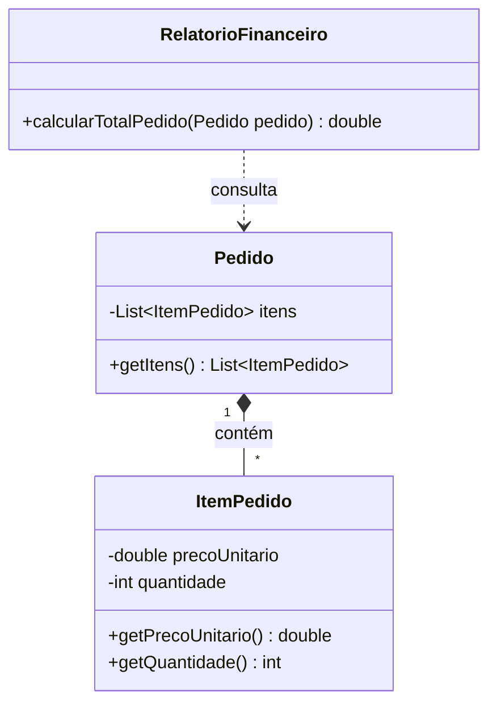
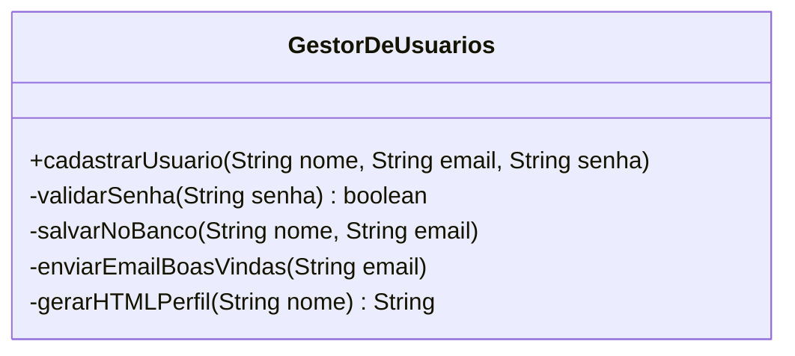
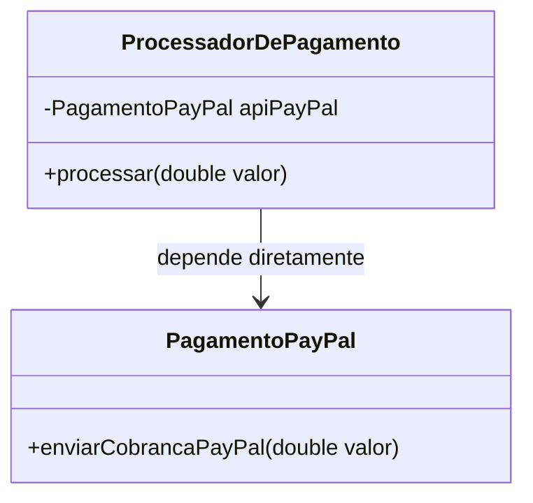
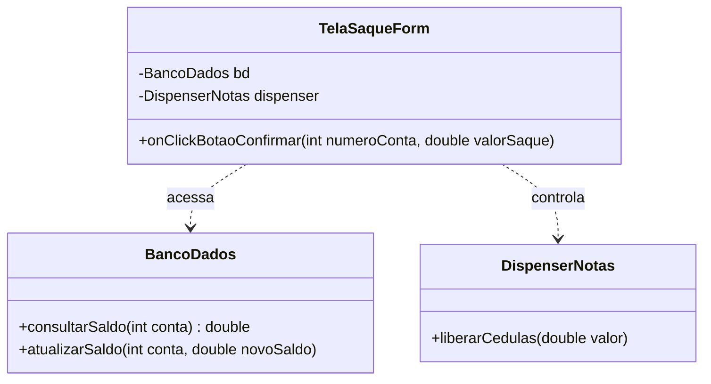

# Questionário — Princípios de Design de Software

### Questão 1

> O Princípio da Responsabilidade Única estabelece que uma classe deve ter apenas um motivo para mudar, servindo a um único ator ou contexto de negócio.

Considere o seguinte trecho de código:

```java
public class Pedido {
    public double calcularTotal() {
        // Cálculo de preços e impostos do pedido
        return 100.0;
    }

    public void salvarNoBanco() {
        // Conexão SQL e lógica de inserção em banco de dados
    }
}
```

Com base nessa definição, responda:

1. Quais são os dois cenários distintos de mudança no negócio ou na tecnologia que forçariam essa mesma classe a ser modificada?
2. Qual é o impacto dessa mistura de responsabilidades na execução de testes unitários automatizados da regra de cálculo?
3. Como a separação em duas classes melhora a manutenção do sistema?

---

### Questão 2

> O Princípio do Aberto/Fechado orienta que entidades de software devem estar abertas para expansão, mas fechadas para modificação.

Examine a implementação a seguir:

```java
public class CalculadoraDesconto {
    public double calcular(String tipoCliente, double valor) {
        if (tipoCliente.equals("COMUM")) {
            return valor * 0.05;
        } else if (tipoCliente.equals("VIP")) {
            return valor * 0.15;
        }
        return 0.0;
    }
}
```

Com base nesse contexto, responda:

1. Qual é a complicação direta no código caso a empresa decida adicionar cinco novos tipos de clientes nos próximos meses?
2. Como o uso de polimorfismo e interfaces resolve o problema de alterar arquivos já consolidados e testados?
3. Refatore o código utilizando polimorfismo.

---

### Questão 3

> Se `B` é uma subclasse de `A`, então qualquer lugar do sistema que usa um objeto do tipo `A` deve funcionar corretamente ao receber um objeto do tipo `B`, sem surpresas no comportamento.

Observe as classes abaixo:

```java
// Classe-base: representa qualquer carro no sistema
public class Carro {
    public void ligarMotor() {
        System.out.println("Motor ligado com sucesso!");
    }

    public void acelerar() {
        System.out.println("O carro está andando...");
    }
}

// Subclasse: representa um brinquedo
public class CarroDeControleRemoto extends Carro {

    // Este carro de brinquedo não tem motor de verdade!
    @Override
    public void ligarMotor() {
        // Não faz nada porque não existe motor para ligar
    }
}
```

Agora, veja este código que usa a classe `Carro`:

```java
public class Garagem {
    public void prepararCarroParaViagem(Carro carro) {
        carro.ligarMotor(); // O sistema espera que o motor ligue!
        carro.acelerar();
    }
}
```

Responda:

1. **Análise do problema:** se `prepararCarroParaViagem` receber um objeto do tipo `CarroDeControleRemoto`, o que acontece de errado na lógica da aplicação, levando em conta o que a classe-base prometia fazer?
2. **Impacto no design:** por que dizer que “um carro de controle remoto é um tipo de carro” foi uma escolha ruim de modelagem e herança nesse cenário?
3. **Solução prática:** como você alteraria essas classes, ou a estrutura de herança, para que `Carro` represente apenas veículos reais e o brinquedo não seja forçado a herdar comportamentos que não possui?

---

### Questão 4

> O Princípio da Segregação de Interfaces afirma que os clientes não devem ser forçados a depender de interfaces que não utilizam.

Analise a interface a seguir:

```java
public interface DispositivoMultifuncional {
    void imprimir();
    void escanear();
    void enviarFax();
}

public class ImpressoraSimples implements DispositivoMultifuncional {
    public void imprimir() {
        System.out.println("Imprimindo...");
    }

    public void escanear() {
        /* Não suportado */
    }

    public void enviarFax() {
        /* Não suportado */
    }
}
```

Responda:

1. Qual é o problema de um componente ser forçado a implementar métodos vazios ou lançar exceções para recursos não suportados?
2. O que acontece se `DispositivoMultifuncional` ganhar um método como `grampearDocumento()`?
3. Proponha a refatoração dessa interface monolítica em interfaces menores e focadas.

---

### Questão 5

> O Princípio da Inversão de Dependência define que módulos de alto nível não devem depender de módulos de baixo nível; ambos devem depender de abstrações.

Considere o relacionamento entre as classes abaixo:

```java
public class MailSender {
    public void enviarEmail(String mensagem) {
        // Envio direto via SMTP
    }
}

public class ServicoNotificacao {
    private MailSender mailSender = new MailSender();

    public void notificarCliente(String msg) {
        mailSender.enviarEmail(msg);
    }
}
```

Responda:

1. Por que a instanciação direta com `new MailSender()` acopla rigidamente a classe de alto nível `ServicoNotificacao` a uma implementação concreta?
2. O que ocorre se for necessário trocar o envio por e-mail por um serviço de SMS ou WhatsApp?
3. Como a introdução de uma interface `ProvedorNotificacao` e a injeção de dependência via construtor tornam essa arquitetura mais flexível?

---

### Questão 6

> O Princípio da Responsabilidade Única preza pela coesão de uma classe, separando tarefas de persistência, formatação e comunicação de rede.

Considere este componente de geração de relatórios:

```java
public class GeradorRelatorioVendas {
    public String buscarDadosDoBanco() {
        return "Dados de Vendas";
    }

    public String formatarParaPDF(String dados) {
        return "[PDF] " + dados;
    }

    public void enviarPorEmail(String pdf) {
        // Conexão SMTP e envio de e-mail
    }
}
```

Responda:

1. Identifique as três responsabilidades distintas contidas nessa única classe.
2. Como uma falha na rede ao enviar o e-mail pode impactar indiretamente a rotina de quem precisa apenas do relatório formatado na tela?
3. Como a divisão dessa classe em `RepositorioVendas`, `FormatadorPDF` e `ServicoEmail` melhora a reutilização do código?

---

### Questão 7

> O Princípio do Aberto/Fechado prioriza o crescimento do código pela adição de novas classes, em vez da alteração do código-fonte existente.

Examine a classe de cálculo financeiro abaixo:

```java
public class ProcessadorPagamento {
    public void processar(String metodo, double valor) {
        if (metodo.equals("BOLETO")) {
            // Lógica de geração de boleto bancário
        } else if (metodo.equals("PIX")) {
            // Lógica de integração com API do PIX
        } else if (metodo.equals("CARTAO")) {
            // Lógica de comunicação com adquirente de cartão
        }
    }
}
```

Responda:

1. O que acontece com o tamanho e a complexidade dessa classe à medida que o sistema passa a aceitar criptomoedas, voucher e vale-refeição?
2. Do ponto de vista de testes, qual é o problema de abrir essa classe para edição a cada novo meio de pagamento?
3. Refatore o código utilizando polimorfismo.

---

### Questão 8

> As subclasses devem honrar os contratos e as regras estabelecidas pela classe-base. Se a classe-base estabelece uma garantia de comportamento, a subclasse não pode alterar nem anular essa garantia. — Princípio da Substituição, Barbara Liskov

Observe as classes a seguir:

```java
// Classe-base: define as regras universais de movimentação de conta
public class ContaBancaria {
    protected double saldo = 0.0;

    public void depositar(double valor) {
        if (valor > 0) {
            saldo += valor;
            System.out.println("Depósito realizado. Saldo atual: R$ " + saldo);
        }
    }

    public void sacar(double valor) {
        if (valor > 0) {
            saldo -= valor;
            System.out.println("Saque realizado. Saldo atual: R$ " + saldo);
        }
    }

    public double getSaldo() {
        return saldo;
    }
}

// Conta de investimento com prazo fixo de resgate
public class ContaInvestimentoBloqueada extends ContaBancaria {

    @Override
    public void sacar(double valor) {
        System.out.println("Aviso: Esta conta está bloqueada para saques.");
    }
}
```

Agora analise a função que realiza o pagamento de contas de consumo usando qualquer conta cadastrada:

```java
public class ServicoDePagamentos {

    public void pagarBoleto(ContaBancaria conta, double valorBoleto) {
        double saldoInicial = conta.getSaldo();

        // O serviço solicita o saque para pagar a conta
        conta.sacar(valorBoleto);

        // O sistema confia que o saldo foi reduzido
        System.out.println("Boleto de R$ " + valorBoleto + " pago com sucesso!");
    }
}
```

Responda:

1. **Análise de comportamento:** o que acontece de errado no fluxo de `pagarBoleto` quando a função recebe uma `ContaInvestimentoBloqueada` em vez de uma `ContaBancaria` comum?
2. **Quebra de expectativa:** como `ContaInvestimentoBloqueada` viola, sem lançar erros, a garantia da classe-base de que `sacar()` altera o saldo?
3. **Reestruturação:** como você alteraria a modelagem, por exemplo separando os tipos de conta ou ajustando a hierarquia, para que o sistema de pagamento aceite apenas contas que realmente permitam movimentação e saque imediato?

---

### Questão 9

> O Princípio da Segregação de Interfaces previne que classes sejam forçadas a assumir dependências de métodos desnecessários ao seu papel.

Analise o contrato exposto para usuários de uma plataforma corporativa:

```java
public interface OperacoesSistema {
    void fazerLogin();
    void alterarSenha();
    void aprovarOrcamento();       // Apenas perfil "Diretor"
    void rodarFolhaPagamento();    // Apenas perfil "RH"
}
```

Responda:

1. Ao implementar `OperadorAtendimento` usando `OperacoesSistema`, quais problemas surgem por ter que lidar com `aprovarOrcamento()`?
2. Por que interfaces infladas reduzem a coesão e aumentam o risco de violações de segurança de acesso no código?
3. Proponha o redesenho dessa interface em contratos menores orientados aos papéis do sistema.

---

### Questão 10

> O Princípio da Inversão de Dependência orienta que detalhes de implementação, como a escolha de um banco de dados específico, devem depender de abstrações, e não o contrário.

Examine a estrutura abaixo:

```java
public class MySQLRepository {
    public void salvar(String dados) {
        System.out.println("Salvando no banco MySQL...");
    }
}

public class PedidoService {
    private MySQLRepository repository = new MySQLRepository();

    public void processar(String pedido) {
        // Processamento
        repository.salvar(pedido);
    }
}
```

Responda:

1. Por que a classe de regra de negócio `PedidoService` está fortemente acoplada à tecnologia MySQL?
2. Como essa dependência direta dificulta a criação de um teste unitário rápido que rode totalmente em memória, sem precisar de um MySQL na máquina?
3. Mostre como a arquitetura deve ser ajustada usando uma interface `ContratoRepositorio` e injeção de dependência.

---

### Questão 11

> Classes abstratas servem para definir reuso de código e estado entre classes estritamente parentes — relação “é um”. Interfaces servem para definir contratos de comportamento, permitindo que classes de origens completamente diferentes garantam as mesmas capacidades — relação “funciona como”.

Considere o sistema de folha de pagamento abaixo:

```java
// Tentativa de criar um contrato único usando classe abstrata
public abstract class Funcionario {
    private String nome;
    private double salarioBase;

    public Funcionario(String nome, double salarioBase) {
        this.nome = nome;
        this.salarioBase = salarioBase;
    }

    public String getNome() {
        return nome;
    }

    public double getSalarioBase() {
        return salarioBase;
    }

    public abstract double calcularPagamento();
}

public class Desenvolvedor extends Funcionario {
    public Desenvolvedor(String nome, double salarioBase) {
        super(nome, salarioBase);
    }

    @Override
    public double calcularPagamento() {
        return getSalarioBase();
    }
}
```

A empresa precisa contratar consultores externos (PJ). Eles não são funcionários, não possuem nome cadastrado na folha interna nem salário-base mensal, mas o sistema precisa chamar `calcularPagamento()` para todos no fim do mês.

Responda:

1. **Problema de modelagem:** se `ConsultorPJ` herdar de `Funcionario` apenas para ter acesso a `calcularPagamento()`, quais problemas de design e dados desnecessários surgirão?
2. **Escolha da solução:** o correto é transformar `Funcionario` em interface ou criar uma nova interface separada, como `Pagavel`? Justifique com base na diferença entre compartilhar estado/código e definir apenas um contrato de ação.
3. **Refatoração:** reescreva resumidamente o código mostrando a estrutura refatorada de classes e interfaces.

---

### Questão 12

> Usamos uma classe abstrata quando temos classes muito parecidas que compartilham campos e partes de algoritmos. Usamos uma interface quando temos apenas assinaturas de métodos, sem código-base ou estado compartilhado.

Observe a modelagem inicial de um sistema de exportação de dados:

```java
public interface ExportadorRelatorio {
    void abrirArquivo();
    void escreverCabecalho();
    void escreverCorpo(String dados);
    void fecharArquivo();
    void exportar(String dados);
}

public class ExportadorPDF implements ExportadorRelatorio {
    @Override
    public void abrirArquivo() {
        System.out.println("Criando arquivo .pdf...");
    }

    @Override
    public void escreverCabecalho() {
        System.out.println("Cabeçalho padrão da Empresa X");
    }

    @Override
    public void escreverCorpo(String dados) {
        System.out.println("PDF: " + dados);
    }

    @Override
    public void fecharArquivo() {
        System.out.println("Salvando PDF.");
    }

    @Override
    public void exportar(String dados) {
        abrirArquivo();
        escreverCabecalho();
        escreverCorpo(dados);
        fecharArquivo();
    }
}

public class ExportadorCSV implements ExportadorRelatorio {
    @Override
    public void abrirArquivo() {
        System.out.println("Criando arquivo .csv...");
    }

    @Override
    public void escreverCabecalho() {
        System.out.println("Cabeçalho padrão da Empresa X");
    }

    @Override
    public void escreverCorpo(String dados) {
        System.out.println("CSV: " + dados);
    }

    @Override
    public void fecharArquivo() {
        System.out.println("Salvando CSV.");
    }

    @Override
    public void exportar(String dados) {
        abrirArquivo();
        escreverCabecalho();
        escreverCorpo(dados);
        fecharArquivo();
    }
}
```

Responda:

1. **Análise de duplicação:** quais partes do código e da lógica de execução são repetidas desnecessariamente em `ExportadorPDF` e `ExportadorCSV`?
2. **Escolha da solução:** por que manter `ExportadorRelatorio` estritamente como uma interface é uma escolha ruim neste cenário? Explique por que substituir ou combinar essa interface com uma classe abstrata resolve a duplicação.
3. **Refatoração:** mostre uma classe abstrata com os métodos comuns já implementados, como `escreverCabecalho()` e o fluxo `exportar()`, deixando às subclasses apenas o que é específico.

---

### Questão 13

> Código limpo deve ser claro, ter intenção explícita e ser fácil de ler. Os nomes de variáveis e métodos devem dizer exatamente o que fazem, sem a necessidade de comentários para explicar o óbvio, e cada função deve fazer apenas uma coisa. — Robert C. Martin

Observe o código abaixo:

```java
public class Processador {

    // Método que verifica o pedido
    public boolean proc(List<Double> p, int t) {
        double s = 0;

        // Soma os itens
        for (double i : p) {
            s += i;
        }

        // Aplica a taxa de acordo com o tipo
        if (t == 1) {
            s = s * 1.05; // Taxa padrão de 5%
        } else if (t == 2) {
            s = s * 1.10; // Taxa expressa de 10%
        }

        // Verifica se é maior que o mínimo
        if (s > 100) {
            return true;
        } else {
            return false;
        }
    }
}
```

Responda:

1. **Problemas de legibilidade:** aponte ao menos três problemas de clareza e nomenclatura no método `proc` que dificultam seu entendimento sem os comentários.
2. **Boas práticas:** como nomes significativos e a eliminação de números mágicos, como `1`, `2`, `100` e `1.05`, melhoram a manutenção?
3. **Refatoração:** recrie o método aplicando boas práticas de Clean Code para torná-lo autoexplicativo.

---

### Questão 14

> O princípio KISS estabelece que a maioria dos sistemas funciona melhor quando é mantida simples. A simplicidade deve ser um objetivo-chave no design, e complexidades desnecessárias devem ser evitadas.

Analise o código:

```java
public class ValidadorUsuario {

    public boolean validarCadastro(String email, String senha) {
        boolean emailValido = false;
        if (email != null) {
            if (email.contains("@")) {
                String[] partes = email.split("@");
                if (partes.length == 2) {
                    if (partes[1].contains(".")) {
                        emailValido = true;
                    }
                }
            }
        }

        boolean senhaValida = false;
        if (senha != null) {
            int tamanho = 0;
            for (char c : senha.toCharArray()) {
                tamanho++;
            }
            if (tamanho >= 8) {
                senhaValida = true;
            }
        }

        if (emailValido == true && senhaValida == true) {
            return true;
        } else {
            return false;
        }
    }
}
```

Responda:

1. **Complexidade desnecessária:** quais trechos representam reinvenção da roda ou sobrecomplicação de tarefas simples?
2. **Impacto:** por que estruturas condicionais excessivamente aninhadas aumentam a chance de bugs sutis?
3. **Refatoração:** reescreva `validarCadastro` aplicando KISS, com lógica direta, enxuta e legível.

---

### Questão 15

> Toda peça de conhecimento ou lógica de negócio deve ter uma representação única, não ambígua e definitiva dentro do sistema. Duplicar código ou regras dificulta a manutenção, pois uma alteração futura exige mudanças em múltiplos lugares.

Considere o módulo de faturamento:

```java
public class GerenciadorDeVendas {

    public double calcularVendaBalcao(double valorProduto, int quantidade) {
        double subtotal = valorProduto * quantidade;
        double imposto = subtotal * 0.15; // Imposto padrão de 15%
        double total = subtotal + imposto;
        System.out.println("Venda Balcão registrada no valor de: " + total);
        return total;
    }

    public double calcularVendaOnline(
            double valorProduto,
            int quantidade,
            double frete
    ) {
        double subtotal = valorProduto * quantidade;
        double imposto = subtotal * 0.15; // Imposto padrão de 15%
        double total = subtotal + imposto + frete;
        System.out.println("Venda Online registrada no valor de: " + total);
        return total;
    }
}
```

Responda:

1. **Identificação da duplicação:** qual regra de negócio foi duplicada nos dois métodos?
2. **Risco de manutenção:** o que aconteceria se a alíquota mudasse de 15% para 18%? Qual é o risco de manter essa duplicação em um sistema grande?
3. **Refatoração:** elimine a duplicação, centralizando a regra de cálculo de imposto e subtotal em um único ponto.

---

### Questão 16

> Um objeto deve conversar apenas com seus “amigos próximos”, e não com “estranhos”. Evite cadeias longas como `a.getB().getC().getD().executar()`.

Considere o código de envio de notificações de entrega:

```java
public class Endereco {
    private String cidade;

    public String getCidade() {
        return cidade;
    }
}

public class Cliente {
    private Endereco endereco;

    public Endereco getEndereco() {
        return endereco;
    }
}

public class Pedido {
    private Cliente cliente;

    public Cliente getCliente() {
        return cliente;
    }
}

public class ServicoDeEntrega {

    public void verificarEnvio(Pedido pedido) {
        String cidadeDestino = pedido.getCliente().getEndereco().getCidade();

        if (cidadeDestino.equalsIgnoreCase("São Paulo")) {
            System.out.println("Entrega expressa disponível.");
        } else {
            System.out.println("Entrega convencional.");
        }
    }
}
```

Responda:

1. **Violação do princípio:** por que `pedido.getCliente().getEndereco().getCidade()` viola a Lei de Demeter? Qual é o problema de `ServicoDeEntrega` conhecer toda a estrutura interna de `Pedido`, `Cliente` e `Endereco`?
2. **Efeito colateral:** se `Cliente` mudar para suportar múltiplos endereços, por exemplo com `getEnderecoPrincipal()`, o que acontecerá com `ServicoDeEntrega`?
3. **Refatoração:** como delegar responsabilidades para que `ServicoDeEntrega` obtenha a cidade de destino diretamente, sem navegar nas entranhas dos objetos vizinhos?

---

### Questão 17

> Atribua uma responsabilidade à classe que possui as informações necessárias para cumpri-la. Isso mantém o encapsulamento dos dados e coloca a lógica junto da informação.

Observe a estrutura atual:



```java
public class ItemPedido {
    private double precoUnitario;
    private int quantidade;

    public ItemPedido(double precoUnitario, int quantidade) {
        this.precoUnitario = precoUnitario;
        this.quantidade = quantidade;
    }

    public double getPrecoUnitario() {
        return precoUnitario;
    }

    public int getQuantidade() {
        return quantidade;
    }
}

public class Pedido {
    private List<ItemPedido> itens = new ArrayList<>();

    public List<ItemPedido> getItens() {
        return itens;
    }
}

public class RelatorioFinanceiro {

    public double calcularTotalPedido(Pedido pedido) {
        double total = 0;
        for (ItemPedido item : pedido.getItens()) {
            total += item.getPrecoUnitario() * item.getQuantidade();
        }
        return total;
    }
}
```

Responda:

1. **Quebra de encapsulamento:** por que retirar de `Pedido` a responsabilidade pelo cálculo do total e colocá-la em `RelatorioFinanceiro` viola a ideia de que quem possui a informação deve ter o comportamento?
2. **Impacto de manutenção:** se a regra de subtotal de `ItemPedido` mudar, por exemplo com desconto por item, quantas classes precisarão ser modificadas na estrutura atual?
3. **Refatoração com UML:** reescreva o cálculo dentro da classe apropriada e desenhe um novo diagrama de classes em Mermaid mostrando onde o comportamento deve residir.

#### Espaço para o diagrama da resposta

```mermaid
classDiagram
    %% Substitua este comentário pelo diagrama refatorado.
```

---

### Questão 18

> Mantenha as responsabilidades de uma classe fortemente relacionadas e focadas. Classes que misturam tarefas não relacionadas tornam-se difíceis de compreender e manter.

Observe a classe atual:



```java
public class GestorDeUsuarios {

    public void cadastrarUsuario(String nome, String email, String senha) {
        if (!validarSenha(senha)) {
            System.out.println("Senha inválida.");
            return;
        }

        salvarNoBanco(nome, email);
        enviarEmailBoasVindas(email);

        String paginaHtml = gerarHTMLPerfil(nome);
        System.out.println("Página gerada: " + paginaHtml);
    }

    private boolean validarSenha(String senha) {
        return senha.length() >= 8;
    }

    private void salvarNoBanco(String nome, String email) {
        System.out.println(
                "INSERT INTO usuarios VALUES (" + nome + ", " + email + ")"
        );
    }

    private void enviarEmailBoasVindas(String email) {
        System.out.println(
                "Conectando ao servidor SMTP para enviar e-mail para " + email
        );
    }

    private String gerarHTMLPerfil(String nome) {
        return "<html><body><h1>Bem-vindo, " + nome + "</h1></body></html>";
    }
}
```

Responda:

1. **Análise de responsabilidades:** identifique ao menos três domínios ou tarefas completamente distintas que `GestorDeUsuarios` tenta resolver simultaneamente.
2. **Efeitos da baixa coesão:** por que alterar o layout da página de perfil pode colocar em risco a persistência no banco de dados nessa estrutura?
3. **Divisão em componentes:** proponha uma estrutura refatorada em Mermaid, separando validação, persistência, notificação e apresentação.

#### Espaço para o diagrama da resposta

```mermaid
classDiagram
    %% Substitua este comentário pelo diagrama refatorado.
```

---

### Questão 19

> Minimize as dependências diretas entre classes concretas. Depender de abstrações em vez de implementações específicas permite alterar ou substituir partes do sistema sem impacto em cadeia.

Observe o acoplamento direto no sistema de vendas:



```java
public class PagamentoPayPal {
    public void enviarCobrancaPayPal(double valor) {
        System.out.println(
                "Cobrança de R$ " + valor + " efetuada no PayPal."
        );
    }
}

public class ProcessadorDePagamento {
    // Dependência direta fixada na classe concreta do PayPal
    private PagamentoPayPal apiPayPal = new PagamentoPayPal();

    public void processar(double valor) {
        apiPayPal.enviarCobrancaPayPal(valor);
    }
}
```

Responda:

1. **Rigidez do código:** se a empresa aceitar cartão de crédito via Stripe ou Pix, quais alterações serão necessárias em `ProcessadorDePagamento`?
2. **Solução por abstração:** como uma interface reduz a dependência de `ProcessadorDePagamento` em relação a um gateway específico?
3. **Refatoração com código e Mermaid:** desenhe o novo diagrama com uma interface `GatewayPagamento` e reescreva `ProcessadorDePagamento` usando injeção de dependência.

#### Espaço para o diagrama da resposta

```mermaid
classDiagram
    %% Substitua este comentário pelo diagrama refatorado.
```

---

### Questão 20

> Atribua a responsabilidade de receber e coordenar uma operação do sistema a uma classe da camada de domínio, ou fachada de caso de uso, em vez de colocar a orquestração diretamente na interface gráfica.

Considere um sistema de caixa eletrônico no qual a tela coordena todas as etapas do processo:



```java
// Componente da camada de interface com o usuário
public class TelaSaqueForm {
    private BancoDados bd = new BancoDados();
    private DispenserNotas dispenser = new DispenserNotas();

    public void onClickBotaoConfirmar(int numeroConta, double valorSaque) {
        double saldoAtual = bd.consultarSaldo(numeroConta);

        if (saldoAtual >= valorSaque) {
            bd.atualizarSaldo(numeroConta, saldoAtual - valorSaque);
            dispenser.liberarCédulas(valorSaque);
            System.out.println("Exibindo mensagem na tela: Saque com sucesso!");
        } else {
            System.out.println("Exibindo mensagem na tela: Saldo insuficiente.");
        }
    }
}
```

Responda:

1. **Acoplamento da apresentação:** por que permitir que `TelaSaqueForm` acesse o banco de dados e controle dispositivos físicos inviabiliza o reuso da regra em outros canais, como aplicativo móvel ou Internet Banking?
2. **Papel do controlador:** qual deve ser o papel de `RealizarSaqueController` entre a tela e os serviços de domínio?
3. **Arquitetura em camadas:** desenhe um diagrama de sequência Mermaid com o fluxo `TelaSaqueForm` → `RealizarSaqueController` → serviço de domínio.

#### Espaço para o diagrama da resposta

```mermaid
sequenceDiagram
    %% Substitua este comentário pelo fluxo refatorado.
```
